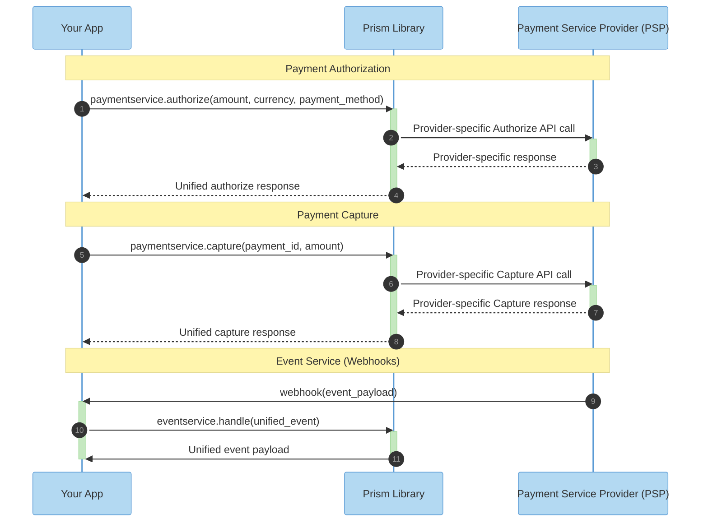

<div align="center">

# Hyperswitch Prism

**One Library. Connect any payment processor.**

[](https://opensource.org/licenses/Apache-2.0)

*A high-performance payment abstraction library, and part of [Juspay Hyperswitch](https://hyperswitch.io/) — the open-source, composable payments platform with 40,000+ GitHub stars, trusted by leading brands worldwide.*

[GitHub](https://github.com/juspay/hyperswitch) · [Website](https://hyperswitch.io/) · [Documentation](https://docs.hyperswitch.io/)

</div>

---

## 🎯 Why Prism?

Integrating multiple payment processors will either make you circle around with AI agents recreating an entire setup from ground up, or spending months of engineering effort in building and maintaining.

Every Payment Processor has different APIs, error codes, authentication methods. Above all, widely variable behaviour in the environment (not aligned to the specs), creates a lot of tribal undocumented knowledge. This makes the job harder for AI agents which are typically great at implementing well-defined specifications.

**Hyperswitch Prism solves this problem - as a Unified Connector Library for AI agents and Developers, hardened and tested on payment processor sandbox and/or production environments.**

| ❌ Without Prism | ✅ With Prism |
|------------------------------|----------------------------|
| 🗂️ 100+ different API schemas | 📋 Single unified schema |
| ⏳ Months of integration work, Indefinite Agentic loops | ⚡ Hours to integrate, AI agent can reuse instead of recreate |
| 🔗 Brittle, provider-specific code | 🔓 Portable, provider-agnostic code |
| 🚫 Hard to switch providers | 🔄 Change providers in 1 line |

---

## ✨ Features

- **🔌 50+ Connectors** — Stripe, Adyen, Braintree, PayPal, Worldpay, and more
- **🌍 Global Coverage** — Cards, wallets, bank transfers, BNPL, and regional methods
- **🚀 Zero Overhead** — Rust core with native bindings, no overhead
- **🔒 PCI-Compliant by Design** — Stateless, no data storage

---

## 🏗️ Architecture

```
┌─────────────────────────────────────────────────────────────────┐
│                        Your Application                         │
└─────────────────────────────────┬───────────────────────────────┘
                                  │
                                  ▼
┌─────────────────────────────────────────────────────────────────┐
│                        Hyperswitch Prism                        │
│                 (Type-safe, idiomatic interface)                │
└─────────────────────────────────┬───────────────────────────────┘
                                  │
                                  ▼
         ┌──────────────┼────────────────────┬───────────────────┐
         ▼              ▼                    ▼                   ▼
   ┌──────────┐     ┌──────────┐       ┌──────────┐        ┌───────────┐
   │  Stripe  │     │  Adyen   │       │ Braintree│        │ 100+ more │
   └──────────┘     └──────────┘       └──────────┘        └───────────┘
```

### Payment & Capture Flow Sequence



---

## 🚀 Quick Start

### Installation

Install the Prism SDK for your preferred language:

<!-- tabs:start -->

#### **Node.js**

```bash
npm install @juspay/hyperswitch-prism
```

#### **Python**

```bash
pip install hyperswitch-prism
```

#### **Java**

Add to your `pom.xml`:

```xml
<dependency>
    <groupId>com.juspay</groupId>
    <artifactId>hyperswitch-prism</artifactId>
    <version>1.0.0</version>
</dependency>
```

#### **Ruby**

```bash
gem install hyperswitch-prism
```

<!-- tabs:end -->

For detailed installation guides and language-specific setup, see [Installation Guide](./docs/getting-started/installation.md).

---

### Usage

Initialize the client and make your first payment:

<!-- tabs:start -->

#### **Node.js**

```javascript
const { PaymentClient, Connector, Currency } = require('@juspay/hyperswitch-prism');

async function main() {
  const client = new PaymentClient('your_api_key');

  const payment = await client.createPayment({
    amount: { value: 1000, currency: Currency.USD }, // $10.00
    connector: Connector.Stripe,
    paymentMethod: {
      card: {
        number: '4242424242424242',
        expMonth: 12,
        expYear: 2030,
        cvv: '123'
      }
    },
    captureMethod: 'automatic'
  });

  console.log('Payment ID:', payment.id);
  console.log('Status:', payment.status);
}

main();
```

#### **Python**

```python
from hyperswitch_prism import PaymentClient, Connector, Currency

client = PaymentClient('your_api_key')

payment = client.create_payment({
    'amount': {'value': 1000, 'currency': Currency.USD},
    'connector': Connector.STRIPE,
    'payment_method': {
        'card': {
            'number': '4242424242424242',
            'exp_month': 12,
            'exp_year': 2030,
            'cvv': '123'
        }
    },
    'capture_method': 'automatic'
})

print(f"Payment ID: {payment.id}")
print(f"Status: {payment.status}")
```

#### **Java**

```java
import com.juspay.hyperswitchprism.*;

public class Example {
    public static void main(String[] args) {
        PaymentClient client = PaymentClient.create("your_api_key");

        PaymentRequest request = PaymentRequest.builder()
            .amount(Amount.of(1000, Currency.USD))
            .connector(Connector.STRIPE)
            .paymentMethod(PaymentMethod.card(
                "4242424242424242", 12, 2030, "123"))
            .captureMethod(CaptureMethod.AUTOMATIC)
            .build();

        Payment payment = client.createPayment(request);

        System.out.println("Payment ID: " + payment.getId());
        System.out.println("Status: " + payment.getStatus());
    }
}
```

#### **Ruby**

```ruby
require 'hyperswitch_prism'

client = PaymentClient.new('your_api_key')

payment = client.create_payment(
  amount: { value: 1000, currency: :USD },
  connector: :STRIPE,
  payment_method: {
    card: {
      number: '4242424242424242',
      exp_month: 12,
      exp_year: 2030,
      cvv: '123'
    }
  },
  capture_method: :AUTOMATIC
)

puts "Payment ID: #{payment.id}"
puts "Status: #{payment.status}"
```

<!-- tabs:end -->

For complete payment workflows including tokenization, 3D Secure, and error handling, see [First Payment Guide](./docs/getting-started/first-payment.md).

For all supported languages and SDKs, see [SDK Reference](./docs-generated/sdks/).

---

## 🔄 Switching Providers

One of Prism's core benefits: switch payment providers by changing **one line**.

```javascript
// Before: Using Stripe
const payment = await client.createPayment({
   connector: Connector.Stripe,  // ← Change this
   // ... rest stays the same
});

// After: Using Adyen
const payment = await client.createPayment({
   connector: Connector.Adyen,   // ← That's it!
   // ... everything else identical
});
```

No rewriting. No re-architecting. Just swap the connector.

---

## 🌊 Abstracted Payment Flows

Prism unifies complex payment operations across all processors:

### Core Payment Operations
| Flow | Description |
|------|-------------|
| **Authorize** | Hold funds on a customer's payment method |
| **Capture** | Complete an authorized payment and transfer funds |
| **Void** | Cancel an authorized payment without charging |
| **Refund** | Return captured funds to the customer |
| **Sync** | Retrieve the latest payment status from the processor |

### Advanced Flows
| Flow | Description |
|------|-------------|
| **Setup Mandate** | Create recurring payment authorizations |
| **Incremental Auth** | Increase the authorized amount post-transaction |
| **Partial Capture** | Capture less than the originally authorized amount |

Each flow uses the same unified schema regardless of the underlying processor's API differences. No custom code per provider.

For all supported flows, see [Extending to More Flows](./docs/getting-started/extend-to-more-flows.md).

---

## 📚 Documentation

| Guide | Description |
|-------|-------------|
| [Installation](./docs/getting-started/installation.md) | Install SDKs for all supported languages |
| [First Payment](./docs/getting-started/first-payment.md) | Complete payment flow with error handling |
| [Extending Flows](./docs/getting-started/extend-to-more-flows.md) | Subscriptions, 3DS, incremental auth, and more |
| [Architecture](./docs/architecture/README.md) | How Prism works under the hood |
| [SDK Reference](./docs-generated/sdks/) | Language-specific API documentation |

---

## 🛠️ Development

### Prerequisites

- Rust 1.70+
- Protocol Buffers (protoc)

### Building from Source

```bash
# Clone the repository
git clone https://github.com/juspay/hyperswitch.git
cd hyperswitch

# Build
cargo build --release

# Run tests
cargo test
```

---

## 🔒 Security

- **Stateless by design** — No PII or PCI data stored
- **Memory-safe** — Built in Rust, no buffer overflows
- **Encrypted credentials** — API keys never logged or exposed

### Reporting Vulnerabilities

Please report security issues to [security@juspay.in](mailto:security@juspay.in).

---

<div align="center">

**[⬆ Back to Top](#hyperswitch-prism)**

Made with ❤️ by [Juspay Hyperswitch](https://hyperswitch.io)

</div>
