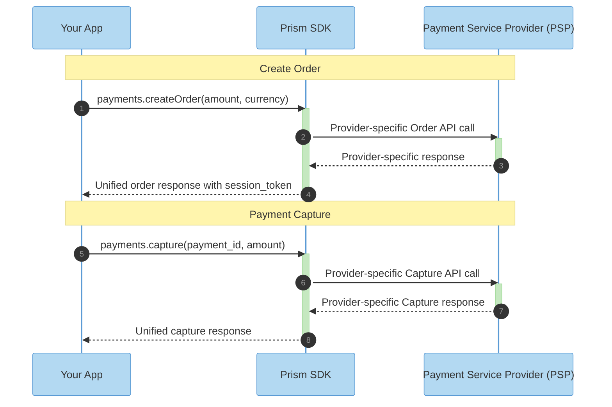

<div align="center">

# Hyperswitch Prism

**One integration. Any payment processor. Zero lock-in.**

[](https://opensource.org/licenses/Apache-2.0)

*A high-performance payment abstraction library, and part of [Juspay Hyperswitch](https://hyperswitch.io/) — the open-source, composable payments platform with 40,000+ GitHub stars, trusted by leading brands worldwide.*

[GitHub](https://github.com/juspay/hyperswitch) · [Website](https://hyperswitch.io/) · [Documentation](https://docs.hyperswitch.io/)

</div>

---

## 🎯 Why Prism?

Integrating multiple payment processors requires running in circles with AI agents to recreate integrations from specs, or developers spending months of engineering effort.

Every payment processor has diverse APIs, error codes, authentication methods, PDF documents to read, and above all - different behaviour in the actual environment when compared to documented specs. All this rests as tribal or undocumented knowledge making it harder for AI agents which are very good at implementing clearly documented specifications.

**Prism is the unified connector library for AI agents and Developers to connect with any payment processor.**

**Prism offers hardened transformation through testing on payment processor environments.**

| ❌ Without Prism | ✅ With Prism |
|------------------------------|----------------------------|
| 🗂️ 100+ different API schemas | 📋 Single unified schema |
| ⏳ Never ending agent loops / months of integration work | ⚡ Hours to integrate, Agent driven |
| 🔗 Brittle, provider-specific code | 🔓 Portable, provider-agnostic code |
| 🚫 Hard to switch providers | 🔄 Change providers in 1 line |

---

## ✨ Features

- **🔌 100+ Connectors** — Stripe, Adyen, Braintree, PayPal, Worldpay, and more
- **🌍 Global Coverage** — Cards, wallets, bank transfers, BNPL, and regional methods
- **🚀 Zero Overhead** — Rust core with native bindings, no overhead
- **🔒 PCI-Compliant by Design** — Stateless, no data storage

---

## 🏗️ Architecture

```
┌─────────────────────────────────────────────────────────────────┐
│                        Your Application                         │
└───────────────────────────────┬─────────────────────────────────┘
                                │
                                ▼
┌─────────────────────────────────────────────────────────────────┐
│                         Prism Library                           │
│                 (Type-safe, idiomatic interface)                │
└────────────────────────────────┬────────────────────────────────┘
                                 │
                                 ▼
         ┌───────────────────────┼───────────────────────┬───────────────────────┐
         ▼                       ▼                       ▼                       ▼
   ┌──────────┐           ┌──────────┐           ┌──────────┐           ┌──────────┐
   │  Stripe  │           │  Adyen   │           │ Braintree│           │ 50+ more │
   └──────────┘           └──────────┘           └──────────┘           └──────────┘
```

### Payment & Capture Flow Sequence



---

## 🚀 Quick Start

### Install the Library

<!-- tabs:start -->

#### **Node.js**

```bash
npm install @juspay/hyperswitch-prism
```

#### **Python**

```bash
pip install hyperswitch-prism
```

#### **Java**

Add to your `pom.xml`:

```xml
<dependency>
    <groupId>com.juspay</groupId>
    <artifactId>hyperswitch-prism</artifactId>
    <version>1.0.0</version>
</dependency>
```

#### **PHP**

```bash
composer require juspay/hyperswitch-prism
```

<!-- tabs:end -->

For detailed installation instructions, see [Installation Guide](./getting-started/installation.md).

---

### Create a Payment Order

Create an order to get a `session_token` (client secret) from your payment processor:

<!-- tabs:start -->

#### **Node.js**

```javascript
const { ConnectorClient, Currency } = require('@juspay/hyperswitch-prism');

async function main() {
    const client = new ConnectorClient({
        connectors: {
            stripe: { apiKey: process.env.STRIPE_API_KEY }
        }
    });

    const order = await client.payments.createOrder({
        amount: {
            minorAmount: 1000,  // $10.00
            currency: Currency.USD
        },
        merchantOrderId: 'order-123'
    });

    console.log('Order ID:', order.connectorOrderId);
    console.log('Client Secret:', order.sessionToken.clientSecret);
}

main().catch(console.error);
```

#### **Python**

```python
import os
from hyperswitch_prism import ConnectorClient, Currency

client = ConnectorClient(
    connectors={
        "stripe": {"api_key": os.environ["STRIPE_API_KEY"]}
    }
)

order = client.payments.create_order(
    amount={"minor_amount": 1000, "currency": Currency.USD},
    merchant_order_id="order-123"
)

print(f"Order ID: {order.connector_order_id}")
print(f"Client Secret: {order.session_token.client_secret}")
```

#### **Java**

```java
import com.juspay.hyperswitchprism.*;

public class Example {
    public static void main(String[] args) {
        ConnectorClient client = ConnectorClient.builder()
            .connector("stripe", StripeConfig.builder()
                .apiKey(System.getenv("STRIPE_API_KEY"))
                .build())
            .build();

        CreateOrderResponse order = client.payments().createOrder(
            CreateOrderRequest.builder()
                .amount(Amount.of(1000, Currency.USD))
                .merchantOrderId("order-123")
                .build()
        );

        System.out.println("Order ID: " + order.getConnectorOrderId());
        System.out.println("Client Secret: " + order.getSessionToken().getClientSecret());
    }
}
```

<!-- tabs:end -->

For complete payment workflows, see [First Payment Guide](./getting-started/first-payment.md).

---

## 🔄 Switching Providers

One of Prism's core benefits: switch payment providers by changing the connector configuration.

```javascript
// Before: Using Stripe
const client = new ConnectorClient({
    connectors: {
        stripe: { apiKey: process.env.STRIPE_API_KEY }
    }
});

// After: Using Braintree
const client = new ConnectorClient({
    connectors: {
        braintree: {
            publicKey: process.env.BRAINTREE_PUBLIC_KEY,
            privateKey: process.env.BRAINTREE_PRIVATE_KEY,
            merchantAccountId: process.env.BRAINTREE_MERCHANT_ID
        }
    }
});

// The createOrder call stays exactly the same!
const order = await client.payments.createOrder({
    amount: { minorAmount: 1000, currency: Currency.USD },
    merchantOrderId: 'order-123'
});
```

No rewriting. No re-architecting. Just swap the connector config.

---

## 🌊 Abstracted Payment Flows

Prism unifies complex payment operations across all processors:

### Core Payment Operations
| Flow | Description |
|------|-------------|
| **CreateOrder** | Create a payment intent/order with the processor |
| **Authorize** | Hold funds on a customer's payment method |
| **Capture** | Complete an authorized payment and transfer funds |
| **Void** | Cancel an authorized payment without charging |
| **Refund** | Return captured funds to the customer |
| **Sync** | Retrieve the latest payment status from the processor |

### Advanced Flows
| Flow | Description |
|------|-------------|
| **Setup Mandate** | Create recurring payment authorizations |
| **Incremental Auth** | Increase the authorized amount post-transaction |
| **Partial Capture** | Capture less than the originally authorized amount |

Each flow uses the same unified schema regardless of the underlying processor's API differences. No custom code per provider.

For all supported flows, see [Extending to More Flows](./getting-started/extend-to-more-flows.md).

---

## 📚 Documentation

| Guide | Description |
|-------|-------------|
| [Installation](./getting-started/installation.md) | Install SDKs for all supported languages |
| [Create Order](./getting-started/create-order.md) | Create payment orders with any processor |
| [First Payment](./getting-started/first-payment.md) | Complete payment flow with error handling |
| [Extending Flows](./getting-started/extend-to-more-flows.md) | Subscriptions, 3DS, incremental auth, and more |
| [Architecture](./architecture/README.md) | How Prism works under the hood |
| [SDK Reference](../docs-generated/sdks/) | Language-specific API documentation |

---

## 🛠️ Development

### Prerequisites

- Rust 1.70+
- Protocol Buffers (protoc)

### Building from Source

```bash
# Clone the repository
git clone https://github.com/juspay/hyperswitch.git
cd hyperswitch

# Build
cargo build --release

# Run tests
cargo test
```

---

## 🔒 Security

- **Stateless by design** — No PII or PCI data stored
- **Memory-safe** — Built in Rust, no buffer overflows
- **Encrypted credentials** — API keys never logged or exposed

### Reporting Vulnerabilities

Please report security issues to [security@juspay.in](mailto:security@juspay.in).

---

<div align="center">

**[⬆ Back to Top](#hyperswitch-prism)**

Built and maintained by [Juspay Hyperswitch](https://hyperswitch.io)

</div>
