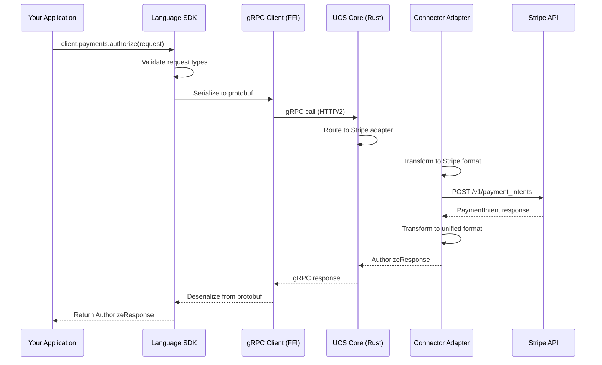
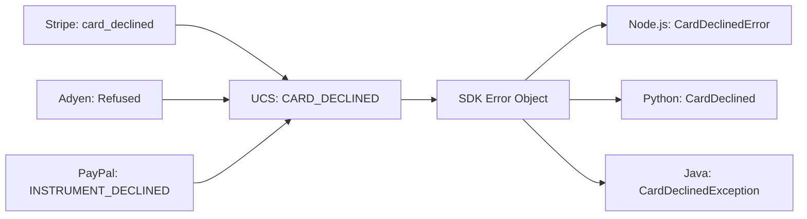

# Architecture Overview

<!--
---
title: Architecture Overview
description: How Connector Service library is architected for multi-language SDKs and unified payment processing
last_updated: 2026-03-03
generated_from: N/A
auto_generated: false
reviewed_by: engineering
reviewed_at: 2026-03-03
approved: true
---
-->

## Why This Architecture Matters

If you've integrated multiple payment providers, you know the pain: Stripe uses PaymentIntents, Adyen uses payments, PayPal uses orders. Each has different field names, different status enums, different error formats. Connector Service eliminates this fragmentation through a unified architecture that abstracts 100+ connectors behind one consistent interface.

## Architecture Layers

```
┌─────────────────────────────────────────────────────────────────────────────┐
│                              APPLICATION LAYER                               │
│  ┌─────────────┐  ┌─────────────┐  ┌─────────────┐  ┌─────────────┐        │
│  │   Node.js   │  │   Python    │  │    Java     │  │    .NET     │  ...   │
│  │     SDK     │  │     SDK     │  │     SDK     │  │     SDK     │        │
│  └──────┬──────┘  └──────┬──────┘  └──────┬──────┘  └──────┬──────┘        │
└─────────┼────────────────┼────────────────┼────────────────┼────────────────┘
          │                │                │                │
          ▼                ▼                ▼                ▼
┌─────────────────────────────────────────────────────────────────────────────┐
│                              FFI / BINDING LAYER                             │
│  ┌───────────────────────────────────────────────────────────────────────┐  │
│  │  gRPC Native Clients (tonic, grpcio, grpc-dotnet, go-grpc, etc.)     │  │
│  │                                                                       │  │
│  │  • Proto serialization/deserialization                               │  │
│  │  • HTTP/2 connection management                                      │  │
│  │  • Streaming support                                                 │  │
│  └───────────────────────────────────────────────────────────────────────┘  │
└─────────────────────────────────────────────────────────────────────────────┘
          │
          ▼
┌─────────────────────────────────────────────────────────────────────────────┐
│                           CONNECTOR SERVICE CORE                             │
│  ┌─────────────┐    ┌─────────────┐    ┌─────────────┐                      │
│  │    gRPC     │───▶│   Router    │───▶│  Connector  │                      │
│  │   Server    │    │             │    │  Adapters   │                      │
│  └─────────────┘    └─────────────┘    └──────┬──────┘                      │
│                                               │                             │
│  ┌─────────────┐    ┌─────────────┐          │  ┌─────────┐ ┌─────────┐    │
│  │   Webhook   │    │   Unified   │◀─────────┘  │ Stripe  │ │  Adyen  │    │
│  │   Handler   │    │   Types     │             │ Adapter │ │ Adapter │    │
│  └─────────────┘    └─────────────┘             └────┬────┘ └────┬────┘    │
└──────────────────────────────────────────────────────┼────────────┼─────────┘
                                                       │            │
                                                       ▼            ▼
                                                  ┌─────────┐  ┌─────────┐
                                                  │ Stripe  │  │  Adyen  │
                                                  │   API   │  │   API   │
                                                  └─────────┘  └─────────┘
```

### Layer Descriptions

| Layer | Responsibility | Technologies |
|-------|----------------|--------------|
| **Application Layer** | Language-idiomatic APIs | Node.js, Python, Java, .NET, Go, Haskell SDKs |
| **FFI/Binding Layer** | gRPC communication | tonic, grpcio, grpc-dotnet, go-grpc |
| **Core Layer** | Request routing, transformation | Rust, protocol buffers |
| **Connector Layer** | Connector-specific implementations | 100+ connector adapters |

## FFI Bindings

Each language SDK uses native gRPC libraries (FFI bindings) to communicate with the Connector Service:

| Language | gRPC Library | FFI Pattern |
|----------|--------------|-------------|
| Node.js | `@grpc/grpc-js` | Native JS implementation |
| Python | `grpcio` | Cython bindings to C++ core |
| Java | `grpc-java` | JNI to Netty transport |
| .NET | `Grpc.Net.Client` | Pure managed + HTTP/2 |
| Go | `google.golang.org/grpc` | Native Go implementation |
| Haskell | `grpc-haskell` | FFI to C++ core |

The FFI layer handles:
- **Proto serialization**: Converting language objects to protobuf bytes
- **HTTP/2 framing**: Managing connections, streams, and flow control
- **Streaming**: Bidirectional communication for webhooks

## Data Flow



## Connector Transformation

The core value: Connector Service transforms unified requests to connector-specific formats.

**Authorization Mapping:**

| Unified Field | Stripe | Adyen |
|---------------|--------|-------|
| `amount.currency` | `currency` | `amount.currency` |
| `amount.amount` | `amount` (cents) | `value` (cents) |
| `payment_method.card.card_number` | `payment_method[card][number]` | `paymentMethod[number]` |
| `connector_metadata` | `metadata` | `additionalData` |

This transformation happens server-side, so SDKs remain unchanged when adding new connectors.

## Error Normalization

Connector errors are mapped to unified error codes:



You handle `CARD_DECLINED` once, it works for all connectors.

## Connector Adapter Pattern

Each connector implements a standard interface:

```rust
trait ConnectorAdapter {
    async fn authorize(&self, request: AuthorizeRequest) -> Result<AuthorizeResponse>;
    async fn capture(&self, request: CaptureRequest) -> Result<CaptureResponse>;
    async fn void(&self, request: VoidRequest) -> Result<VoidResponse>;
    async fn refund(&self, request: RefundRequest) -> Result<RefundResponse>;
    // ... 20+ operations
}
```

New connectors only need an adapter implementation. SDKs require zero changes.

## Developer Pain Points Solved

| Without Connector Service | With Connector Service |
|---------------------------|------------------------|
| Learn 5+ different APIs | Learn 1 API |
| Map different status enums | Use unified PaymentStatus |
| Handle different error formats | Handle unified error codes |
| Maintain N integration tests | Test once, deploy to all |
| Vendor lock-in to one connector | Swap connectors with config change |

## Summary

The architecture prioritizes:

1. **Consistency**: Same types, patterns, and errors across all connectors
2. **Extensibility**: Add connectors without SDK changes
3. **Performance**: gRPC binary transport, connection pooling
4. **Developer Experience**: Idiomatic SDKs with FFI-native performance

For developers integrating multiple payment providers, this means weeks of integration work becomes hours, and maintenance burden drops from O(N connectors) to O(1).
