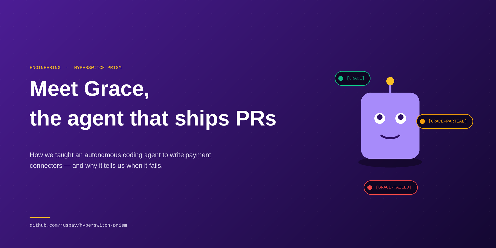
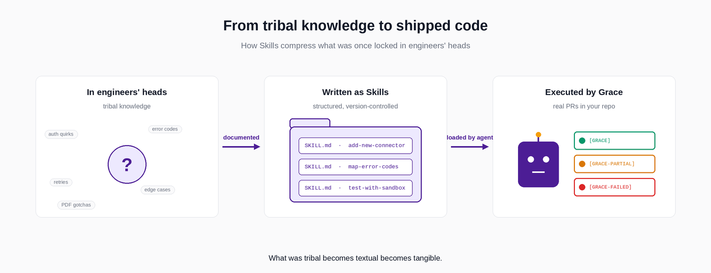
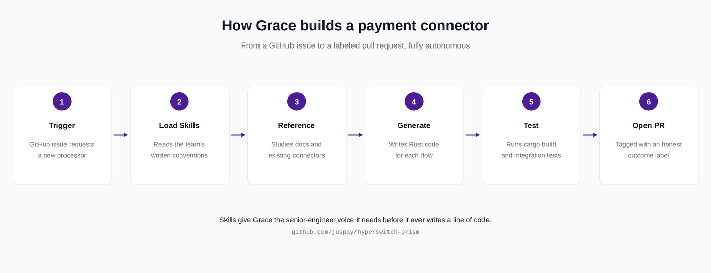
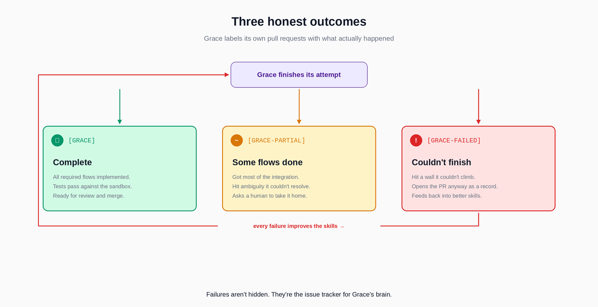

# How We Built Grace, an AI Agent That Writes Payment Connectors for Prism

*Meet 10xGRACE: an autonomous coding agent that opens production pull requests for payment integrations — and the engineering ideas that made it actually work.*

---

If you have ever integrated a new payment processor, you know that the official documentation is rarely the hard part. The hard part is everything that *isn't* in the documentation. The undocumented quirk where a sandbox returns a slightly different field shape from production. The error code that means one thing on Stripe and something completely different on Adyen. The order in which you have to set headers before authentication will succeed. This is what every payments engineer in the world has spent years learning and re-learning, and it is the exact reason that "just use an LLM to generate a Stripe client" produces something that compiles but quietly fails in production.

We have been thinking about this problem for a long time at Juspay. Prism, our open-source connector library, was our answer to the API side of it: one unified schema across one hundred-plus payment processors, hardened by years of real traffic inside Hyperswitch. Prism solved the problem of *using* payment APIs. But it did not, by itself, solve the problem of *building* them. Every time we wanted to add a new connector to Prism, an engineer still had to read a PDF, run sandbox tests, discover the undocumented behavior, and translate it into Rust. We had moved the tribal knowledge from "every developer using payment APIs" to "Prism contributors", but the knowledge was still trapped inside human heads.

So we built Grace. Grace is an AI agent that opens its own pull requests against the Prism repo, under the GitHub identity `10xGRACE`, and writes new connector integrations on its own. If you scroll through the open pull requests on `juspay/hyperswitch-prism`, you will find PRs from Grace tagged with `[GRACE]`, `[GRACE-PARTIAL]`, or `[GRACE-FAILED]` — adding bank transfer flows for Helcim, implementing recurring payments for PayU, wiring up new flows for LazyPay. Some of those PRs ship to production. Some get partway. Some fail loudly and visibly. All of that is by design, and the design is what this post is really about.

## The Problem With "Just Ask the LLM"

The naive way to build something like Grace is to give a large language model a payment processor's documentation and ask it to write a Rust integration. We tried it. The output looks correct. The structure is reasonable. The types compile. And then it fails in subtle, expensive ways the moment it touches a real sandbox.

The reason it fails is the same reason a brand-new engineer fails on day one even after reading every page of the docs. A Prism connector is not really a translation of a single API specification. It is a translation of a payment processor's API into the *Prism way of doing things*: the right `RouterDataV2` flow markers, the right error code mapping, the right pattern for authentication, the right place to handle webhooks, the right way to map currency minor units, the right opinions about idempotency. These conventions are written nowhere. They live in the muscle memory of the engineers who have shipped fifty connectors before.

What we needed was a way to *write that muscle memory down* in a form an AI agent could actually pick up and use. And it turned out the format we needed already existed.

## Skills: Tribal Knowledge As A File

Earlier this year, Anthropic released an open format called Agent Skills. The idea is almost embarrassingly simple. A Skill is a folder. Inside the folder there is a file called `SKILL.md`, which has a name, a short description of when to use it, and step-by-step instructions written for an AI agent the way you would write onboarding notes for a new hire. Optionally, the folder can also include scripts, reference materials, code templates, and worked examples. The agent reads the skill before it tries to do the task, and now it knows what only the senior engineer used to know.

The reason this format is important is not the file structure. It is the *interface contract*. A Skill says: here is a unit of expertise, packaged in a way that any agent on any platform can consume. It treats institutional knowledge the same way good software treats functions — as a reusable, named, versionable artifact.

Pull request `[GRACE] Add skills to Hyperswitch-Prism (#781)` was the moment Prism started to grow its own brain. We took the things our connector engineers do almost without thinking — the conventions, the gotchas, the patterns we always copy from the last connector — and we wrote them down as Skills inside the `grace/` folder of the repo. A skill for "how to add a new card payment flow." A skill for "how to map this processor's error codes to the unified Prism error model." A skill for "how to write the integration test that talks to a real sandbox." The skills do not write the code. They tell Grace *how to think* before it writes the code.

*The transformation at the heart of Grace: knowledge that used to live only in senior engineers' heads becomes a structured Skill, and the same Skill becomes executable when Grace picks it up.*

## The Architecture Of Grace

Once the skills exist, the rest of Grace is more straightforward than you might guess. The agent runs as a process that watches for a trigger — usually a GitHub issue saying "we want a connector for Processor X" or a configuration file that lists missing flows. From there, it walks through a fairly traditional autonomous-agent loop, but with the skills as its scaffolding.

The flow looks like this.

*The six steps that turn a connector request into a reviewable pull request. The order matters: skills load before any code is written, which is what separates Grace from a generic coding agent staring at a blank file.*

The thing worth pausing on is step two: *load the skills first*. This is the design choice that makes Grace different from a generic coding agent. A generic coding agent stares at the existing code and tries to infer the patterns. Grace doesn't have to infer, because the patterns are already written down. The senior-engineer voice is in the skill, not the model.

## Honesty As An Architectural Choice

The most interesting thing about Grace, the part I genuinely think more AI projects should copy, is the labeling system on its pull requests. When Grace finishes a job, it tags its own pull request with one of three prefixes that tell the human reviewers exactly what to expect. A pull request tagged `[GRACE]` has been built end to end and the agent believes the integration is complete, with all flows implemented and tests passing. A pull request tagged `[GRACE-PARTIAL]` means the agent got some flows working but knew it could not finish others — usually because the documentation was ambiguous or the sandbox wouldn't cooperate — and it is asking a human to take it the rest of the way. A pull request tagged `[GRACE-FAILED]` is the most important one of all. It means the agent tried, hit a wall it could not climb, and is opening the PR anyway as a record of the attempt.

*Each of Grace's pull requests carries one of three labels that tell a reviewer exactly what to expect. The red feedback loop is the part that matters: every `[GRACE-FAILED]` becomes a directly observable gap in the skills, and editing the skill closes the gap permanently.*

That last category is the secret. Most AI agents are designed to either succeed or stay quiet. Grace is designed to fail visibly. The `[GRACE-FAILED]` PRs are gold dust for us, because every one of them is a directly observable gap in the skills — a place where we forgot to write something down, or where our written instructions weren't clear enough, or where the connector category is genuinely too unusual for the existing skills to cover. We read the failure, update the skills, and the next time Grace attempts a similar connector, that failure mode is gone forever. Grace gets better not by retraining a model but by editing a markdown file. Skills are the version-controlled brain of the agent, and failures are the issue tracker for that brain.

## What This Means For Open Source Payments

Step back from the implementation for a moment, because the implications are bigger than one repo. The long tail of payment processors is genuinely huge — there are hundreds of regional acquirers, alternative payment methods, BNPL providers, and wallet schemes that no commercial library will ever bother to integrate, because the engineering cost is greater than the revenue any single company will see from supporting them. That is exactly the gap an open source project is meant to fill, and exactly the gap that is too expensive to fill with humans alone.

Grace is the bet that an AI agent, scaffolded with carefully written skills and operating with full transparency about its successes and failures, can durably close that gap. Not by replacing the contributors who maintain Prism, but by giving them leverage. A human reviewer can check a Grace pull request in an afternoon — far less time than it would take that same human to write the integration from scratch. And every PR that gets merged is one more processor that any developer in the world can use through a single unified API.

## Try It

Grace lives in the `grace/` folder of the Prism repo. The skills it uses are right there, readable as plain markdown — not a black box, not a model weight, just files. If you want to see what an AI-agent-readable engineering manual actually looks like in production, that is the place to start.

If you are integrating payments and you have ever thought "there has to be a better way", come use Prism directly. If you are interested in the design of AI agents that ship real production code, read Grace's skills and her open PRs. And if you can do either, please consider starring the repo — it makes a real difference for what we can do next.

The full project lives here: [github.com/juspay/hyperswitch-prism](https://github.com/juspay/hyperswitch-prism)

---

*Prism is part of [Juspay Hyperswitch](https://hyperswitch.io/), the open-source payments orchestration platform with 40,000+ GitHub stars. Grace is the AI agent that helps maintain it.*

*Originally published on [Medium](https://medium.com/@shuklatushar100/how-we-built-grace-an-ai-agent-that-writes-payment-connectors-for-prism-a-payment-library-b4b65f045817).*
