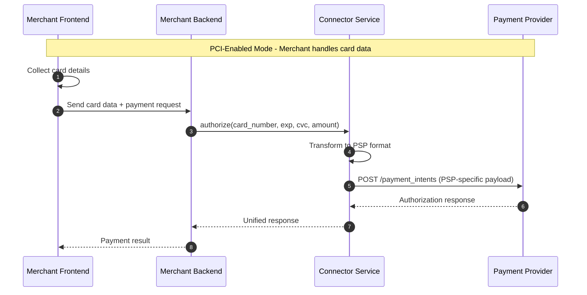
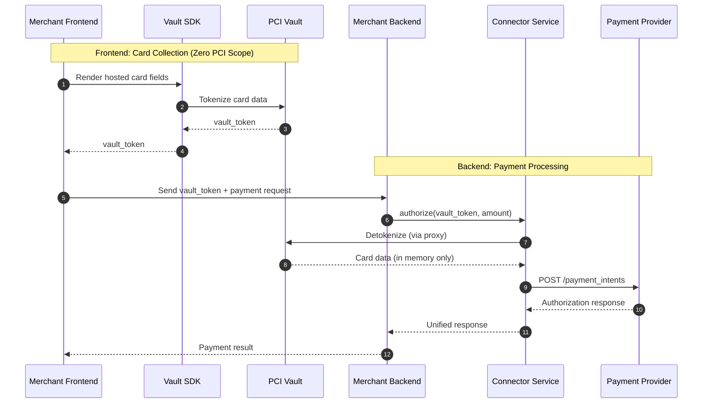

# PCI Compliance with Connector Service

> How connector-service (UCS) handles PCI compliance through multiple integration patterns

---

## Overview

Connector Service (UCS) provides flexible PCI compliance options for merchants. Depending on your compliance requirements and infrastructure, you can operate in one of two modes:

| Mode | PCI Scope | Description |
|------|-----------|-------------|
| **PCI-Enabled Mode** | Full SAQ D | Your application handles raw card data |
| **PCI-Disabled Mode** | Reduced (SAQ A/A-EP) | Third-party vault handles card data |

---

## Mode 1: PCI-Enabled Mode

In this mode, your application receives and processes raw card data. You are responsible for PCI DSS compliance.

### When to Use
- You have existing PCI DSS certification
- You need direct control over card data
- You want to minimize third-party dependencies

### Flow Diagram



### Key Characteristics
- Raw card data flows through your infrastructure
- Full PCI DSS compliance required
- Direct control over payment flow
- No additional vault subscription needed

---

## Mode 2: PCI-Disabled Mode (Vault Integration)

In this mode, a third-party vault handles card data. Your application only sees tokens, significantly reducing PCI scope.

### When to Use
- You want to minimize PCI compliance burden
- You prefer not to handle raw card data
- You want to outsource security to specialists

### Requirement
**You must subscribe to a third-party PCI vault service.** UCS supports three integration patterns:

| Vault Provider | Proxy Pattern | Documentation |
|----------------|---------------|---------------|
| **VGS (Very Good Security)** | [Network Proxy](./network-proxy.md) | Zero-code, URL-based routing |
| **Evervault** | [Network Proxy](./network-proxy.md) | HTTP CONNECT relay, client-side encryption |
| **Basis Theory** | [Transform Proxy](./transform-proxy.md) | Expression-based `{{ }}` detokenization |
| **Skyflow** | [Transform Proxy](./transform-proxy.md) | Connection-based detokenizing proxy |
| **TokenEx** | [Relay Proxy](./relay-proxy.md) | Header-driven with `{ }` token markers |

### Flow Diagram



### Key Characteristics
- Card data never touches your servers
- Reduced PCI scope (SAQ A or A-EP)
- Vault provider manages security
- Subscription to vault service required

---

## Proxy Pattern Comparison

Choose the right proxy pattern based on your requirements:

| Aspect | [Network Proxy](./network-proxy.md) | [Transform Proxy](./transform-proxy.md) | [Relay Proxy](./relay-proxy.md) |
|--------|-------------------------------------|-----------------------------------------|---------------------------------|
| **Providers** | VGS, Evervault | Basis Theory, Skyflow | TokenEx |
| **Code Changes** | **None**—just change URL | Required—use template expressions | Minimal—add headers + `{ }` markers |
| **Integration Layer** | Network/Transport | Application | Application (headers + body) |
| **Token Syntax** | Transparent (no syntax) | `{{ token.property }}` or JSON paths | `{token}` |
| **Routing Method** | URL-based | Proxy endpoint + expressions | HTTP headers (`TX-URL`) |
| **Customization** | Low | **High** (custom transforms) | Medium |
| **Token Format** | `tok_xxx`, `ev:encrypted:xxx` | UUID `26818785-...`, `f80c5d4a-...` | Format-preserving `4242123456784242` |
| **PSP Portability** | Vendor-specific | Vendor-specific | **Universal** (works with any PSP) |

---

## Quick Decision Guide

<details>
<summary><b>Which Proxy Pattern Should I Use?</b></summary>

### Choose Network Proxy (VGS, Evervault) if:
- ✅ You want **zero code changes**
- ✅ You need the **fastest integration**
- ✅ You already use VGS/Evervault infrastructure
- ✅ You want **client-side encryption** (Evervault)
- ❌ You need custom request transformations

### Choose Transform Proxy (Basis Theory, Skyflow) if:
- ✅ You need **explicit control** over token placement
- ✅ You want **custom transformations** (Liquid/Node.js)
- ✅ You work with **multiple vault providers**
- ✅ You need **data residency** controls (Skyflow)
- ✅ You want **vault-per-tenant** isolation (Skyflow)
- ❌ You want zero code changes

### Choose Relay Proxy (TokenEx) if:
- ✅ You want **PSP portability** (one token works everywhere)
- ✅ You prefer **format-preserving tokens** (looks like real cards)
- ✅ You want a **middle ground** between zero-code and full-control
- ❌ You need complex request transformations

</details>

---

## Code Example Comparison

Here's how a Stripe Payment Intent call looks across all three patterns:

<details>
<summary><b>1. Without Vault (Raw Card Data)</b></summary>

```bash
# Direct to Stripe—your server sees raw card data
curl "https://api.stripe.com/v1/payment_intents" \
  -H "Authorization: Bearer sk_test_xxx" \
  -d "amount=1000" \
  -d "currency=usd" \
  -d "payment_method_data[card][number]=4242424242424242" \
  -d "payment_method_data[card][exp_month]=12" \
  -d "confirm=true"
```
</details>

<details>
<summary><b>2. Network Proxy (VGS)</b></summary>

```bash
# Change URL only—VGS handles detokenization automatically
curl "https://tntSANDBOX.sandbox.verygoodproxy.com/v1/payment_intents" \
  -H "Authorization: Bearer sk_test_xxx" \
  -d "amount=1000" \
  -d "currency=usd" \
  -d "payment_method_data[card][number]=tok_sandbox_4242xxxxxxxx4242" \
  -d "payment_method_data[card][exp_month]=12" \
  -d "confirm=true"
```
</details>

<details>
<summary><b>3. Transform Proxy (Basis Theory)</b></summary>

```bash
# Use {{ }} expressions to mark detokenization points
curl "https://api.basistheory.com/proxy" \
  -H "BT-API-KEY: test_xxx" \
  -H "BT-PROXY-URL: https://api.stripe.com/v1/payment_intents" \
  -d "amount=1000" \
  -d "currency=usd" \
  -d "payment_method_data[card][number]={{ 26818785-547b-4b28-b0fa-531377e99f4e.number }}" \
  -d "payment_method_data[card][exp_month]={{ 26818785-547b-4b28-b0fa-531377e99f4e.expiration_month }}" \
  -d "confirm=true"
```
</details>

<details>
<summary><b>4. Relay Proxy (TokenEx)</b></summary>

```bash
# Use TX-* headers for routing, { } markers for tokens
curl "https://tgapi.tokenex.com" \
  -H "TX-URL: https://api.stripe.com/v1/payment_intents" \
  -H "TX-Method: POST" \
  -H "Authorization: Bearer sk_test_xxx" \
  -d "amount=1000" \
  -d "currency=usd" \
  -d "payment_method_data[card][number]={4242123456784242}" \
  -d "payment_method_data[card][exp_month]=12" \
  -d "confirm=true"
```
</details>

---

## Data Flow Comparison

```
┌─────────────────────────────────────────────────────────────────────────┐
│                         WITHOUT VAULT                                   │
│  Frontend → Backend (raw card) → UCS (raw card) → Stripe (raw card)    │
│                                                                         │
│  PCI Scope: SAQ D (Full) ❌                                             │
└─────────────────────────────────────────────────────────────────────────┘

┌─────────────────────────────────────────────────────────────────────────┐
│                      NETWORK PROXY                                      │
│  Frontend → Backend (token) → UCS (token) → Network Proxy → Stripe     │
│                                    ↑                                    │
│                         VGS/Evervault: URL change only                  │
│                                                                         │
│  PCI Scope: SAQ A/A-EP ✅  Code Changes: None                           │
└─────────────────────────────────────────────────────────────────────────┘

┌─────────────────────────────────────────────────────────────────────────┐
│                   TRANSFORM PROXY                                       │
│  Frontend → Backend (token) → UCS (templates) → Transform Proxy → PSP  │
│                                    ↑                                    │
│                    Basis Theory: {{ }} / Skyflow: JSON paths            │
│                                                                         │
│  PCI Scope: SAQ A/A-EP ✅  Control: High                                │
└─────────────────────────────────────────────────────────────────────────┘

┌─────────────────────────────────────────────────────────────────────────┐
│                      RELAY PROXY (TokenEx)                              │
│  Frontend → Backend (token) → UCS ({ }) → TGAPI → Stripe (card)        │
│                                    ↑                                    │
│                              TX-* headers + { } markers                 │
│                                                                         │
│  PCI Scope: SAQ A/A-EP ✅  Portability: Universal                       │
└─────────────────────────────────────────────────────────────────────────┘
```

---

## Configuration Summary

| Pattern | Config Key | Primary Setting |
|---------|------------|-----------------|
| Network Proxy | `vault.mode` | `network_proxy` |
| Transform Proxy | `vault.mode` | `transform_proxy` |
| Relay Proxy | `vault.mode` | `relay_proxy` |

---

## Next Steps

1. **Choose your mode** based on PCI requirements
2. **If PCI-Disabled**: Select a [proxy pattern](#proxy-pattern-comparison) based on your needs
3. **Subscribe to a vault provider** (VGS, Basis Theory, or TokenEx)
4. **Configure UCS** with vault credentials
5. **Implement Vault SDK** in your frontend
6. **Test with sandbox** credentials before going live

---

## Documentation Index

| Document | Description |
|----------|-------------|
| [README.md](./README.md) | This file—overview and comparison |
| [network-proxy.md](./network-proxy.md) | VGS, Evervault integration (zero code changes) |
| [transform-proxy.md](./transform-proxy.md) | Basis Theory, Skyflow integration (expressions) |
| [relay-proxy.md](./relay-proxy.md) | TokenEx integration (headers + markers) |

---

_Need help? Join our [Discord](https://discord.gg/hyperswitch) or open a [GitHub Discussion](https://github.com/juspay/connector-service/discussions)._
