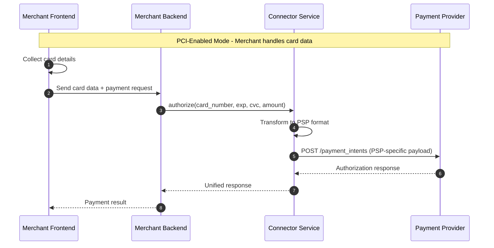
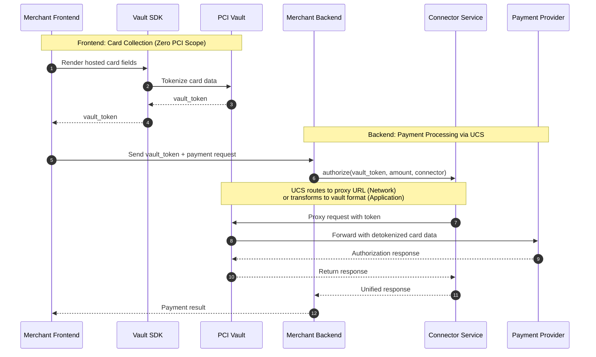

# PCI Compliance with Connector Service

> How connector-service handles PCI compliance through multiple integration patterns

---

## Overview

PCI DSS (Payment Card Industry Data Security Standard) compliance is not just a configuration option—it's a **business-critical architectural decision** that affects:

1. **Security liability** — Handling raw card data makes you responsible for breaches
2. **Compliance cost** — Full SAQ D certification costs $50K–$500K+ annually in audits, infrastructure, and security tools
3. **Time to market** — Achieving PCI certification can take 6–12 months
4. **Operational overhead** — Ongoing security patches, monitoring, and audits

The choice you make here determines your risk profile, operational burden, and agility.

Whether you choose a **PSP-native vault** (Stripe Vault, Adyen Vault), an **independent third-party vault** (VGS, Basis Theory, TokenEx, Hyperswitch Vault), or **self-managed PCI compliance** with your own card vault—**Connector Service has you covered**.

| Scenario | Your Strategy | Connector Service Solves |
|----------|---------------|--------------------------|
| **PSP-Native Vault** | You rely on Stripe/Adyen vault for PCI scope reduction | Abstracts PSP-specific token formats; single API regardless of which PSP vault you use |
| **Independent Third-Party Vault** | You use VGS, Basis Theory, TokenEx, or Hyperswitch Vault as a vault layer | Supports two proxy patterns (Network, Application) with zero to minimal code changes |
| **In-House Vault** | You have your own PCI-certified card vault infrastructure | PCI-Enabled Mode lets you send raw card data through while maintaining full control |

Connector Service (connector-service) provides flexible PCI compliance options for merchants. Depending on your compliance requirements and infrastructure, you can operate in one of two modes:

| Mode | PCI Scope | Description |
|------|-----------|-------------|
| **PCI-Enabled Mode** | Full SAQ D | Your application handles raw card data |
| **PCI-Disabled Mode** | Reduced (SAQ A/A-EP) | Third-party vault handles card data |

---

## Mode 1: PCI-Enabled Mode

In this mode, your application receives and processes raw card data. You are responsible for PCI DSS compliance.

### When to Use
- You have existing PCI DSS certification
- You need direct control over card data
- You want to minimize third-party dependencies

### Flow Diagram



### Key Characteristics
- Raw card data flows through your infrastructure
- Full PCI DSS compliance required
- Direct control over payment flow
- No additional vault subscription needed

---

## Mode 2: PCI-Disabled Mode (Vault Integration)

In this mode, a third-party vault handles card data. Your application only handles tokens, significantly reducing PCI scope.

### When to Use
- You want to minimize PCI compliance burden
- You prefer not to handle raw card data
- You want to outsource security to specialists

### Requirement
**You must subscribe to a third-party PCI vault service.** connector-service supports two integration patterns:

| Proxy Pattern | You Send | UCS Handles | Popular Vault Providers |
|---------------|----------|-------------|-------------------------|
| **[Network Proxy](./network-proxy.md)** | Token to UCS | Routes to proxy URL; proxy detokenizes transparently | **VGS**: URL-based routing (`tntxxx.sandbox.verygoodproxy.com`)<br>**Evervault**: HTTP CONNECT relay with client-side encryption |
| **[Application Proxy](./application-proxy.md)** | Token to UCS | Transforms token into vault-specific format (headers, expressions, or wrapped requests) | **Hyperswitch Vault**, **TokenEx**, **Basis Theory** |

### Flow Diagram



### Key Characteristics
- Card data never touches your servers
- Reduced PCI scope (SAQ A or A-EP)
- Vault provider manages security
- Subscription to vault service required

---

## PCI Modes Explained

### PCI-Enabled Mode (Full SAQ D)

| Aspect | Details |
|--------|---------|
| **What happens** | Your application receives and transmits raw card data (PAN, CVV, expiry) |
| **PCI Scope** | Full SAQ D — your entire infrastructure is in scope |
| **When to use** | • You already have PCI DSS certification<br>• You operate your own card vault<br>• You need direct control over card data for compliance/regulatory reasons<br>• You want to minimize third-party dependencies |
| **Trade-off** | Higher compliance burden, but maximum flexibility and control |

### PCI-Disabled Mode (Reduced SAQ A/A-EP)

| Aspect | Details |
|--------|---------|
| **What happens** | A third-party vault tokenizes card data; you only handle tokens |
| **PCI Scope** | Reduced SAQ A or A-EP — card data never touches your servers |
| **When to use** | • You want to minimize PCI compliance burden<br>• You prefer outsourcing security to specialists<br>• You need faster time-to-market without certification delays<br>• You use a PSP vault or independent vault provider |
| **Trade-off** | Subscription cost for vault service, but drastically reduced compliance overhead |

---

## Mapping Recommended PCI Modes to Use Cases

| Use Case | Recommended Mode | Rationale |
|----------|------------------|-----------|
| **Early-stage startup, moving from single-PSP to multi-PSP** | PCI-Disabled | Launch quickly without 6–12 month certification delays |
| **Expanding Multi-PSP strategy without changing your existing vault vendor** | PCI-Disabled + Independent Vault | Token portability across PSPs (e.g., TokenEx format-preserving tokens) |
| **High-security requirements** | PCI-Enabled + In-House Vault | Full data sovereignty and audit control |
| **Marketplace/SaaS platform supporting multi-PSP** | PCI-Disabled + Application Proxy | UCS handles multiple vault providers seamlessly |
| **Enterprise with existing PCI certification** | PCI-Enabled | Leverage existing investment; maintain control |

---

## The Confidence Factor

Connector Service abstracts the complexity regardless of your PCI strategy. You integrate once with connector-service, and it handles:

- **Token format translation** — PSP-specific tokens, vault tokens, or raw cards all normalize to a unified interface
- **Proxy pattern selection** — Network or Application based on your vault provider
- **Connector-level flexibility** — Use PCI-Enabled for your in-house vault in one region, PCI-Disabled with a third party vault provider in another

Your PCI choice is a business decision—Connector Service ensures it's never a technical blocker.

---

## Proxy Pattern Comparison

Choose the right proxy pattern based on your requirements:

| Aspect | [Network Proxy](./network-proxy.md) | [Application Proxy](./application-proxy.md) |
|--------|-------------------------------------|---------------------------------------------|
| **Providers** | VGS, Evervault | Basis Theory, TokenEx, Hyperswitch Vault |
| **You send to UCS** | Token | Token |
| **UCS transforms** | ❌ No—routes to proxy URL only | ✅ Yes—formats token for vault-specific protocol |
| **Vault receives** | Token (transparent detokenization) | Token in vault format (headers/`{ }`/`{{ }}`/`{{$}}`) |
| **Code Changes** | **None** | Minimal |
| **PCI Scope** | SAQ A/A-EP ✅ | SAQ A/A-EP ✅ |

**Key difference:** Both patterns send tokens to UCS. Network Proxy simply routes to the vault's proxy URL (the vault handles detokenization transparently). Application Proxy requires UCS to transform tokens into vault-specific formats—headers for TokenEx/Basis Theory, wrapped requests for Hyperswitch Vault.

---

## Quick Decision Guide

<details>
<summary><b>Which Proxy Pattern Should I Use?</b></summary>

Both patterns require you to **send tokens to UCS**. The difference is what UCS does with them:

### Choose Network Proxy (VGS, Evervault) if:
- ✅ You want **zero code changes**—UCS just routes to the proxy URL
- ✅ You need the **fastest integration**
- ✅ You already use VGS/Evervault infrastructure
- ✅ You want **client-side encryption** (Evervault)

**How it works:** You send `tok_sandbox_xxx` → UCS routes to `tntxxx.verygoodproxy.com` → VGS detokenizes transparently → PSP receives raw card data.

### Choose Application Proxy (Basis Theory, TokenEx, Hyperswitch Vault) if:
- ✅ You want **unified integration** regardless of vault provider
- ✅ You prefer UCS to handle vault-specific token formatting
- ✅ You want to switch vault providers without changing your code
- ✅ You work with **multiple PSPs**

**How it works:** You send `4242123456784242` → UCS transforms to vault format (adds `TX-URL` header + `{ }` markers for TokenEx) → Vault detokenizes → PSP receives raw card data.

</details>

---

## Code Example Comparison

Here's how a payment call looks across all scenarios:

<details>
<summary><b>Scenario 1: Using independent third-party vault through Network Proxy (example: VGS)</b></summary>

```bash
# Change URL only—VGS handles detokenization automatically
curl "https://tntSANDBOX.sandbox.verygoodproxy.com/v1/payment_intents" \
  -H "Authorization: Bearer sk_test_xxx" \
  -d "amount=1000" \
  -d "currency=usd" \
  -d "payment_method_data[card][number]=tok_sandbox_4242xxxxxxxx4242" \
  -d "payment_method_data[card][exp_month]=12" \
  -d "confirm=true"
```
</details>

<details>
<summary><b>Scenario 2: Using independent third-party vault through Application Proxy (example: Hyperswitch Vault, TokenEx, Basis Theory)</b></summary>

```bash
# Send tokens to UCS—UCS handles vault-specific routing and transformations
curl "https://api.connector-service.juspay.net/payments" \
  -H "Authorization: Bearer ${UCS_API_KEY}" \
  -H "Content-Type: application/json" \
  -d '{
    "amount": 1000,
    "currency": "USD",
    "connector": "stripe",
    "payment_method": {
      "type": "card",
      "card": {
        "token": "pm_0196f252baa1736190bf0fc81b9651ea"
      }
    }
  }'
```

**What happens behind the scenes:**
- **Hyperswitch Vault**: UCS constructs wrapped request with `{{$variable}}` expressions
- **TokenEx**: UCS adds `TX-URL` and `TX-Method` headers, wraps token in `{ }`
- **Basis Theory**: UCS adds `BT-PROXY-URL` header, uses `{{ token.property }}` expressions

</details>

<details>
<summary><b>Scenario 3: Using in-house vault with self-managed PCI compliance</b></summary>

```bash
# Direct to Stripe—your server sees raw card data
curl "https://api.stripe.com/v1/payment_intents" \
  -H "Authorization: Bearer sk_test_xxx" \
  -d "amount=1000" \
  -d "currency=usd" \
  -d "payment_method_data[card][number]=4242424242424242" \
  -d "payment_method_data[card][exp_month]=12" \
  -d "confirm=true"
```
</details>


---

## Data Flow Comparison

```
┌──────────────────────────────────────────────────────────────────────────────────┐
│                         INHOUSE CARD VAULT                                       │
│  Frontend → Backend (raw card) → connector-service (raw card) → Stripe (raw card)│
│                                                                                  │
│  PCI Scope: SAQ D (Full) ❌                                                      │
└──────────────────────────────────────────────────────────────────────────────────┘

┌───────────────────────────────────────────────────────────────────────────────────────┐
│                      NETWORK PROXY                                                    │
│  Frontend → Backend (token) → UCS → Network Proxy → PSP                               │
│                                    ↑                                                  │
│              UCS routes to proxy URL only (no token transformation)                   │
│              VGS/Evervault detokenizes transparently                                  │
│                                                                                       │
│  PCI Scope: SAQ A/A-EP ✅  Code Changes: None                                         │
└───────────────────────────────────────────────────────────────────────────────────────┘

┌───────────────────────────────────────────────────────────────────────────────────────┐
│                   APPLICATION PROXY                                                   │
│  Frontend → Backend (token) → UCS → Vault Proxy → PSP                                 │
│                                    ↑                                                  │
│              UCS transforms token → vault-specific format:                            │
│              • TokenEx: `{token}` markers + TX-* headers                              │
│              • Basis Theory: `{{token.property}}` + BT-PROXY-URL header               │
│              • Hyperswitch: `{{$variable}}` in wrapped request body                   │
│                                                                                       │
│  PCI Scope: SAQ A/A-EP ✅  Works with: Basis Theory, TokenEx, Hyperswitch Vault       │
└───────────────────────────────────────────────────────────────────────────────────────┘
```

---

## Configuration Summary

| Pattern | Config Key | Primary Setting | Providers |
|---------|------------|-----------------|-----------|
| Network Proxy | `vault.mode` | `network_proxy` | VGS, Evervault |
| Application Proxy | `vault.mode` | `application_proxy` | Basis Theory, TokenEx, Hyperswitch Vault |

---

## Next Steps

1. **Choose your mode** based on PCI requirements
2. **If PCI-Disabled**: Select a [proxy pattern](#proxy-pattern-comparison) based on your needs
3. **Subscribe to a vault provider** (VGS, Evervault, Basis Theory, TokenEx, or Hyperswitch Vault)
4. **Configure connector-service** with vault credentials
5. **Implement Vault SDK** in your frontend
6. **Test with sandbox** credentials before going live

---

## Documentation Index

| Document | Description |
|----------|-------------|
| [README.md](./README.md) | This file—overview and comparison |
| [network-proxy.md](./network-proxy.md) | VGS, Evervault integration (zero code changes) |
| [application-proxy.md](./application-proxy.md) | Basis Theory, TokenEx, Hyperswitch Vault integration (UCS handles routing) |

---

