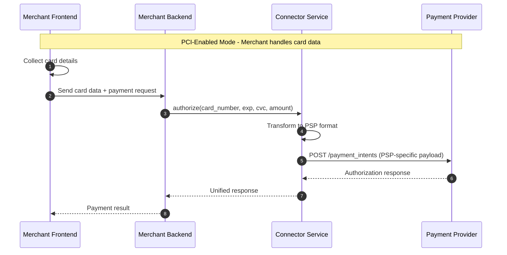
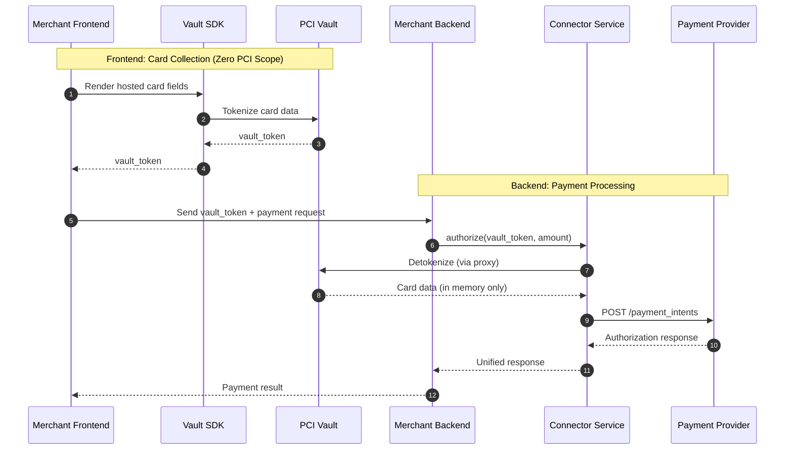

# PCI Compliance with Connector Service

> How connector-service handles PCI compliance through multiple integration patterns

---

## Overview

PCI DSS (Payment Card Industry Data Security Standard) compliance is not just a configuration option—it's a **business-critical architectural decision** that affects:

1. **Security liability** — Handling raw card data makes you responsible for breaches
2. **Compliance cost** — Full SAQ D certification costs $50K–$500K+ annually in audits, infrastructure, and security tools
3. **Time to market** — Achieving PCI certification can take 6–12 months
4. **Operational overhead** — Ongoing security patches, monitoring, and audits

The choice you make here determines your risk profile, operational burden, and agility.

Whether you choose a **PSP-native vault** (Stripe Vault, Adyen Vault), an **independent third-party vault** (VGS, Basis Theory, TokenEx, Hyperswitch Vault), or **self-managed PCI compliance** with your own card vault—**Connector Service has you covered**.

| Scenario | Your Strategy | Connector Service Solves |
|----------|---------------|--------------------------|
| **PSP-Native Vault** | You rely on Stripe/Adyen vault for PCI scope reduction | Abstracts PSP-specific token formats; single API regardless of which PSP vault you use |
| **Independent Third-Party Vault** | You use VGS, Basis Theory, TokenEx, or Hyperswitch Vault as a vault layer | Supports three proxy patterns (Network, Transform, Relay) with zero to minimal code changes |
| **In-House Vault** | You have your own PCI-certified card vault infrastructure | PCI-Enabled Mode lets you send raw card data through while maintaining full control |

Connector Service (connector-service) provides flexible PCI compliance options for merchants. Depending on your compliance requirements and infrastructure, you can operate in one of two modes:

| Mode | PCI Scope | Description |
|------|-----------|-------------|
| **PCI-Enabled Mode** | Full SAQ D | Your application handles raw card data |
| **PCI-Disabled Mode** | Reduced (SAQ A/A-EP) | Third-party vault handles card data |

---

## Mode 1: PCI-Enabled Mode

In this mode, your application receives and processes raw card data. You are responsible for PCI DSS compliance.

### When to Use
- You have existing PCI DSS certification
- You need direct control over card data
- You want to minimize third-party dependencies

### Flow Diagram



### Key Characteristics
- Raw card data flows through your infrastructure
- Full PCI DSS compliance required
- Direct control over payment flow
- No additional vault subscription needed

---

## Mode 2: PCI-Disabled Mode (Vault Integration)

In this mode, a third-party vault handles card data. Your application only handles tokens, significantly reducing PCI scope.

### When to Use
- You want to minimize PCI compliance burden
- You prefer not to handle raw card data
- You want to outsource security to specialists

### Requirement
**You must subscribe to a third-party PCI vault service.** connector-service supports three integration patterns:

| Proxy Pattern | What It Means | Popular Vault Providers |
|---------------|---------------|-------------------------|
| **[Network Proxy](./network-proxy.md)** | Zero-code integration—just change the URL. The proxy transparently intercepts and detokenizes requests at the network layer. | **VGS**: URL-based routing (`tntxxx.sandbox.verygoodproxy.com`)<br>**Evervault**: HTTP CONNECT relay with client-side encryption |
| **[Transform Proxy](./transform-proxy.md)** | Application-layer proxy using wrapped requests with template expressions (e.g., `{{$card_number}}`) to mark where detokenization should occur. | **Hyperswitch Vault**: Transform proxy with request wrapping and `{{$variable}}` expressions |
| **[Relay Proxy](./relay-proxy.md)** | Header-driven routing with proxy URLs in headers; use token markers in request body to indicate detokenization points. | **Basis Theory**: `BT-PROXY-URL` header with `{{ }}` expressions<br>**TokenEx**: `TX-*` headers with `{ }` markers |

### Flow Diagram



### Key Characteristics
- Card data never touches your servers
- Reduced PCI scope (SAQ A or A-EP)
- Vault provider manages security
- Subscription to vault service required

---

## PCI Modes Explained

### PCI-Enabled Mode (Full SAQ D)

| Aspect | Details |
|--------|---------|
| **What happens** | Your application receives and transmits raw card data (PAN, CVV, expiry) |
| **PCI Scope** | Full SAQ D — your entire infrastructure is in scope |
| **When to use** | • You already have PCI DSS certification<br>• You operate your own card vault<br>• You need direct control over card data for compliance/regulatory reasons<br>• You want to minimize third-party dependencies |
| **Trade-off** | Higher compliance burden, but maximum flexibility and control |

### PCI-Disabled Mode (Reduced SAQ A/A-EP)

| Aspect | Details |
|--------|---------|
| **What happens** | A third-party vault tokenizes card data; you only handle tokens |
| **PCI Scope** | Reduced SAQ A or A-EP — card data never touches your servers |
| **When to use** | • You want to minimize PCI compliance burden<br>• You prefer outsourcing security to specialists<br>• You need faster time-to-market without certification delays<br>• You use a PSP vault or independent vault provider |
| **Trade-off** | Subscription cost for vault service, but drastically reduced compliance overhead |

---

## Mapping Recommended PCI Modes to Use Cases

| Use Case | Recommended Mode | Rationale |
|----------|------------------|-----------|
| **Early-stage startup, moving from single-PSP to multi-PSP** | PCI-Disabled | Launch quickly without 6–12 month certification delays |
| **Expanding Multi-PSP strategy without changing your existing vault vendor** | PCI-Disabled + Independent Vault | Token portability across PSPs (e.g., TokenEx format-preserving tokens) |
| **High-security requirements** | PCI-Enabled + In-House Vault | Full data sovereignty and audit control |
| **Marketplace/SaaS platform supporting multi-PSP** | PCI-Disabled + Transform Proxy | Hyperswitch Vault supports multiple PSPs with request wrapping |
| **Enterprise with existing PCI certification** | PCI-Enabled | Leverage existing investment; maintain control |

---

## The Confidence Factor

Connector Service abstracts the complexity regardless of your PCI strategy. You integrate once with connector-service, and it handles:

- **Token format translation** — PSP-specific tokens, vault tokens, or raw cards all normalize to a unified interface
- **Proxy pattern selection** — Network, Transform, or Relay based on your vault provider
- **Connector-level flexibility** — Use PCI-Enabled for your in-house vault in one region, PCI-Disabled with a third party vault provider in another

Your PCI choice is a business decision—Connector Service ensures it's never a technical blocker.

---

## Proxy Pattern Comparison

Choose the right proxy pattern based on your requirements:

| Aspect | [Network Proxy](./network-proxy.md) | [Transform Proxy](./transform-proxy.md) | [Relay Proxy](./relay-proxy.md) |
|--------|-------------------------------------|-----------------------------------------|---------------------------------|
| **Providers** | VGS, Evervault | Hyperswitch Vault | TokenEx |
| **Code Changes** | **None**—just change URL | Required—wrapped request with expressions | Minimal—add headers + `{ }` markers |
| **Integration Layer** | Network/Transport | Application | Application (headers + body) |
| **Token Syntax** | Transparent (no syntax) | `{{$card_number}}` expressions | `{token}` |
| **Routing Method** | URL-based | Wrapped request with `destination_url` | HTTP headers (`TX-URL`) |
| **Customization** | Low | **High** (wrapped requests) | Medium |
| **Token Format** | `tok_xxx`, `ev:encrypted:xxx` | `pm_xxx` (payment method ID) | Format-preserving `4242123456784242` |
| **PSP Portability** | Vendor-specific | **Universal** (works with any PSP) | **Universal** (works with any PSP) |

---

## Transform Proxy vs Relay Proxy: Key Difference

Both Transform and Relay proxies use **expressions** in the request body, but the critical difference is **where the destination URL is specified**:

| Proxy Type | Routing Mechanism | Request Structure |
|------------|-------------------|-------------------|
| **Transform Proxy** (Hyperswitch Vault) | `destination_url` inside the **request body** | Wrapped request with nested `request_body` object |
| **Relay Proxy** (Basis Theory, TokenEx) | `BT-PROXY-URL` or `TX-URL` in **HTTP headers** | Flat request body with token markers |

**Why this matters:**
- **Transform Proxy**: The entire PSP payload is nested inside a `request_body` field, with routing metadata (`destination_url`, `headers`, `token`) at the top level. This provides more control over headers and destination.
- **Relay Proxy**: The request body contains only the PSP payload with token markers. The destination is specified via HTTP headers, making it simpler but less flexible for header manipulation.

---

## Quick Decision Guide

<details>
<summary><b>Which Proxy Pattern Should I Use?</b></summary>

### Choose Network Proxy (VGS, Evervault) if:
- ✅ You want **zero code changes**
- ✅ You need the **fastest integration**
- ✅ You already use VGS/Evervault infrastructure
- ✅ You want **client-side encryption** (Evervault)
- 🔧 You need to implement custom request transformations through connector service

### Choose Transform Proxy (Hyperswitch Vault) if:
- ✅ You need **explicit control** over token placement
- ✅ You want **request wrapping** with destination URL control
- ✅ You work with **multiple PSPs**
- ✅ You need **{{$variable}}** expression syntax
- ❌ You need to implement custom request transformations through connector service

### Choose Relay Proxy (Basis Theory, TokenEx) if:
- ✅ You want **header-driven routing** with proxy URLs
- ✅ You prefer **expression-based** (Basis Theory) or **format-preserving tokens** (TokenEx)
- ✅ You want a **middle ground** between zero-code and vendor-diversity
- ❌ You need to implement custom request transformations through connector service

</details>

---

## Code Example Comparison

Here's how a Stripe Payment Intent call can look across all the scenarios:

<details>
<summary><b>Scenario 1: Using Independent third party vault through Network Proxy pattern (example: VGS)</b></summary>

```bash
# Change URL only—VGS handles detokenization automatically
curl "https://tntSANDBOX.sandbox.verygoodproxy.com/v1/payment_intents" \
  -H "Authorization: Bearer sk_test_xxx" \
  -d "amount=1000" \
  -d "currency=usd" \
  -d "payment_method_data[card][number]=tok_sandbox_4242xxxxxxxx4242" \
  -d "payment_method_data[card][exp_month]=12" \
  -d "confirm=true"
```
</details>

<details>
<summary><b>Scenario 2: Using Independent third party vault through Transform Proxy pattern (example: Hyperswitch Vault)</b></summary>

```bash
# Use wrapped request with {{$variable}} expressions
curl "https://sandbox.hyperswitch.io/proxy" \
  -H "Content-Type: application/json" \
  -H "api-key: dev_xxxxxxxxxx" \
  -X "POST" \
  -d '{
    "request_body": {
      "source": {
        "type": "card",
        "number": "{{$card_number}}",
        "expiry_month": "{{$card_exp_month}}",
        "expiry_year": "{{$card_exp_year}}"
      },
      "amount": 6540,
      "currency": "USD"
    },
    "destination_url": "https://api.checkout.com/payments",
    "headers": {
      "Content-Type": "application/json",
      "Authorization": "Bearer sk_sbox_xxx"
    },
    "token": "pm_0196f252baa1736190bf0fc81b9651ea",
    "token_type": "payment_method_id",
    "method": "POST"
  }'
```
</details>

<details>
<summary><b>Scenario 3: Using Independent third party vault through Relay Proxy pattern (example: Basis Theory)</b></summary>

```bash
# Use {{ }} expressions and BT-PROXY-URL header for routing
curl "https://api.basistheory.com/proxy" \
  -H "BT-API-KEY: test_xxx" \
  -H "BT-PROXY-URL: https://api.stripe.com/v1/payment_intents" \
  -d "amount=1000" \
  -d "currency=usd" \
  -d "payment_method_data[card][number]={{ 26818785-547b-4b28-b0fa-531377e99f4e.number }}" \
  -d "payment_method_data[card][exp_month]={{ 26818785-547b-4b28-b0fa-531377e99f4e.expiration_month }}" \
  -d "confirm=true"
```
</details>

<details>
<summary><b>Scenario 4: Using Independent third party vault through Relay Proxy pattern (example: TokenEx)</b></summary>

```bash
# Use TX-* headers for routing, { } markers for tokens
curl "https://tgapi.tokenex.com" \
  -H "TX-URL: https://api.stripe.com/v1/payment_intents" \
  -H "TX-Method: POST" \
  -H "Authorization: Bearer sk_test_xxx" \
  -d "amount=1000" \
  -d "currency=usd" \
  -d "payment_method_data[card][number]={4242123456784242}" \
  -d "payment_method_data[card][exp_month]=12" \
  -d "confirm=true"
```
</details>

<details>
<summary><b>Scenario 4: Using inhouse card vault with self managed PCI compliance </b></summary>

```bash
# Direct to Stripe—your server sees raw card data
curl "https://api.stripe.com/v1/payment_intents" \
  -H "Authorization: Bearer sk_test_xxx" \
  -d "amount=1000" \
  -d "currency=usd" \
  -d "payment_method_data[card][number]=4242424242424242" \
  -d "payment_method_data[card][exp_month]=12" \
  -d "confirm=true"
```
</details>


---

## Data Flow Comparison

```
┌──────────────────────────────────────────────────────────────────────────────────┐
│                         INHOUSE CARD VAULT                                       │
│  Frontend → Backend (raw card) → connector-service (raw card) → Stripe (raw card)│
│                                                                                  │
│  PCI Scope: SAQ D (Full) ❌                                                      │
└──────────────────────────────────────────────────────────────────────────────────┘

┌───────────────────────────────────────────────────────────────────────────────────────┐
│                      NETWORK PROXY                                                    │
│  Frontend → Backend (token) → connector-service (token) → Network Proxy → Stripe      │
│                                    ↑                                                  │
│                         VGS/Evervault: URL change only                                │
│                                                                                       │
│  PCI Scope: SAQ A/A-EP ✅  Code Changes: None                                         │
└───────────────────────────────────────────────────────────────────────────────────────┘

┌───────────────────────────────────────────────────────────────────────────────────────┐
│                   TRANSFORM PROXY                                                     │
│  Frontend → Backend (token) → connector-service (wrapped) → Transform Proxy → PSP     │
│                                    ↑                                                  │
│              Hyperswitch Vault: {{$variable}} in wrapped request                      │
│                                                                                       │
│  PCI Scope: SAQ A/A-EP ✅  Control: High                                              │
└───────────────────────────────────────────────────────────────────────────────────────┘

┌──────────────────────────────────────────────────────────────────────────────────────┐
│                      RELAY PROXY (TokenEx)                                           │
│  Frontend → Backend (token) → connector-service ({ }) → TGAPI → Stripe (card)        │
│                                    ↑                                                 │
│                              TX-* headers + { } markers                              │
│                                                                                      │
│  PCI Scope: SAQ A/A-EP ✅  Portability: Universal                                    │
└──────────────────────────────────────────────────────────────────────────────────────┘
```

---

## Configuration Summary

| Pattern | Config Key | Primary Setting |
|---------|------------|-----------------|
| Network Proxy | `vault.mode` | `network_proxy` |
| Transform Proxy | `vault.mode` | `transform_proxy` |
| Relay Proxy | `vault.mode` | `relay_proxy` |

---

## Next Steps

1. **Choose your mode** based on PCI requirements
2. **If PCI-Disabled**: Select a [proxy pattern](#proxy-pattern-comparison) based on your needs
3. **Subscribe to a vault provider** (VGS, Basis Theory, or TokenEx)
4. **Configure connector-service** with vault credentials
5. **Implement Vault SDK** in your frontend
6. **Test with sandbox** credentials before going live

---

## Documentation Index

| Document | Description |
|----------|-------------|
| [README.md](./README.md) | This file—overview and comparison |
| [network-proxy.md](./network-proxy.md) | VGS, Evervault integration (zero code changes) |
| [transform-proxy.md](./transform-proxy.md) | Hyperswitch Vault integration (wrapped requests with expressions) |
| [relay-proxy.md](./relay-proxy.md) | TokenEx integration (headers + markers) |

---

