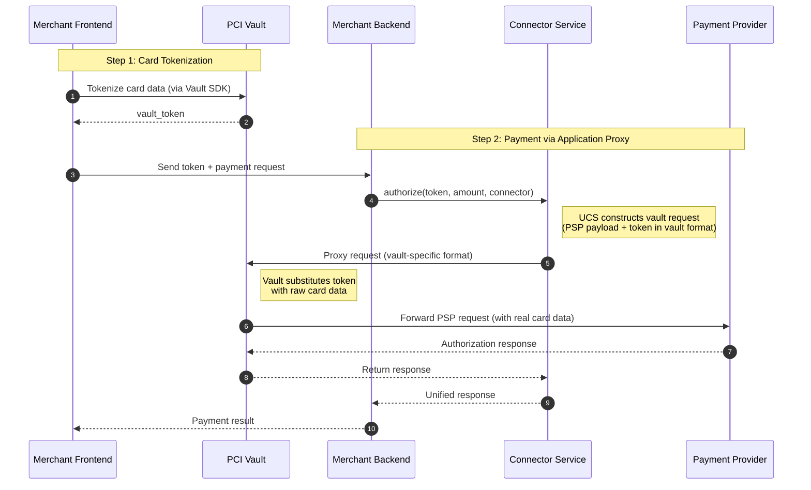

# Application Proxy (Basis Theory, TokenEx, Hyperswitch Vault)

> Application-layer vault integration where you send tokens to UCS, and we handle vault-specific routing and detokenization.

---

## Overview

**Application Proxy** provides a unified integration pattern for vault providers that require application-layer transformations.

**The key distinction:** Like Network Proxy, you send tokens to UCS. Unlike Network Proxy, UCS must transform those tokens into vault-specific formats—adding headers, wrapping in expressions, or constructing special request bodies.

| Aspect | Description |
|--------|-------------|
| **Integration Level** | Application layer |
| **You send to UCS** | Token (same as Network Proxy) |
| **UCS transforms** | ✅ Yes—into vault-specific format (headers, `{ }`, `{{ }}`, or wrapped requests) |
| **Token Handling** | UCS formats tokens for vault protocol |
| **Request Flow** | Your App → UCS → Vault Proxy → PSP |

---

## How It Works



**One-line Summary:** Send tokens to UCS. UCS handles all vault-specific routing and transformation.

---

## Network Proxy vs Application Proxy

| | Network Proxy | Application Proxy |
|---|---|---|
| **What you send to UCS** | Token | Token |
| **UCS transformation** | ❌ No—just routes to proxy URL | ✅ Yes—formats token for vault protocol |
| **Example** | Send `tok_xxx` → UCS routes to `tnt.vgs.com` | Send `4242123456784242` → UCS adds `TX-URL` header + `{ }` markers |

---

## Supported Vault Providers

| Provider | Routing Mechanism | Token Marker Syntax |
|----------|-------------------|---------------------|
| **Hyperswitch Vault** | Wrapped request body | `{{$variable}}` |
| **TokenEx** | Headers (`TX-URL`, `TX-Method`) | `{token}` |
| **Basis Theory** | Header (`BT-PROXY-URL`) | `{{ token.property }}` |

---

## Hyperswitch Vault

### Overview

Hyperswitch Vault uses a **wrapped request structure**. You send a JSON payload that includes the destination URL, headers, and a `request_body` containing `{{$variable}}` expressions where tokens should be detokenized.

| Attribute | Value |
|-----------|-------|
| **Documentation** | [Hyperswitch Docs](https://docs.hyperswitch.io) |
| **Proxy Type** | Transform Proxy with request wrapping |
| **Token Format** | `pm_xxx` (payment method ID) |
| **Expression Syntax** | `{{$card_number}}`, `{{$card_exp_month}}`, `{{$card_exp_year}}` |
| **Endpoint** | `https://sandbox.hyperswitch.io/proxy` |

### Token Format

```json
{
  "token": "pm_0196f252baa1736190bf0fc81b9651ea",
  "token_type": "payment_method_id"
}
```

### UCS Integration

When you send a Hyperswitch Vault token to UCS:

1. UCS identifies the vault provider from your configuration
2. UCS constructs the wrapped proxy payload:
   - `request_body`: PSP-specific payload with `{{$variable}}` expressions
   - `destination_url`: The PSP endpoint
   - `headers`: PSP authentication headers
   - `token`: The payment method token
3. Hyperswitch Vault evaluates expressions and forwards to the PSP

### Example: Direct Hyperswitch Vault Call (Without UCS)

```bash
# This is what UCS constructs internally

curl "https://sandbox.hyperswitch.io/proxy" \
  -H "Content-Type: application/json" \
  -H "api-key: dev_xxxxxxxxxx" \
  -H "X-Profile-Id: pro_xxxxxxxxxx" \
  -X "POST" \
  -d '{
    "request_body": {
      "source": {
        "type": "card",
        "number": "{{$card_number}}",
        "expiry_month": "{{$card_exp_month}}",
        "expiry_year": "{{$card_exp_year}}"
      },
      "amount": 6540,
      "currency": "USD"
    },
    "destination_url": "https://api.checkout.com/payments",
    "headers": {
      "Content-Type": "application/json",
      "Authorization": "Bearer sk_sbox_xxx"
    },
    "token": "pm_0196f252baa1736190bf0fc81b9651ea",
    "token_type": "payment_method_id",
    "method": "POST"
  }'
```

---

## TokenEx

### Overview

TokenEx uses header-driven routing with `TX-URL` and `TX-Method` headers. Tokens are wrapped in curly braces `{token}` in the request body.

| Attribute | Value |
|-----------|-------|
| **Documentation** | [TokenEx Docs](https://documentation.ixopay.com/docs/tokenex) |
| **Proxy Type** | Transparent Gateway API (TGAPI) |
| **Token Format** | Format-preserving `4242123456784242` |
| **Marker Syntax** | `{token}` curly braces |
| **Routing** | HTTP headers (`TX-URL`, `TX-Method`) |

### Token Format

TokenEx uses **format-preserving tokens** that look like the original data:

```
Real Card:     4242424242424242
TokenEx Token: 4242123456784242
               └─ looks identical, different value
```

### UCS Integration

When you send a TokenEx token to UCS:

1. UCS identifies the vault provider from your configuration
2. UCS constructs the TGAPI request:
   - URL: `https://tgapi.tokenex.com`
   - Headers: `TX-URL`, `TX-Method`
   - Body: Token wrapped in `{ }` markers
3. TokenEx detokenizes and forwards to the PSP

### Example: Direct TokenEx Call (Without UCS)

```bash
# This is what UCS constructs internally

curl "https://tgapi.tokenex.com" \
  -H "TX-URL: https://api.stripe.com/v1/payment_intents" \
  -H "TX-Method: POST" \
  -H "Authorization: Bearer sk_test_xxx" \
  -d "amount=1000" \
  -d "currency=usd" \
  -d "payment_method_data[card][number]={4242123456784242}" \
  -d "payment_method_data[card][exp_month]=12" \
  -d "confirm=true"
```

---

## Basis Theory

### Overview

Basis Theory uses header-driven routing with the `BT-PROXY-URL` header. Tokens are referenced in the body using `{{ token.property }}` expressions.

| Attribute | Value |
|-----------|-------|
| **Documentation** | [Basis Theory Docs](https://developers.basistheory.com) |
| **Proxy Type** | Ephemeral Proxy |
| **Token Format** | UUID `26818785-547b-4b28-b0fa-531377e99f4e` |
| **Expression Syntax** | `{{ token_id.property }}` double curly braces |
| **Routing** | HTTP header (`BT-PROXY-URL`) |

### Token Format

```json
{
  "id": "26818785-547b-4b28-b0fa-531377e99f4e",
  "type": "card",
  "data": {
    "number": "4242424242424242",
    "expiration_month": 12,
    "expiration_year": 2025
  }
}
```

### UCS Integration

When you send a Basis Theory token to UCS:

1. UCS identifies the vault provider from your configuration
2. UCS constructs the proxy request:
   - Adds `BT-PROXY-URL` header with the destination PSP URL
   - Replaces token references with `{{ token.property }}` expressions
3. Basis Theory evaluates expressions and forwards to the PSP

### Example: Direct Basis Theory Call (Without UCS)

```bash
# This is what UCS constructs internally

curl "https://api.basistheory.com/proxy" \
  -H "BT-API-KEY: test_xxx" \
  -H "BT-PROXY-URL: https://api.stripe.com/v1/payment_intents" \
  -d "amount=1000" \
  -d "currency=usd" \
  -d "payment_method_data[card][number]={{ 26818785-547b-4b28-b0fa-531377e99f4e.number }}" \
  -d "payment_method_data[card][exp_month]={{ 26818785-547b-4b28-b0fa-531377e99f4e.expiration_month }}" \
  -d "confirm=true"
```

---

## Unified UCS Integration

### Recommended: Payment via UCS + Application Proxy

Regardless of which vault provider you use, your integration code looks the same:

```bash
# Merchant Backend calls UCS—UCS handles all vault-specific complexity

curl "https://api.connector-service.juspay.net/payments" \
  -H "Authorization: Bearer ${UCS_API_KEY}" \
  -H "Content-Type: application/json" \
  -X "POST" \
  -d '{
    "amount": 1000,
    "currency": "USD",
    "connector": "stripe",
    "payment_method": {
      "type": "card",
      "card": {
        "token": "YOUR_VAULT_TOKEN"
      }
    }
  }'
```

**What UCS does based on your vault provider:**

| Provider | UCS Action |
|----------|------------|
| Hyperswitch Vault | Constructs wrapped request with `{{$variable}}` expressions |
| TokenEx | Adds `TX-URL`/`TX-Method` headers, wraps token in `{ }` |
| Basis Theory | Adds `BT-PROXY-URL` header, formats `{{ token.property }}` expressions |

---

## Configuration

### UCS Configuration Examples

**Basis Theory:**

```yaml
vault:
  provider: basistheory
  mode: application_proxy
  api_key: ${BASISTHEORY_API_KEY}

connectors:
  stripe:
    api_key: ${STRIPE_API_KEY}
    vault_aware: true
```

**TokenEx:**

```yaml
vault:
  provider: tokenex
  mode: application_proxy
  tgapi_url: https://tgapi.tokenex.com
  tokenex_id: ${TOKENEX_ID}
  api_key: ${TOKENEX_API_KEY}

connectors:
  stripe:
    api_key: ${STRIPE_API_KEY}
    vault_aware: true
```

**Hyperswitch Vault:**

```yaml
vault:
  provider: hyperswitch
  mode: application_proxy
  api_url: https://sandbox.hyperswitch.io/proxy
  api_key: ${HYPERSWITCH_API_KEY}
  profile_id: ${HYPERSWITCH_PROFILE_ID}

connectors:
  checkout:
    api_key: ${CHECKOUT_API_KEY}
    vault_aware: true
```

---

## Provider Comparison

| Aspect | Hyperswitch Vault | TokenEx | Basis Theory |
|--------|-------------------|---------|--------------|
| **Token Format** | `pm_xxx` | Format-preserving | UUID |
| **Routing** | Wrapped request body | `TX-URL`/`TX-Method` headers | `BT-PROXY-URL` header |
| **Token Syntax** | `{{$variable}}` | `{token}` | `{{ token.property }}` |
| **Best For** | Wrapped request control | Universal PSP portability | Flexible proxying |

---

## When to Use Application Proxy

| Scenario | Recommendation |
|----------|----------------|
| Want **unified integration** across vault providers | ✅ Perfect fit |
| Prefer UCS to handle vault-specific complexity | ✅ Perfect fit |
| Need to **switch vault providers** without code changes | ✅ Perfect fit |
| Work with **multiple PSPs** | ✅ Perfect fit |
| Want **zero code changes** | ❌ Use Network Proxy |

---

## Limitations

| Limitation | Details | Mitigation |
|------------|---------|------------|
| **Vault-specific knowledge** | Still need to understand your vault provider's token format | UCS abstracts the integration |
| **Token format differences** | Each vault uses different token formats | Store tokens with provider metadata |

---

## Quick Reference

### Application Proxy Flow

```
┌─────────────────┐     ┌────────────────────────────────┐     ┌─────────────┐
│  Your Backend   │────▶│      Application Proxy         │────▶│     PSP     │
│                 │     │         (UCS)                  │     │             │
│ Sends: tokens   │     │ 1. Identifies vault provider   │     │             │
│                 │     │ 2. Applies vault-specific      │     │ Receives:   │
│                 │     │    transformation              │     │ real card   │
│                 │     │ 3. Routes through vault        │     │ data        │
└─────────────────┘     └────────────────────────────────┘     └─────────────┘
                               │
                               ▼
                    ┌──────────────────────┐
                    │  Vault Provider      │
                    │  (Basis/TokenEx/HV)  │
                    └──────────────────────┘
```

**One-line Summary:** Send tokens to UCS. UCS handles all vault-specific routing and transformations.

---

## Related Documentation

- [Overview](./README.md) - PCI Compliance overview
- [Network Proxy](./network-proxy.md) - Alternative: Zero-code transparent proxy (VGS, Evervault)

---

_Need help? Join our [Discord](https://discord.gg/hyperswitch) or open a [GitHub Discussion](https://github.com/juspay/connector-service/discussions)._
