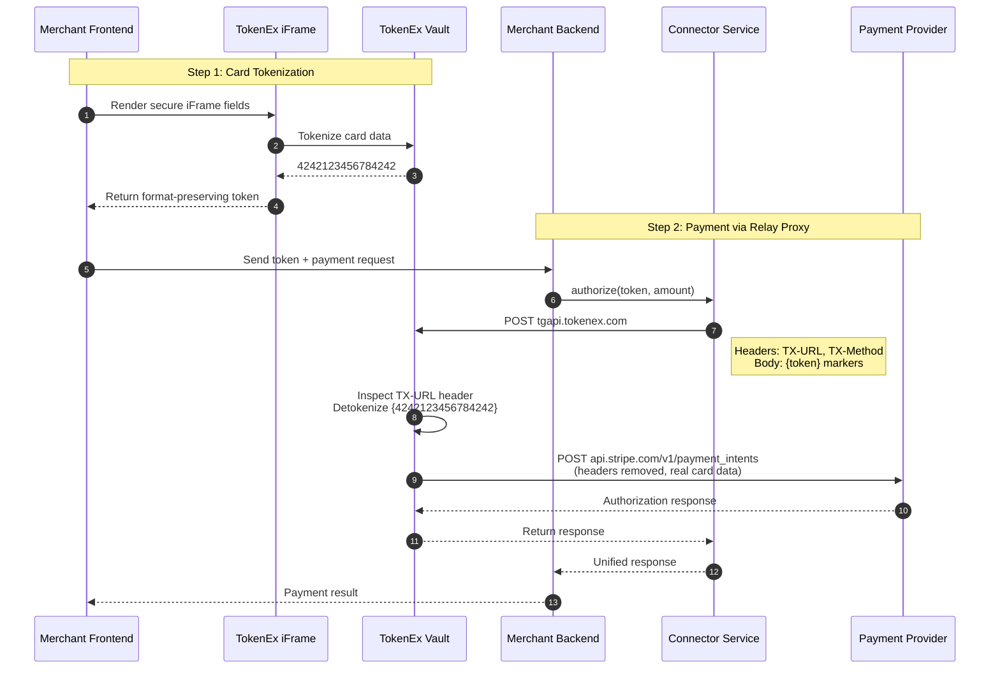
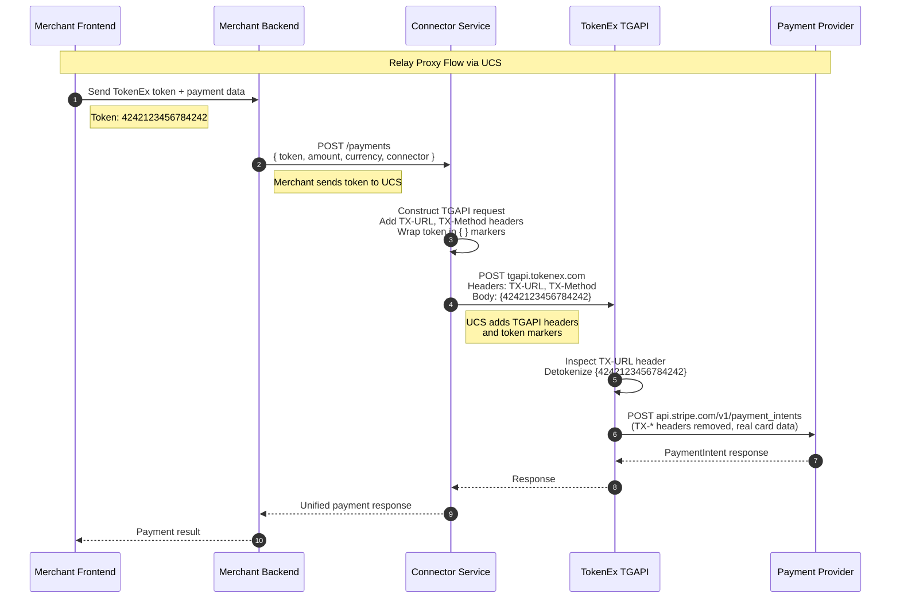

# Relay Proxy (TokenEx)

> Header-driven request relay with curly-brace token markers. Route via HTTP headers, mark tokens with `{ }`, and let the relay handle the rest.

---

## Overview

**Relay Proxy** takes a hybrid approach: you **route requests via HTTP headers** (`TX-URL`, `TX-Method`) and **mark tokens with curly braces** `{token}` in the payload. The relay inspects headers, detokenizes marked fields, removes its metadata, and forwards to the destination.

| Aspect | Description |
|--------|-------------|
| **Integration Level** | Application layer (headers + body markers) |
| **Code Changes** | Minimal—add headers, wrap tokens in `{ }` |
| **Token Handling** | Marked with `{ }` braces in payload |
| **Request Flow** | Your App → Relay Proxy → PSP |

---

## How It Works



---

## Example Provider: TokenEx

| Attribute | Value |
|-----------|-------|
| **Documentation** | [TokenEx Docs](https://documentation.ixopay.com/docs/tokenex) |
| **Proxy Type** | Transparent Gateway API (TGAPI) |
| **Token Format** | Format-preserving `4242123456784242` |
| **Marker Syntax** | `{token}` curly braces |
| **Routing** | HTTP headers (`TX-URL`, `TX-Method`) |

### Token Format

TokenEx uses **format-preserving tokens** that look like the original data:

```
Real Card:     4242424242424242
TokenEx Token: 4242123456784242
               └─ looks identical, different value
```

This provides maximum compatibility with systems that validate card number formats (Luhn check).

---

## UCS Integration Flow

When integrating with UCS, the merchant sends tokens in the request body. UCS constructs the TGAPI request with `TX-*` headers and `{ }` token markers, then routes it through TokenEx.



---

## Code Examples

<details>
<summary><b>1. Direct Stripe Payment (Without Vault - DON'T DO THIS)</b></summary>

```bash
# DON'T: Direct API call to Stripe with raw card data
# This puts you in full PCI scope!

curl "https://api.stripe.com/v1/payment_intents" \
  -H "Authorization: Bearer sk_test_xxx" \
  -H "Content-Type: application/x-www-form-urlencoded" \
  -X "POST" \
  -d "amount=1000" \
  -d "currency=usd" \
  -d "payment_method_data[type]=card" \
  -d "payment_method_data[card][number]=4242424242424242" \
  -d "confirm=true"
```

**Problem:** Your server handles raw card data → Full PCI scope (SAQ D) ❌
</details>

<details>
<summary><b>2. Tokenize with TokenEx</b></summary>

```bash
# Call TokenEx API to tokenize card data
curl "https://api.tokenex.com/TokenServices.svc/REST/Tokenize" \
  -H "Content-Type: application/json" \
  -X "POST" \
  -d '{
    "APIKey": "YOUR_API_KEY",
    "TokenExID": "YOUR_TOKENEX_ID",
    "Data": "4242424242424242",
    "TokenScheme": "TOKENfour"
  }'

# Response:
# {
#   "Success": true,
#   "Token": "4242123456784242",
#   "ReferenceNumber": "REF123456"
# }
```

**Store the `Token` value—this is what you'll use in payment requests.**

### Token Schemes

| Scheme | Description | Example |
|--------|-------------|---------|
| `TOKENfour` | Format-preserving 16-digit | `4242123456784242` |
| `GUID` | UUID format | `a1b2c3d4-e5f6-7890-abcd-ef1234567890` |
| `SSN` | SSN format | `123-45-6789` |
| `nTOKENfour` | Numeric only | `4242123456784242` |
</details>

<details>
<summary><b>3. Payment via UCS + Relay Proxy (RECOMMENDED)</b></summary>

```bash
# Merchant Backend calls UCS (not TokenEx directly!)
# UCS handles TGAPI headers and token markers

curl "https://api.connector-service.juspay.net/payments" \
  -H "Authorization: Bearer ${UCS_API_KEY}" \
  -H "Content-Type: application/json" \
  -X "POST" \
  -d '{
    "amount": 1000,
    "currency": "USD",
    "connector": "stripe",
    "payment_method": {
      "type": "card",
      "card": {
        "token": "4242123456784242"
      }
    }
  }'
```

**What happens behind the scenes:**
1. UCS receives your request with the TokenEx token
2. UCS constructs TGAPI request with headers:
   - `TX-URL: https://api.stripe.com/v1/payment_intents`
   - `TX-Method: POST`
3. UCS wraps token in curly braces: `{4242123456784242}`
4. TokenEx detokenizes and forwards to Stripe
5. Response flows back: Stripe → TokenEx → UCS → Your Backend

**Result:** You send simple token references. UCS handles the TGAPI header complexity.
</details>

<details>
<summary><b>4. Direct TokenEx Call (Without UCS)</b></summary>

```bash
# If you called TokenEx directly (without UCS), it would look like this:
# This is what UCS does internally for you

curl "https://tgapi.tokenex.com" \
  -H "TX-URL: https://api.stripe.com/v1/payment_intents" \
  -H "TX-Method: POST" \
  -H "TX-Headers: Authorization,Content-Type" \
  -H "Authorization: Bearer sk_test_xxx" \
  -H "Content-Type: application/x-www-form-urlencoded" \
  -X "POST" \
  -d "amount=1000" \
  -d "currency=usd" \
  -d "payment_method_data[type]=card" \
  -d "payment_method_data[card][number]={4242123456784242}" \
  -d "confirm=true"

# TokenEx TGAPI:
# 1. Reads TX-URL → knows to forward to Stripe
# 2. Reads TX-Method → uses POST
# 3. Finds {4242123456784242} in payload
# 4. Detokenizes to 4242424242424242
# 5. Removes TX-* headers and curly braces
# 6. Forwards to Stripe
```

**Note:** When using UCS, you don't make this call directly—UCS constructs the TGAPI request for you!
</details>

<details>
<summary><b>4. JSON Payload with Token Markers</b></summary>

```bash
# TokenEx also supports JSON payloads with { } markers
curl "https://tgapi.tokenex.com" \
  -H "TX-URL: https://api.stripe.com/v1/payment_intents" \
  -H "TX-Method: POST" \
  -H "TX-Headers: Authorization" \
  -H "Authorization: Bearer sk_test_xxx" \
  -H "Content-Type: application/json" \
  -X "POST" \
  -d '{
    "amount": 1000,
    "currency": "usd",
    "payment_method_types": ["card"],
    "payment_method_data": {
      "type": "card",
      "card": {
        "number": "{4242123456784242}",
        "exp_month": "12",
        "exp_year": "25"
      }
    },
    "confirm": true
  }'
```

**Note:** TokenEx removes the curly braces `{ }` and replaces the token with real data before forwarding.
</details>

---

## Header Reference

### Required Headers

| Header | Description | Example |
|--------|-------------|---------|
| `TX-URL` | Destination URL | `https://api.stripe.com/v1/payment_intents` |
| `TX-Method` | HTTP method | `POST`, `GET`, `PATCH` |

### Optional Headers

| Header | Description | Example |
|--------|-------------|---------|
| `TX-Headers` | Comma-separated list of response headers to preserve | `Authorization,Idempotency-Key` |
| `TX-TokenExID` | Override default TokenEx ID | `merchant_123` |
| `TX-APIKey` | Override default API key | `key_xxx` |

### Token Markers

| Marker | Description | Example |
|--------|-------------|---------|
| `{token}` | Single token to detokenize | `{4242123456784242}` |
| `{token1},{token2}` | Multiple tokens | `{4242...},{5555...}` |

---

## Configuration

### TokenEx TGAPI Setup

```yaml
# TokenEx Dashboard: Transparent Gateway Configuration
tgapi:
  endpoint: https://tgapi.tokenex.com
  version: 2  # TGAPI v2 (v1 deprecated)

  routes:
    - name: stripe-payments
      destinations:
        - https://api.stripe.com
        - https://api.stripe.com/v1/*

  token_schemes:
    default: TOKENfour
    available:
      - TOKENfour  # Format-preserving 16-digit
      - GUID       # UUID format
      - SIXTokenfour # 6-digit prefix preserved
```

### UCS Configuration

UCS handles the TGAPI header construction automatically. You just configure the TGAPI endpoint and credentials:

```yaml
# UCS config.yaml
vault:
  provider: tokenex
  mode: relay_proxy
  tgapi_url: https://tgapi.tokenex.com
  tokenex_id: ${TOKENEX_ID}
  api_key: ${TOKENEX_API_KEY}
  default_token_scheme: TOKENfour

connectors:
  stripe:
    # Stripe base_url is still used for response validation
    base_url: https://api.stripe.com
    api_key: ${STRIPE_API_KEY}
    vault_aware: true

  adyen:
    base_url: https://api.adyen.com
    api_key: ${ADYEN_API_KEY}
    vault_aware: true
```

**How UCS constructs the TGAPI request:**

When processing a payment with TokenEx tokens:

1. UCS identifies the connector (e.g., `stripe`)
2. UCS looks up the connector's `base_url` → `https://api.stripe.com`
3. UCS constructs the full PSP endpoint: `https://api.stripe.com/v1/payment_intents`
4. UCS builds the TGAPI request:
   - URL: `https://tgapi.tokenex.com` (from `tgapi_url`)
   - Header: `TX-URL: https://api.stripe.com/v1/payment_intents`
   - Header: `TX-Method: POST`
   - Body: Token wrapped in `{ }` → `{4242123456784242}`
5. UCS sends to TokenEx, which handles detokenization and forwarding

---

## Comparison: Before vs After

| Aspect | Without Vault | With Relay Proxy |
|--------|-------------|------------------|
| **URL** | `api.stripe.com` | `tgapi.tokenex.com` |
| **Routing** | Direct | Via `TX-URL` header |
| **Payload** | Raw card numbers | Tokens in `{ }` braces |
| **Headers** | Standard | `TX-*` headers added |
| **Code Changes** | None (baseline) | Minimal (headers + braces) |
| **PCI Scope** | SAQ D (Full) | SAQ A or A-EP (Reduced) |

---

## Universal Tokens: TokenEx Advantage

TokenEx's **Universal Tokens** work across **any PSP** without re-tokenization:

```
┌─────────────────────────────────────────────────────────────┐
│                     TokenEx Universal Token                  │
│                      4242123456784242                       │
└─────────────────────────────────────────────────────────────┘
          │                    │                    │
          ▼                    ▼                    ▼
    ┌──────────┐        ┌──────────┐        ┌──────────┐
    │  Stripe  │        │  Adyen   │        │  Braintree│
    │ (detoken)│        │ (detoken)│        │ (detoken)│
    └──────────┘        └──────────┘        └──────────┘
```

**Benefit:** One token works everywhere. Switch PSPs without migrating card data.

---

## When to Use Relay Proxy

| Scenario | Recommendation |
|----------|----------------|
| Need **PSP portability** | ✅ Universal tokens |
| Want **format-preserving tokens** | ✅ Looks like real cards |
| Prefer **header-based routing** | ✅ Clean separation |
| **Minimal code changes** acceptable | ✅ Good middle ground |
| Want **zero code changes** | ❌ Use Network Proxy |
| Need **custom transformations** | ❌ Use Transform Proxy |

---

## Limitations

| Limitation | Details | Mitigation |
|------------|---------|------------|
| **Header Overhead** | Must include TX-* headers | Use UCS middleware |
| **Curly Brace Syntax** | Must wrap tokens in `{ }` | SDK helpers |
| **v1 Deprecated** | TGAPI v1 in break/fix mode | Use TGAPI v2 |
| **Complex Mappings** | Limited transform capabilities | Use Transform Proxy |

---

## Quick Reference

```
┌─────────────────┐     ┌──────────────────────────┐     ┌─────────────┐
│  Your Backend   │────▶│      Relay Proxy         │────▶│    Stripe   │
│                 │     │      (TokenEx)           │     │             │
│ Headers:        │     │ 1. Reads TX-URL header   │     │             │
│   TX-URL: ...   │     │ 2. Finds {token} markers │     │             │
│   TX-Method:POST│     │ 3. Detokenizes           │     │ Receives:   │
│                 │     │ 4. Removes TX-* headers  │     │ real card   │
│ Body:           │     │ 5. Forwards              │     │ data        │
│   number={tok}  │     │                          │     │             │
└─────────────────┘     └──────────────────────────┘     └─────────────┘
```

**One-line Summary:** Route via headers, mark tokens with `{ }`, relay handles the rest.

---

## Related Documentation

- [Overview](./README.md) - PCI Compliance overview
- [Network Proxy](./network-proxy.md) - Alternative: Zero-code transparent proxy
- [Transform Proxy](./transform-proxy.md) - Alternative: Expression-based transformation

---

_Need help? Join our [Discord](https://discord.gg/hyperswitch) or open a [GitHub Discussion](https://github.com/juspay/connector-service/discussions)._
