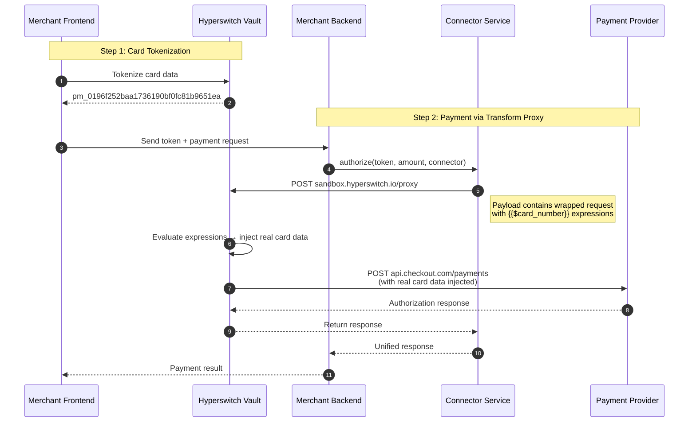
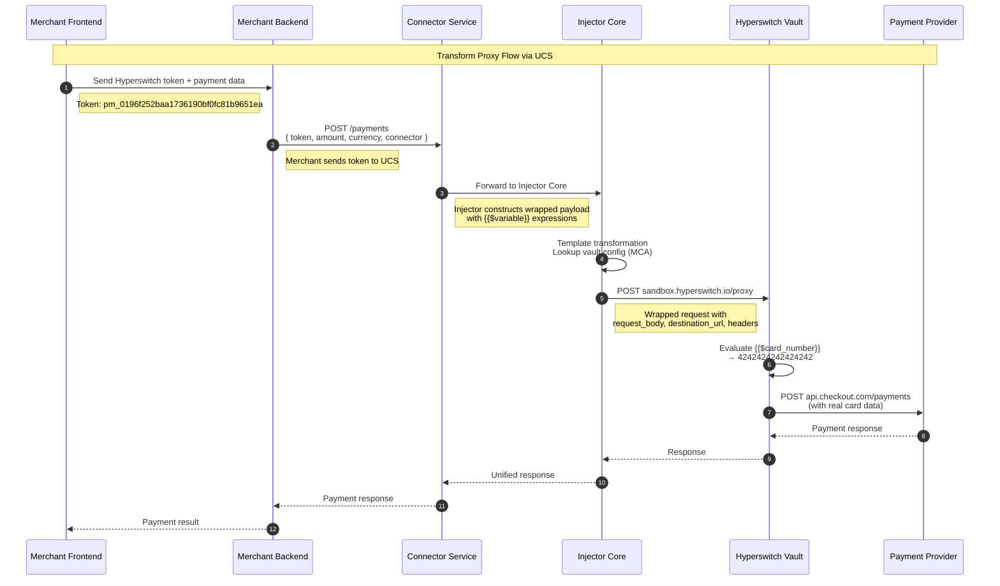

# Transform Proxy (Hyperswitch Vault)

> Explicit token transformation using expression syntax. Wrap your PSP request with metadata and use template expressions to mark where tokens should be detokenized.

---

## Overview

**Transform Proxy** gives you explicit control over token placement and request transformation. Instead of transparent detokenization, you use **expression syntax** (`{{$variable}}`) within a wrapped request structure that includes the destination URL, headers, and metadata.

| Aspect | Description |
|--------|-------------|
| **Integration Level** | Application layer |
| **Code Changes** | Required—use `{{$variable}}` expressions in wrapped request |
| **Token Handling** | Explicit—marked with expressions inside `request_body` |
| **Request Flow** | Your App → Transform Proxy → PSP |

---

## How It Works



---

## Example Provider: Hyperswitch Vault

| Attribute | Value |
|-----------|-------|
| **Documentation** | [Hyperswitch Docs](https://docs.hyperswitch.io) |
| **Proxy Type** | Transform Proxy with request wrapping |
| **Token Format** | `pm_xxx` (payment method ID) |
| **Expression Syntax** | `{{$card_number}}`, `{{$card_exp_month}}`, `{{$card_exp_year}}` |
| **Endpoint** | `https://sandbox.hyperswitch.io/proxy` |

### Token Format

Hyperswitch Vault uses payment method tokens:

```json
{
  "token": "pm_0196f252baa1736190bf0fc81b9651ea",
  "token_type": "payment_method_id"
}
```

---

## UCS Integration Flow

When integrating with UCS, the merchant sends tokens in the request body. UCS constructs the wrapped proxy payload with `{{$variable}}` expressions and routes it through the Transform Proxy.



---

## Code Examples

<details>
<summary><b>1. Direct Checkout.com Payment (Without Vault - DON'T DO THIS)</b></summary>

```bash
# DON'T: Direct API call to Checkout.com with raw card data
# This puts you in full PCI scope!

curl "https://api.checkout.com/payments" \
  -H "Authorization: Bearer sk_sbox_xxx" \
  -H "Content-Type: application/json" \
  -X "POST" \
  -d '{
    "source": {
      "type": "card",
      "number": "4242424242424242",
      "expiry_month": 12,
      "expiry_year": 2025
    },
    "amount": 6540,
    "currency": "USD"
  }'
```

**Problem:** Your server handles raw card data → Full PCI scope (SAQ D) ❌
</details>

<details>
<summary><b>2. Tokenize with Hyperswitch Vault</b></summary>

```bash
# Call Hyperswitch to tokenize card data
curl "https://sandbox.hyperswitch.io/vault/tokens" \
  -H "Content-Type: application/json" \
  -H "api-key: dev_xxxxxxxxxx" \
  -X "POST" \
  -d '{
    "payment_method": "card",
    "payment_method_type": "credit",
    "card": {
      "number": "4242424242424242",
      "expiry_month": "12",
      "expiry_year": "2025",
      "cvc": "123"
    }
  }'

# Response:
# {
#   "token": "pm_0196f252baa1736190bf0fc81b9651ea",
#   "token_type": "payment_method_id"
# }
```

**Store the `token`—this is what you'll use in payment requests.**
</details>

<details>
<summary><b>3. Payment via UCS + Transform Proxy (RECOMMENDED)</b></summary>

```bash
# Merchant Backend calls UCS (not Hyperswitch directly!)
# UCS handles expression construction and proxy routing

curl "https://api.connector-service.juspay.net/payments" \
  -H "Authorization: Bearer ${UCS_API_KEY}" \
  -H "Content-Type: application/json" \
  -X "POST" \
  -d '{
    "amount": 6540,
    "currency": "USD",
    "connector": "checkout",
    "payment_method": {
      "type": "card",
      "card": {
        "token": "pm_0196f252baa1736190bf0fc81b9651ea"
      }
    }
  }'
```

**What happens behind the scenes:**
1. UCS receives your request with the Hyperswitch token
2. UCS Injector constructs the wrapped proxy payload
3. Injector inserts `{{$card_number}}`, `{{$card_exp_month}}`, `{{$card_exp_year}}` expressions
4. Hyperswitch Vault evaluates expressions and detokenizes
5. Request flows to Checkout.com with real card data
6. Response flows back: Checkout.com → Hyperswitch → Injector → UCS → Your Backend

**Result:** You send simple token references. UCS handles the wrapped request complexity.
</details>

<details>
<summary><b>4. Direct Hyperswitch Proxy Call (Without UCS)</b></summary>

```bash
# If you called Hyperswitch Proxy directly (without UCS), it would look like this:
# This is what UCS Injector does internally for you

curl "https://sandbox.hyperswitch.io/proxy" \
  -H "Content-Type: application/json" \
  -H "Accept: application/json" \
  -H "X-Profile-Id: pro_xxxxxxxxxx" \
  -H "Authorization: api-key=dev_xxxxxxxxxx" \
  -H "api-key: dev_xxxxxxxxxx" \
  -X "POST" \
  -d '{
    "request_body": {
      "source": {
        "type": "card",
        "number": "{{$card_number}}",
        "expiry_month": "{{$card_exp_month}}",
        "expiry_year": "{{$card_exp_year}}"
      },
      "amount": 6540,
      "currency": "USD"
    },
    "destination_url": "https://api.checkout.com/payments",
    "headers": {
      "Content-Type": "application/json",
      "Authorization": "Bearer sk_sbox_xxx"
    },
    "token": "pm_0196f252baa1736190bf0fc81b9651ea",
    "token_type": "payment_method_id",
    "method": "POST"
  }'

# Hyperswitch Vault:
# 1. Receives wrapped request with {{$variable}} expressions
# 2. Looks up token pm_0196f252baa1736190bf0fc81b9651ea
# 3. Replaces {{$card_number}} with 4242424242424242
# 4. Forwards to destination_url with real values injected
```

**Note:** When using UCS, you don't make this call directly—the UCS Injector handles it!
</details>

---

## Expression Syntax Reference

### Basic Expressions

| Expression | Resolves To | Example Output |
|------------|-------------|----------------|
| `{{$card_number}}` | Card PAN | `4242424242424242` |
| `{{$card_exp_month}}` | Expiry month | `12` |
| `{{$card_exp_year}}` | Expiry year | `2025` |
| `{{$card_cvc}}` | Security code | `123` |

### Wrapped Request Structure

```json
{
  "request_body": {
    // Your PSP-specific payload with expressions
    "source": {
      "type": "card",
      "number": "{{$card_number}}",
      "expiry_month": "{{$card_exp_month}}",
      "expiry_year": "{{$card_exp_year}}"
    }
  },
  "destination_url": "https://api.checkout.com/payments",
  "headers": {
    "Content-Type": "application/json",
    "Authorization": "Bearer sk_sbox_xxx"
  },
  "token": "pm_0196f252baa1736190bf0fc81b9651ea",
  "token_type": "payment_method_id",
  "method": "POST"
}
```

---

## Configuration

### Hyperswitch Vault Setup

```yaml
# Hyperswitch Dashboard: Configure your vault
vault:
  name: "payment_vault"

# Proxy configuration
proxy:
  endpoint: "https://sandbox.hyperswitch.io/proxy"
  authentication:
    type: "api-key"
    key_header: "api-key"
```

### UCS Configuration

```yaml
# UCS config.yaml - Hyperswitch Vault
vault:
  provider: hyperswitch
  mode: transform_proxy
  api_url: https://sandbox.hyperswitch.io/proxy
  api_key: ${HYPERSWITCH_API_KEY}
  profile_id: ${HYPERSWITCH_PROFILE_ID}

connectors:
  checkout:
    api_key: ${CHECKOUT_API_KEY}
    vault_aware: true
    transform_config:
      expression_syntax: "{{$variable}}"
      supported_fields:
        - card_number
        - card_exp_month
        - card_exp_year
        - card_cvc
```

---

## When to Use Transform Proxy

| Scenario | Recommendation |
|----------|----------------|
| Need **explicit control** over token placement | ✅ Perfect fit |
| Want **request wrapping** with metadata | ✅ Built-in capability |
| Need to **preserve PSP payload structure** | ✅ Request body stays intact |
| Want **zero code changes** | ❌ Use Network Proxy |
| Simple URL routing only | ❌ Use Network Proxy |

### Choose Hyperswitch Vault if:
- You want familiar expression syntax (`{{$variable}}`)
- You need request wrapping with destination URL control
- You prefer keeping PSP payload structure unchanged

---

## Limitations

| Limitation | Details | Mitigation |
|------------|---------|------------|
| **Code Changes Required** | Must use wrapped request structure | Use UCS abstraction layer |
| **Expression Learning Curve** | Need to learn variable syntax | Docs + examples |
| **Request Construction** | Must build proxy-specific payloads | UCS handles this automatically |
| **Debug Complexity** | Expressions evaluated server-side | Enable verbose logging |

---

## Quick Reference

### Hyperswitch Vault Flow
```
┌─────────────────┐     ┌──────────────────────┐     ┌─────────────┐
│  Your Backend   │────▶│   Transform Proxy    │────▶│  Checkout   │
│                 │     │ (Hyperswitch Vault)  │     │             │
│ Sends: tokens   │     │ Evaluates {{$var}}   │     │ Receives:   │
│ with wrapping   │     │ Injects real values  │     │ real card   │
└─────────────────┘     └──────────────────────┘     └─────────────┘
```

**One-line Summary:** Wrap your PSP request with metadata and expressions. The proxy transforms tokens into real values at the marked locations.

---

## Related Documentation

- [Overview](./README.md) - PCI Compliance overview
- [Network Proxy](./network-proxy.md) - Alternative: Zero-code transparent proxy
- [Relay Proxy](./relay-proxy.md) - Alternative: Header-driven relay with token markers

---

_Need help? Join our [Discord](https://discord.gg/hyperswitch) or open a [GitHub Discussion](https://github.com/juspay/connector-service/discussions)._
