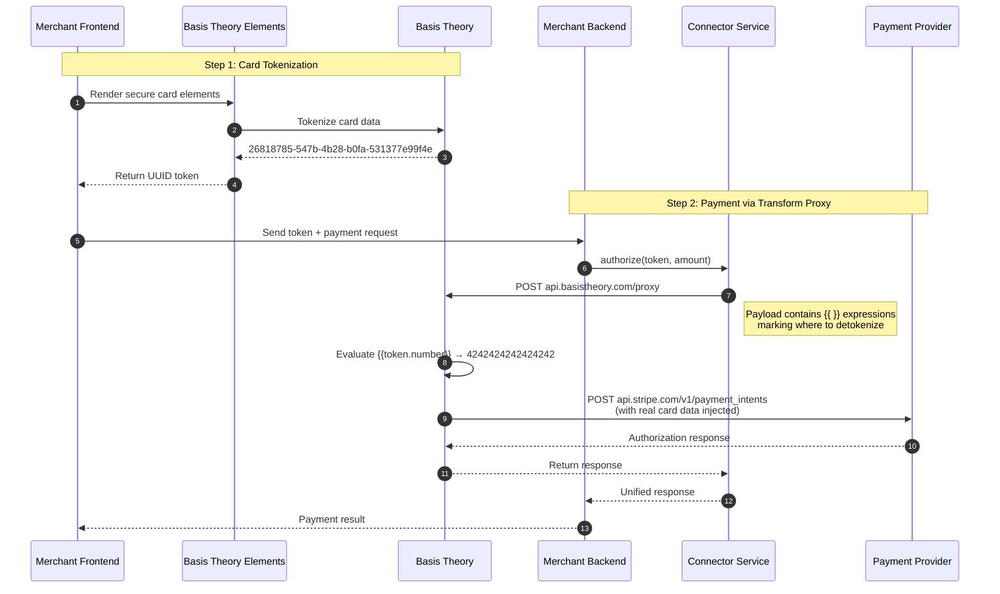
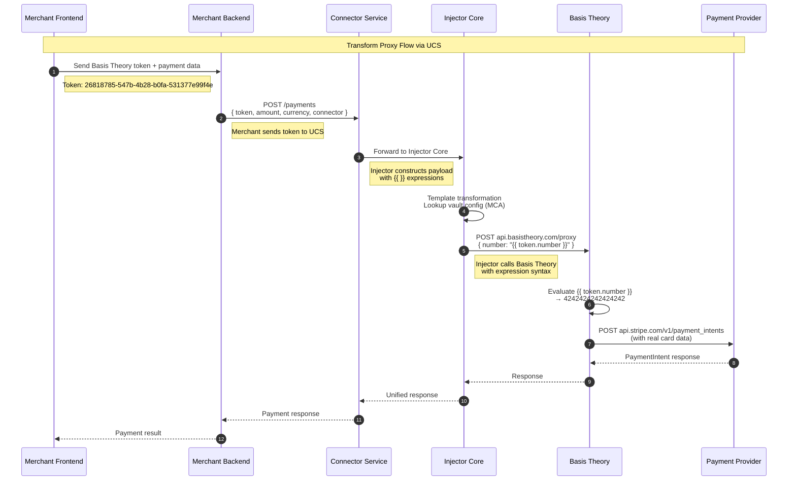

# Transform Proxy (Basis Theory, Skyflow)

> Explicit token transformation using expression syntax. Define exactly where tokens should be detokenized with template expressions.

---

## Overview

**Transform Proxy** gives you explicit control over token placement and request transformation. Instead of transparent detokenization, you use **expression syntax** (`{{ token_id.property }}`) to mark exactly where tokens should be replaced with real data.

| Aspect | Description |
|--------|-------------|
| **Integration Level** | Application layer |
| **Code Changes** | Required—use `{{ }}` expressions |
| **Token Handling** | Explicit—marked with expressions |
| **Request Flow** | Your App → Transform Proxy → PSP |

---

## How It Works



---

## Example Providers

### Basis Theory

| Attribute | Value |
|-----------|-------|
| **Documentation** | [Basis Theory Docs](https://developers.basistheory.com) |
| **Proxy Type** | Ephemeral or Pre-configured Proxy |
| **Token Format** | UUID `26818785-547b-4b28-b0fa-531377e99f4e` |
| **Expression Syntax** | `{{ token_id.property }}` |

#### Token Format

Basis Theory uses UUID tokens with clear structure:

```json
{
  "id": "26818785-547b-4b28-b0fa-531377e99f4e",
  "type": "card",
  "data": {
    "number": "4242424242424242",
    "expiration_month": 12,
    "expiration_year": 2025
  }
}
```

### Skyflow

| Attribute | Value |
|-----------|-------|
| **Documentation** | [Skyflow Docs](https://docs.skyflow.com) |
| **Proxy Type** | Connection (Detokenizing Proxy) |
| **Token Format** | UUID `f80c5d4a-...` (unstructured) or `tokens:card_number:...` (typed) |
| **Expression Syntax** | JSON paths with token references |

#### Token Format

Skyflow uses vault-specific tokens with granular access control:

```json
{
  "card_number": "f80c5d4a-5b6c-4e4f-8c3a-3b2a1c0d9e8f",
  "cvv": "a1b2c3d4-e5f6-7890-abcd-ef1234567890"
}
```

Skyflow's approach uses **Vault IDs** and **Connections** for secure detokenization:
- Data is stored in isolated vaults with fine-grained access policies
- Connection proxies securely detokenize and forward requests
- Supports column-level encryption and role-based access control

---

## UCS Integration Flow

When integrating with UCS, the merchant sends tokens in the request body. UCS constructs the payload with `{{ }}` expressions and routes it through the Transform Proxy.



---

## Code Examples

<details>
<summary><b>1. Direct Stripe Payment (Without Vault - DON'T DO THIS)</b></summary>

```bash
# DON'T: Direct API call to Stripe with raw card data
# This puts you in full PCI scope!

curl "https://api.stripe.com/v1/payment_intents" \
  -H "Authorization: Bearer sk_test_xxx" \
  -H "Content-Type: application/x-www-form-urlencoded" \
  -X "POST" \
  -d "amount=1000" \
  -d "currency=usd" \
  -d "payment_method_data[type]=card" \
  -d "payment_method_data[card][number]=4242424242424242" \
  -d "payment_method_data[card][exp_month]=12" \
  -d "confirm=true"
```

**Problem:** Your server handles raw card data → Full PCI scope (SAQ D) ❌
</details>

<details>
<summary><b>2. Tokenize with Basis Theory</b></summary>

```bash
# Call Basis Theory to tokenize card data
curl "https://api.basistheory.com/tokenize" \
  -H "BT-API-KEY: test_xxxxxxxxxx" \
  -H "Content-Type: application/json" \
  -X "POST" \
  -d '{
    "type": "card",
    "data": {
      "number": "4242424242424242",
      "expiration_month": 12,
      "expiration_year": 2025,
      "cvc": "123"
    }
  }'

# Response:
# {
#   "id": "26818785-547b-4b28-b0fa-531377e99f4e",
#   "type": "card",
#   "data": {
#     "number": "4242424242424242",
#     "expiration_month": 12,
#     "expiration_year": 2025,
#     "cvc": "123"
#   }
# }
```

**Store the `id` (token)—this is what you'll use in payment requests.**
</details>

<details>
<summary><b>3. Payment via UCS + Transform Proxy (RECOMMENDED)</b></summary>

```bash
# Merchant Backend calls UCS (not Basis Theory directly!)
# UCS handles expression construction and proxy routing

curl "https://api.connector-service.juspay.net/payments" \
  -H "Authorization: Bearer ${UCS_API_KEY}" \
  -H "Content-Type: application/json" \
  -X "POST" \
  -d '{
    "amount": 1000,
    "currency": "USD",
    "connector": "stripe",
    "payment_method": {
      "type": "card",
      "card": {
        "token": "26818785-547b-4b28-b0fa-531377e99f4e"
      }
    }
  }'
```

**What happens behind the scenes:**
1. UCS receives your request with the Basis Theory token
2. UCS Injector constructs the payload with `{{ }}` expressions
3. Injector calls Basis Theory proxy with `BT-PROXY-URL` header
4. Basis Theory evaluates expressions and detokenizes
5. Request flows to Stripe with real card data
6. Response flows back: Stripe → Basis Theory → Injector → UCS → Your Backend

**Result:** You send simple token references. UCS handles the expression complexity.
</details>

<details>
<summary><b>4. Direct Basis Theory Call (Without UCS)</b></summary>

```bash
# If you called Basis Theory directly (without UCS), it would look like this:
# This is what UCS Injector does internally for you

curl "https://api.basistheory.com/proxy" \
  -H "BT-API-KEY: test_xxxxxxxxxx" \
  -H "BT-PROXY-URL: https://api.stripe.com/v1/payment_intents" \
  -H "Content-Type: application/x-www-form-urlencoded" \
  -X "POST" \
  -d "amount=1000" \
  -d "currency=usd" \
  -d "payment_method_data[type]=card" \
  -d "payment_method_data[card][number]={{ 26818785-547b-4b28-b0fa-531377e99f4e.number }}" \
  -d "confirm=true"

# Basis Theory:
# 1. Receives request with {{ }} expressions
# 2. Looks up token 26818785-547b-...
# 3. Replaces {{ token.number }} with 4242424242424242
# 4. Forwards to Stripe with real values injected
```

**Note:** When using UCS, you don't make this call directly—the UCS Injector handles it!
</details>

<details>
<summary><b>4. Alternative: JSON Payload with Expressions</b></summary>

```bash
# For APIs that accept JSON, use expressions in JSON fields
curl "https://api.basistheory.com/proxy" \
  -H "BT-API-KEY: test_xxxxxxxxxx" \
  -H "BT-PROXY-URL: https://api.stripe.com/v1/payment_intents" \
  -H "Content-Type: application/json" \
  -X "POST" \
  -d '{
    "amount": 1000,
    "currency": "usd",
    "payment_method_types": ["card"],
    "payment_method_data": {
      "type": "card",
      "card": {
        "number": "{{ 26818785-547b-4b28-b0fa-531377e99f4e.number }}",
        "exp_month": "{{ 26818785-547b-4b28-b0fa-531377e99f4e.expiration_month }}",
        "exp_year": "{{ 26818785-547b-4b28-b0fa-531377e99f4e.expiration_year }}"
      }
    },
    "confirm": true
  }'
```
</details>

<details>
<summary><b>5. Tokenize with Skyflow</b></summary>

```bash
# Call Skyflow to tokenize card data
curl "https://vault.skyflow.com/v1/vaults/VAULT_ID/tokens" \
  -H "Authorization: Bearer ${SKYFLOW_BEARER_TOKEN}" \
  -H "Content-Type: application/json" \
  -X "POST" \
  -d '{
    "records": [
      {
        "fields": {
          "card_number": "4242424242424242",
          "expiry_month": "12",
          "expiry_year": "2025",
          "cvv": "123"
        }
      }
    ]
  }'

# Response:
# {
#   "records": [
#     {
#       "card_number": "f80c5d4a-5b6c-4e4f-8c3a-3b2a1c0d9e8f",
#       "expiry_month": "a1b2c3d4-e5f6-7890-abcd-ef1234567890",
#       "expiry_year": "b2c3d4e5-f6a7-8901-bcde-f23456789012",
#       "cvv": "c3d4e5f6-a7b8-9012-cdef-345678901234"
#     }
#   ]
# }
```

**Store the token values—these are what you'll use in payment requests.**
</details>

<details>
<summary><b>6. Direct Skyflow Call (Without UCS)</b></summary>

```bash
# If you called Skyflow directly (without UCS), it would look like this:
# This is what UCS Injector does internally for you

# First, create a Connection in Skyflow Dashboard pointing to Stripe
# Then call the Connection endpoint with tokens

curl "https://connection.skyflow.com/v1/connections/stripe-connection/payment_intents" \
  -H "Authorization: Bearer ${SKYFLOW_CONNECTION_TOKEN}" \
  -H "Content-Type: application/json" \
  -X "POST" \
  -d '{
    "amount": 1000,
    "currency": "usd",
    "payment_method_types": ["card"],
    "payment_method_data": {
      "type": "card",
      "card": {
        "number": {
          "skyflow_id": "f80c5d4a-5b6c-4e4f-8c3a-3b2a1c0d9e8f",
          "redaction": "PLAIN_TEXT"
        },
        "exp_month": {
          "skyflow_id": "a1b2c3d4-e5f6-7890-abcd-ef1234567890",
          "redaction": "PLAIN_TEXT"
        },
        "exp_year": {
          "skyflow_id": "b2c3d4e5-f6a7-8901-bcde-f23456789012",
          "redaction": "PLAIN_TEXT"
        }
      }
    },
    "confirm": true
  }'

# Skyflow Connection:
# 1. Receives request with token references
# 2. Looks up tokens in vault using skyflow_id
# 3. Detokenizes and injects real values
# 4. Forwards to Stripe with real card data
# 5. Returns Stripe's response
```

**Note:** When using UCS, you don't make this call directly—the UCS Injector constructs the Skyflow Connection request for you!
</details>

---

## Expression Syntax Reference

### Basic Expressions

| Expression | Resolves To | Example Output |
|------------|-------------|----------------|
| `{{ token_id }}` | Full token data object | `{ "number": "4242...", "cvc": "123" }` |
| `{{ token_id.number }}` | Specific property | `4242424242424242` |
| `{{ token_id.expiration_month }}` | Nested property | `12` |
| `{{ token_id.expiration_year }}` | Nested property | `2025` |

### Advanced Expressions

```javascript
// String concatenation
"card_{{ token_id.number }}_ending"
// → "card_4242424242424242_ending"

// Array access
"{{ token_id.cards[0].number }}"

// Conditional (Liquid syntax)
"{{ token_id.cvc | default: '000' }}"
```

---

## Configuration

### Basis Theory Setup

```yaml
# Basis Theory Dashboard: Create a Proxy
proxy:
  name: "stripe-payments"
  destination_url: "https://api.stripe.com"
  require_auth: true

  # Optional: Custom transformations
  request_transform: |
    // Modify request before forwarding
    body.amount = body.amount * 100; // cents to dollars

  response_transform: |
    // Tokenize sensitive response fields
    body.payment_method.id = tokenize(body.payment_method.id);
```

### Skyflow Setup

```yaml
# Skyflow Dashboard: Vault and Connection Configuration
vault:
  id: "VAULT_ID"
  name: "payment_vault"

  # Schema for card data
  tables:
    - name: "cards"
      fields:
        - name: "card_number"
          type: "string"
          sensitive: true
        - name: "expiry_month"
          type: "string"
          sensitive: true
        - name: "expiry_year"
          type: "string"
          sensitive: true
        - name: "cvv"
          type: "string"
          sensitive: true

# Connection: Detokenizing proxy to Stripe
connection:
  name: "stripe-connection"
  type: "detokenizing_proxy"
  destination_url: "https://api.stripe.com"
  vault_id: "VAULT_ID"

  # Token mappings
  request_mapping:
    - field: "payment_method_data[card][number]"
      vault_column: "cards.card_number"
    - field: "payment_method_data[card][exp_month]"
      vault_column: "cards.expiry_month"
    - field: "payment_method_data[card][exp_year]"
      vault_column: "cards.expiry_year"
```

### UCS Configuration

```yaml
# UCS config.yaml - Basis Theory
vault:
  provider: basis_theory
  mode: transform_proxy
  api_url: https://api.basistheory.com/proxy
  api_key: ${BASIS_THEORY_API_KEY}

connectors:
  stripe:
    api_key: ${STRIPE_API_KEY}
    vault_aware: true
    transform_config:
      expression_syntax: "{{ }}"
      token_properties:
        - number
        - expiration_month
        - expiration_year
        - cvc
```

```yaml
# UCS config.yaml - Skyflow
vault:
  provider: skyflow
  mode: transform_proxy
  vault_id: ${SKYFLOW_VAULT_ID}
  connection_url: https://connection.skyflow.com/v1/connections

connectors:
  stripe:
    api_key: ${STRIPE_API_KEY}
    vault_aware: true
    transform_config:
      connection_name: "stripe-connection"
      token_mapping:
        card_number:
          vault_column: "cards.card_number"
        exp_month:
          vault_column: "cards.expiry_month"
        exp_year:
          vault_column: "cards.expiry_year"
```

---

## Provider Comparison

| Aspect | Basis Theory | Skyflow |
|--------|--------------|---------|
| **Token Format** | UUID `26818785-...` | UUID `f80c5d4a-...` |
| **Expression Syntax** | `{{ token.property }}` | JSON path with `skyflow_id` |
| **Proxy Model** | Ephemeral/Pre-configured | Connection (Detokenizing) |
| **Customization** | Liquid/Node.js transforms | Request mapping rules |
| **Access Control** | API key + permissions | Vault policies + roles |
| **Regional Data** | Limited | Strong (data residency) |

## Comparison: Before vs After

| Aspect | Without Vault | With Transform Proxy |
|--------|---------------|----------------------|
| **Payload** | `number=4242424242424242` | Template expressions |
| **Control** | Direct card handling | Explicit token placement |
| **Code Changes** | None (baseline) | Add template expressions |
| **Flexibility** | None | High—custom transforms |
| **PCI Scope** | SAQ D (Full) | SAQ A or A-EP (Reduced) |
| **Visibility** | Raw data | Tokens with clear mapping |

---

## When to Use Transform Proxy

| Scenario | Recommendation |
|----------|----------------|
| Need **explicit control** over token placement | ✅ Perfect fit |
| Using **Basis Theory** or **Skyflow** | ✅ Native support |
| Want **custom transformations** | ✅ Built-in capability |
| Multiple vault providers | ✅ Portable expressions |
| Need **data residency** control | ✅ Skyflow supports this |
| Want **zero code changes** | ❌ Use Network Proxy |
| Simple URL routing only | ❌ Use Network Proxy |

### Choose Basis Theory if:
- You want familiar expression syntax (`{{ }}`)
- You need Liquid/Node.js custom transformations
- You prefer ephemeral (on-the-fly) proxies

### Choose Skyflow if:
- You need strong data residency controls
- You want vault-per-tenant isolation
- You prefer granular access policies
- You need column-level encryption controls

---

## Limitations

| Limitation | Details | Mitigation |
|------------|---------|------------|
| **Code Changes Required** | Must add `{{ }}` expressions | Use SDK helpers |
| **Expression Learning Curve** | Need to learn Liquid syntax | Docs + examples |
| **Request Construction** | Must build proxy-specific payloads | UCS abstraction layer |
| **Debug Complexity** | Expressions evaluated server-side | Enable verbose logging |

---

## Quick Reference

### Basis Theory Flow
```
┌─────────────────┐     ┌──────────────────────┐     ┌─────────────┐
│  Your Backend   │────▶│   Transform Proxy    │────▶│    Stripe   │
│                 │     │   (Basis Theory)     │     │             │
│ Sends: tokens   │     │ Evaluates {{ }} expr │     │ Receives:   │
│ with {{ }}      │     │ Injects real values  │     │ real card   │
└─────────────────┘     └──────────────────────┘     └─────────────┘
```

### Skyflow Flow
```
┌─────────────────┐     ┌──────────────────────┐     ┌─────────────┐
│  Your Backend   │────▶│      Skyflow         │────▶│    Stripe   │
│                 │     │    Connection        │     │             │
│ Sends: tokens   │     │ Detokenizes via      │     │ Receives:   │
│                 │     │ vault lookup         │     │ real card   │
└─────────────────┘     └──────────────────────┘     └─────────────┘
```

**One-line Summary:** Mark token locations with expressions. The proxy transforms them into real values.

---

## Related Documentation

- [Overview](./README.md) - PCI Compliance overview
- [Network Proxy](./network-proxy.md) - Alternative: Zero-code transparent proxy
- [Relay Proxy](./relay-proxy.md) - Alternative: Header-driven relay

---

_Need help? Join our [Discord](https://discord.gg/hyperswitch) or open a [GitHub Discussion](https://github.com/juspay/connector-service/discussions)._
