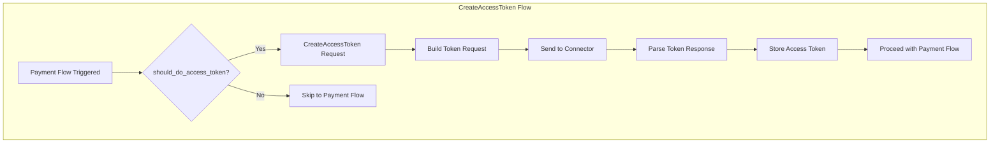

# CreateAccessToken Flow Implementation Patterns

## Overview

The `CreateAccessToken` flow is a crucial authentication flow in the Grace-UCS connector ecosystem. It handles OAuth 2.0 token acquisition for connectors that require bearer tokens to authenticate API requests. This pattern is typically invoked before payment flows when `should_do_access_token()` returns `true`.

### When to Use CreateAccessToken

- **OAuth-based connectors**: When the connector API uses OAuth 2.0 for authentication
- **Token expiration**: When stored access tokens have expired and need refresh
- **First-time authentication**: When no valid access token exists for the connector

## Architecture



## Core Components

### 1. Flow Definition

The CreateAccessToken flow is defined in `domain_types::connector_flow::CreateAccessToken`:

```rust
pub struct CreateAccessToken;

impl ConnectorFlow for CreateAccessToken {
    type Request = AccessTokenRequestData;
    type Response = AccessTokenResponseData;
}
```

### 2. Data Types

#### Request Data
```rust
// AccessTokenRequestData - Empty struct, auth details come from connector_auth_type
pub struct AccessTokenRequestData;
```

#### Response Data
```rust
pub struct AccessTokenResponseData {
    pub access_token: Secret<String>,
    pub expires_in: Option<i64>,      // Token expiration in seconds
    pub token_type: Option<String>,   // e.g., "Bearer"
}
```

### 3. Trait Implementation

Connectors implement `PaymentAccessToken` trait to enable this flow:

```rust
impl<T: PaymentMethodDataTypes + Debug + Sync + Send + 'static + Serialize>
    connector_types::PaymentAccessToken for ConnectorName<T>
{
}
```

Additionally, connectors must implement `ValidationTrait` to indicate when access token is needed:

```rust
impl<T: PaymentMethodDataTypes + Debug + Sync + Send + 'static + Serialize>
    connector_types::ValidationTrait for ConnectorName<T>
{
    fn should_do_access_token(&self, _payment_method: common_enums::PaymentMethod) -> bool {
        true  // Return true if access token is required
    }
}
```

## Implementation Patterns

### Pattern 1: OAuth 2.0 Client Credentials Grant (Full Implementation)

Used by connectors like **Volt**, **Airwallex**, **Getnet**, **Jpmorgan**, **Trustpay**.

#### Request Structure

```rust
#[derive(Debug, Clone, Serialize, PartialEq)]
pub struct ConnectorAuthUpdateRequest {
    grant_type: String,           // "client_credentials" or "password"
    client_id: Secret<String>,
    client_secret: Secret<String>,
    // Optional fields depending on connector
    username: Secret<String>,     // For password grant
    password: Secret<String>,     // For password grant
    scope: Option<String>,        // OAuth scopes
}
```

#### Response Structure

```rust
#[derive(Debug, Clone, Deserialize, Serialize)]
pub struct ConnectorAuthUpdateResponse {
    pub access_token: Secret<String>,
    pub token_type: String,       // "Bearer"
    pub expires_in: i64,          // Seconds until expiration
    pub scope: Option<String>,    // Granted scopes (optional)
}
```

#### Example: Volt Implementation

**Step 1: Define Auth Type**
```rust
#[derive(Debug, Clone)]
pub struct VoltAuthType {
    pub client_id: Secret<String>,
    pub client_secret: Secret<String>,
    pub username: Secret<String>,
    pub password: Secret<String>,
}

impl TryFrom<&ConnectorAuthType> for VoltAuthType {
    type Error = error_stack::Report<errors::ConnectorError>;

    fn try_from(auth_type: &ConnectorAuthType) -> Result<Self, Self::Error> {
        if let ConnectorAuthType::SignatureKey {
            api_key,
            key1,
            api_secret,
            key2,
        } = auth_type
        {
            Ok(Self {
                client_id: api_key.clone(),
                client_secret: api_secret.clone(),
                username: key1.clone(),
                password: key2.clone(),
            })
        } else {
            Err(error_stack::report!(
                errors::ConnectorError::FailedToObtainAuthType
            ))
        }
    }
}
```

**Step 2: Define Request Type**
```rust
#[derive(Debug, Clone, Serialize, PartialEq)]
pub struct VoltAuthUpdateRequest {
    grant_type: String,
    client_id: Secret<String>,
    client_secret: Secret<String>,
    username: Secret<String>,
    password: Secret<String>,
}

impl TryFrom<&ConnectorAuthType> for VoltAuthUpdateRequest {
    type Error = error_stack::Report<errors::ConnectorError>;

    fn try_from(auth_type: &ConnectorAuthType) -> Result<Self, Self::Error> {
        let auth = VoltAuthType::try_from(auth_type)?;
        Ok(Self {
            grant_type: "password".to_string(),
            username: auth.username,
            password: auth.password,
            client_id: auth.client_id,
            client_secret: auth.client_secret,
        })
    }
}

// Router data conversion
impl<T: PaymentMethodDataTypes + std::fmt::Debug + Sync + Send + 'static + Serialize>
    TryFrom<
        VoltRouterData<
            RouterDataV2<
                CreateAccessToken,
                PaymentFlowData,
                AccessTokenRequestData,
                AccessTokenResponseData,
            >,
            T,
        >,
    > for VoltAuthUpdateRequest
{
    type Error = error_stack::Report<errors::ConnectorError>;

    fn try_from(
        item: VoltRouterData<...>,
    ) -> Result<Self, Self::Error> {
        Self::try_from(&item.router_data.connector_auth_type)
    }
}
```

**Step 3: Define Response Type**
```rust
#[derive(Debug, Clone, Deserialize, Serialize)]
pub struct VoltAuthUpdateResponse {
    pub access_token: Secret<String>,
    pub token_type: String,
    pub expires_in: i64,
}

// Response conversion to domain type
impl<F, T> TryFrom<ResponseRouterData<VoltAuthUpdateResponse, Self>>
    for RouterDataV2<F, PaymentFlowData, T, AccessTokenResponseData>
{
    type Error = error_stack::Report<errors::ConnectorError>;

    fn try_from(
        item: ResponseRouterData<VoltAuthUpdateResponse, Self>,
    ) -> Result<Self, Self::Error> {
        Ok(Self {
            response: Ok(AccessTokenResponseData {
                access_token: item.response.access_token,
                expires_in: Some(item.response.expires_in),
                token_type: Some(item.response.token_type),
            }),
            ..item.router_data
        })
    }
}
```

**Step 4: Register in Macro**
```rust
macros::create_all_prerequisites!(
    connector_name: Volt,
    generic_type: T,
    api: [
        (
            flow: CreateAccessToken,
            request_body: VoltAuthUpdateRequest,
            response_body: VoltAuthUpdateResponse,
            router_data: RouterDataV2<CreateAccessToken, PaymentFlowData, AccessTokenRequestData, AccessTokenResponseData>,
        ),
        // ... other flows
    ]
);
```

### Pattern 2: Empty Request Body (Airwallex)

Some connectors like **Airwallex** require an empty request body for token generation:

```rust
// Empty request body for CreateAccessToken - Airwallex requires empty JSON object {}
#[derive(Debug, Serialize)]
pub struct AirwallexAccessTokenRequest {
    // Empty struct that serializes to {} - Airwallex API requirement
}

// Auth is passed via Basic Auth header (client_id:client_secret base64 encoded)
```

**Key Characteristics:**
- Uses `BodyKey` auth type (api_key + key1)
- Client ID and secret sent via HTTP Basic Authentication header
- Empty JSON body `{}` in request

### Pattern 3: OAuth with Base64 Encoding (PayPal)

**PayPal** uses a specific authentication approach with Base64 encoding:

```rust
pub const BASE64_ENGINE: base64::engine::GeneralPurpose = base64::engine::general_purpose::STANDARD;

// Auth header generation
fn auth_headers(
    client_id: &Secret<String>,
    client_secret: &Secret<String>,
) -> CustomResult<String, ConnectorError> {
    let auth = format!(
        "{}:{}",
        client_id.expose(),
        client_secret.expose()
    );
    Ok(BASE64_ENGINE.encode(auth))
}

// Request uses form-urlencoded body
#[derive(Debug, Serialize)]
pub struct PaypalAuthUpdateRequest {
    grant_type: String,
    scope: Option<String>,
}

// Response includes additional fields
#[derive(Debug, Clone, Deserialize, Serialize)]
pub struct PaypalAuthUpdateResponse {
    pub access_token: Secret<String>,
    pub token_type: String,
    pub expires_in: i64,
    pub scope: String,
}
```

### Pattern 4: Stub Implementation

Most connectors (60+) use stub implementations when OAuth is not required:

```rust
impl<T: PaymentMethodDataTypes + Debug + Sync + Send + 'static + Serialize>
    connector_types::ValidationTrait for ConnectorName<T>
{
    fn should_do_access_token(&self, _payment_method: common_enums::PaymentMethod) -> bool {
        false  // OAuth not required
    }
}

impl<T: PaymentMethodDataTypes + Debug + Sync + Send + 'static + Serialize>
    connector_types::PaymentAccessToken for ConnectorName<T>
{
}
```

## Request/Response Conversion Matrix

| Connector | Grant Type | Auth Header | Request Body | Auth Type |
|-----------|------------|-------------|--------------|-----------|
| Airwallex | Implicit (Basic Auth) | Basic base64(client_id:client_secret) | `{}` | BodyKey |
| Getnet | Client Credentials | Basic base64(client_id:client_secret) | Form params | BodyKey |
| Iatapay | Client Credentials | None | JSON body | SignatureKey |
| Jpmorgan | Client Credentials | None | JSON body | BodyKey |
| Paypal | Client Credentials | Basic base64(client_id:client_secret) | Form params | BodyKey |
| Trustpay | Password Grant | None | Form params | SignatureKey |
| Volt | Password Grant | None | Form params | SignatureKey |

## Error Handling Patterns

### Common Error Scenarios

```rust
// Failed to obtain auth type
Err(error_stack::report!(
    errors::ConnectorError::FailedToObtainAuthType
))

// Missing required fields
Err(errors::ConnectorError::MissingRequiredField {
    field_name: "client_id",
})
.into())
```

### Error Response Handling

```rust
#[derive(Debug, Clone, Serialize, Deserialize)]
pub struct ConnectorTokenErrorResponse {
    pub error: String,           // OAuth error code
    pub error_description: String,
}

// Convert to domain error response
impl<F, T> TryFrom<ResponseRouterData<ConnectorTokenErrorResponse, Self>>
    for RouterDataV2<F, PaymentFlowData, T, AccessTokenResponseData>
{
    type Error = error_stack::Report<errors::ConnectorError>;

    fn try_from(
        item: ResponseRouterData<ConnectorTokenErrorResponse, Self>,
    ) -> Result<Self, Self::Error> {
        Ok(Self {
            response: Err(ErrorResponse {
                code: item.response.error,
                message: item.response.error_description,
                ..Default::default()
            }),
            ..item.router_data
        })
    }
}
```

## URL Patterns

### Sandbox vs Production

```rust
fn get_url(
    &self,
    _req: &RouterDataV2<CreateAccessToken, PaymentFlowData, AccessTokenRequestData, AccessTokenResponseData>,
    _connectors: &Connectors,
) -> CustomResult<String, errors::ConnectorError> {
    let base_url = self.base_url(_connectors);
    Ok(format!("{}/oauth/token", base_url))
}
```

Common token endpoint patterns:
- `/oauth/token` - Standard OAuth 2.0
- `/v1/oauth2/token` - PayPal style
- `/api/v1/token` - Custom endpoints

## Header Patterns

### Content-Type Headers

| Connector | Content-Type |
|-----------|--------------|
| Airwallex | `application/json` |
| Getnet | `application/x-www-form-urlencoded` |
| Paypal | `application/x-www-form-urlencoded` |
| Trustpay | `application/x-www-form-urlencoded` |
| Volt | `application/x-www-form-urlencoded` |

### Authorization Headers

```rust
// Basic Auth pattern
pub fn get_headers(
    &self,
    req: &RouterDataV2<CreateAccessToken, PaymentFlowData, AccessTokenRequestData, AccessTokenResponseData>,
    _connectors: &Connectors,
) -> CustomResult<Vec<(String, Maskable<String>)>, errors::ConnectorError> {
    let auth = ConnectorAuthType::try_from(&req.connector_auth_type)?;
    let credentials = format!("{}:{}", auth.client_id.expose(), auth.client_secret.expose());
    let encoded = BASE64_ENGINE.encode(credentials);

    Ok(vec![
        (
            headers::AUTHORIZATION.to_string(),
            format!("Basic {}", encoded).into_masked(),
        ),
        (
            headers::CONTENT_TYPE.to_string(),
            "application/x-www-form-urlencoded".to_string().into_masked(),
        ),
    ])
}
```

## Testing Patterns

### Unit Test Example

```rust
#[cfg(test)]
mod tests {
    use super::*;

    #[test]
    fn test_auth_update_request_conversion() {
        let auth_type = ConnectorAuthType::SignatureKey {
            api_key: Secret::new("client_id".to_string()),
            key1: Secret::new("username".to_string()),
            api_secret: Secret::new("client_secret".to_string()),
            key2: Secret::new("password".to_string()),
        };

        let request = VoltAuthUpdateRequest::try_from(&auth_type).unwrap();

        assert_eq!(request.grant_type, "password");
        assert_eq!(request.client_id.expose(), "client_id");
        assert_eq!(request.username.expose(), "username");
    }

    #[test]
    fn test_auth_update_response_conversion() {
        let response = VoltAuthUpdateResponse {
            access_token: Secret::new("test_token".to_string()),
            token_type: "Bearer".to_string(),
            expires_in: 3600,
        };

        // Verify conversion to AccessTokenResponseData
        let domain_response: AccessTokenResponseData = response.into();
        assert_eq!(domain_response.token_type, Some("Bearer".to_string()));
        assert_eq!(domain_response.expires_in, Some(3600));
    }
}
```

## Integration Guidelines

### Step-by-Step Implementation

1. **Identify Auth Type**: Determine which `ConnectorAuthType` variant holds OAuth credentials
   - `BodyKey { api_key, key1 }` - Common for client_id/client_secret
   - `SignatureKey { api_key, key1, api_secret, key2 }` - For 4-field auth

2. **Create Auth Type Struct**: Define a struct to hold parsed credentials
   ```rust
   pub struct ConnectorAuthType {
       pub client_id: Secret<String>,
       pub client_secret: Secret<String>,
   }
   ```

3. **Implement TryFrom for Auth Type**:
   ```rust
   impl TryFrom<&ConnectorAuthType> for YourAuthType { ... }
   ```

4. **Create Request/Response Types**: Define serializable/deserializable structs

5. **Implement Conversions**:
   - `TryFrom<&ConnectorAuthType>` for request
   - `TryFrom<RouterData<...>>` for request
   - `TryFrom<ResponseRouterData<...>>` for response

6. **Register in Macro**: Add to `create_all_prerequisites!` macro call

7. **Enable Validation**: Implement `ValidationTrait::should_do_access_token`

8. **Implement PaymentAccessToken**: Add empty trait impl

## Common Pitfalls

### 1. Auth Type Mismatch
Ensure your `TryFrom<&ConnectorAuthType>` handles the correct variant:
```rust
// WRONG - This will fail at runtime if wrong variant is used
if let ConnectorAuthType::BodyKey { ... } = auth_type { ... }

// CORRECT - Return proper error
match auth_type {
    ConnectorAuthType::BodyKey { ... } => Ok(...),
    _ => Err(error_stack::report!(
        errors::ConnectorError::FailedToObtainAuthType
    )),
}
```

### 2. Missing Expires In
Always handle optional `expires_in`:
```rust
// Good - Handle missing expiration
pub expires_in: Option<i64>,

// Bad - Assumes always present
pub expires_in: i64,
```

### 3. Secret Exposure
Always use `Secret<String>` for sensitive data:
```rust
// Good
pub access_token: Secret<String>,

// Bad - Token will be logged!
pub access_token: String,
```

## References

- [OAuth 2.0 Specification](https://tools.ietf.org/html/rfc6749)
- [Pattern: Authorize Flow](./pattern_authorize.md)
- [Pattern: PSync Flow](./pattern_psync.md)
- [Grace-UCS Architecture](./ucs-architecture.md)

## Full Implementation Examples

### Volt (Password Grant)
See: `connectors/volt/transformers.rs` lines 308-381

### Airwallex (Empty Body + Basic Auth)
See: `connectors/airwallex/transformers.rs` lines 54-65

### PayPal (Client Credentials + Base64)
See: `connectors/paypal/transformers.rs` lines 1274+

## Summary

The CreateAccessToken flow follows a consistent pattern across all connectors:

1. **Define types** for authentication credentials
2. **Implement conversions** from domain types to connector-specific types
3. **Register in macro** for automatic trait implementation
4. **Enable validation** to trigger token acquisition when needed

The key variations are:
- **Grant type**: `client_credentials`, `password`, or implicit
- **Auth transport**: HTTP Basic header vs request body
- **Content type**: JSON vs form-urlencoded
- **Request body**: Empty vs populated with credentials
