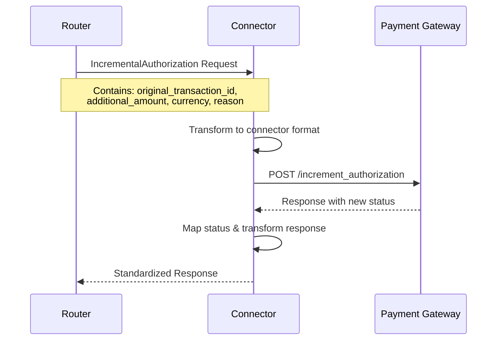

# IncrementalAuthorization Flow Pattern for Connector Implementation

**🎯 GENERIC PATTERN FILE FOR ANY NEW CONNECTOR**

This document provides comprehensive, reusable patterns for implementing the IncrementalAuthorization flow in **ANY** payment connector. IncrementalAuthorization allows merchants to increase the authorized amount for a previously authorized payment, which is commonly used in scenarios like adding tips, handling additional charges, or adjusting for shipping costs after initial authorization.

## 🚀 Quick Start Guide

To implement a new connector using these patterns:

1. **Choose Your Pattern**: Use [Modern Macro-Based Pattern](#modern-macro-based-pattern-recommended) for 95% of connectors
2. **Replace Placeholders**: Follow the [Placeholder Reference Guide](#placeholder-reference-guide)
3. **Select Components**: Choose auth type, request format, and amount converter based on your connector's API
4. **Follow Checklist**: Use the [Integration Checklist](#integration-checklist) to ensure completeness

### Example: Implementing "NewPayment" Connector

```bash
# Replace placeholders:
{ConnectorName} → NewPayment
{connector_name} → new_payment
{AmountType} → StringMinorUnit (if API expects "1000" for $10.00)
{content_type} → "application/json" (if API uses JSON)
{api_endpoint} → "v1/payments/{id}/increment" (your API endpoint)
```

**✅ Result**: Complete, production-ready connector implementation in ~20 minutes

## Table of Contents

1. [Overview](#overview)
2. [Modern Macro-Based Pattern (Recommended)](#modern-macro-based-pattern-recommended)
3. [Legacy Manual Pattern (Reference)](#legacy-manual-pattern-reference)
4. [Authentication Patterns](#authentication-patterns)
5. [Request/Response Format Variations](#requestresponse-format-variations)
6. [Error Handling Patterns](#error-handling-patterns)
7. [Testing Patterns](#testing-patterns)
8. [Common Helper Functions](#common-helper-functions)
9. [Integration Checklist](#integration-checklist)

## Overview

The IncrementalAuthorization flow allows increasing the authorized amount of a previously authorized payment transaction. This is essential for:

- **Tip adjustments** in hospitality industry
- **Shipping cost additions** after order processing
- **Service upgrades** or additional items
- **Currency conversion adjustments**
- **Delayed surcharge applications**

### Key Components:

- **Main Connector File**: Implements traits and flow logic
- **Transformers File**: Handles request/response data transformations
- **Authentication**: Manages API credentials and headers
- **Error Handling**: Processes and maps error responses
- **Status Mapping**: Converts connector statuses to standard statuses

### Flow Architecture



### Data Flow Types

```rust
// Request data structure
PaymentsIncrementalAuthorizationData {
    minor_amount: MinorUnit,           // Additional amount to authorize
    currency: Currency,                // Currency of the additional amount
    reason: Option<String>,            // Reason for incremental authorization
    connector_transaction_id: ResponseId,  // Original transaction ID
    connector_metadata: Option<SecretSerdeValue>,  // Connector-specific metadata
}

// Response data structure
PaymentsResponseData::TransactionResponse {
    resource_id: ResponseId,           // Transaction reference
    redirection_data: Option<RedirectForm>,  // 3DS redirect if needed
    mandate_reference: Option<MandateReferenceId>,
    connector_metadata: Option<SecretSerdeValue>,
    network_txn_id: Option<String>,
    connector_response_reference_id: Option<String>,
    incremental_authorization_allowed: Option<bool>,
    status_code: u16,
}
```

## Modern Macro-Based Pattern (Recommended)

This is the current recommended approach using the macro framework for maximum code reuse and consistency.

### File Structure Template

```
connector-service/backend/connector-integration/src/connectors/
├── {connector_name}.rs           # Main connector implementation
└── {connector_name}/
    └── transformers.rs           # Data transformation logic
```

### Main Connector File Pattern

```rust
// File: backend/connector-integration/src/connectors/{connector_name}.rs

pub mod transformers;

use common_utils::{errors::CustomResult, ext_traits::ByteSliceExt};
use domain_types::{
    connector_flow::{
        Accept, Authenticate, Authorize, Capture, CreateAccessToken, CreateConnectorCustomer,
        CreateOrder, CreateSessionToken, DefendDispute, IncrementalAuthorization, MandateRevoke,
        PSync, PaymentMethodToken, PostAuthenticate, PreAuthenticate, RSync, Refund, RepeatPayment,
        SdkSessionToken, SetupMandate, SubmitEvidence, Void, VoidPC,
    },
    connector_types::{
        AcceptDisputeData, AccessTokenRequestData, AccessTokenResponseData, ConnectorCustomerData,
        ConnectorCustomerResponse, DisputeDefendData, DisputeFlowData, DisputeResponseData,
        MandateRevokeRequestData, MandateRevokeResponseData, PaymentCreateOrderData,
        PaymentCreateOrderResponse, PaymentFlowData, PaymentMethodTokenResponse,
        PaymentMethodTokenizationData, PaymentVoidData, PaymentsAuthenticateData,
        PaymentsAuthorizeData, PaymentsCancelPostCaptureData, PaymentsCaptureData,
        PaymentsIncrementalAuthorizationData, PaymentsPostAuthenticateData,
        PaymentsPreAuthenticateData, PaymentsResponseData, PaymentsSdkSessionTokenData,
        PaymentsSyncData, RefundFlowData, RefundSyncData, RefundsData, RefundsResponseData,
        RepeatPaymentData, ResponseId, SessionTokenRequestData, SessionTokenResponseData,
        SetupMandateRequestData, SubmitEvidenceData,
    },
    errors::{self, ConnectorError},
    payment_method_data::PaymentMethodDataTypes,
    router_data::{ConnectorAuthType, ErrorResponse},
    router_data_v2::RouterDataV2,
    router_response_types::Response,
    types::Connectors,
};
use error_stack::ResultExt;
use hyperswitch_masking::{Mask, Maskable};
use interfaces::{
    api::ConnectorCommon, connector_integration_v2::ConnectorIntegrationV2, connector_types,
    events::connector_api_logs::ConnectorEvent,
};
use serde::Serialize;
use transformers::{
    {ConnectorName}IncrementalAuthRequest, {ConnectorName}IncrementalAuthResponse,
    {ConnectorName}ErrorResponse,
};

use super::macros;
use crate::types::ResponseRouterData;

pub(crate) mod headers {
    pub(crate) const CONTENT_TYPE: &str = "Content-Type";
    pub(crate) const AUTHORIZATION: &str = "Authorization";
    pub(crate) const X_API_KEY: &str = "X-Api-Key";
}

// Trait implementations with generic type parameters
impl<T: PaymentMethodDataTypes + std::fmt::Debug + std::marker::Sync + std::marker::Send + 'static + Serialize>
    connector_types::ConnectorServiceTrait<T> for {ConnectorName}<T>
{
}

impl<T: PaymentMethodDataTypes + std::fmt::Debug + std::marker::Sync + std::marker::Send + 'static + Serialize>
    connector_types::PaymentIncrementalAuthorization for {ConnectorName}<T>
{
}

// Set up connector using macros with all framework integrations
macros::create_all_prerequisites!(
    connector_name: {ConnectorName},
    generic_type: T,
    api: [
        (
            flow: IncrementalAuthorization,
            request_body: {ConnectorName}IncrementalAuthRequest,
            response_body: {ConnectorName}IncrementalAuthResponse,
            router_data: RouterDataV2<IncrementalAuthorization, PaymentFlowData, PaymentsIncrementalAuthorizationData, PaymentsResponseData>,
        ),
        // Add other flows as needed...
    ],
    amount_converters: [
        amount_converter: {AmountUnit} // MinorUnit, StringMinorUnit, StringMajorUnit
    ],
    member_functions: {
        pub fn build_headers<F, FCD, Req, Res>(
            &self,
            req: &RouterDataV2<F, FCD, Req, Res>,
        ) -> CustomResult<Vec<(String, Maskable<String>)>, ConnectorError> {
            let mut header = vec![(
                headers::CONTENT_TYPE.to_string(),
                "{content_type}".to_string().into(),
            )];
            let mut auth_header = self.get_auth_header(&req.connector_auth_type)?;
            header.append(&mut auth_header);
            Ok(header)
        }

        pub fn connector_base_url_payments<'a, F, Req, Res>(
            &self,
            req: &'a RouterDataV2<F, PaymentFlowData, Req, Res>,
        ) -> &'a str {
            &req.resource_common_data.connectors.{connector_name}.base_url
        }
    }
);

// Implement ConnectorCommon trait
impl<T: PaymentMethodDataTypes + std::fmt::Debug + std::marker::Sync + std::marker::Send + 'static + Serialize>
    ConnectorCommon for {ConnectorName}<T>
{
    fn id(&self) -> &'static str {
        "{connector_name}"
    }

    fn get_currency_unit(&self) -> common_enums::CurrencyUnit {
        common_enums::CurrencyUnit::{Major|Minor}
    }

    fn base_url<'a>(&self, connectors: &'a Connectors) -> &'a str {
        &connectors.{connector_name}.base_url
    }

    fn get_auth_header(
        &self,
        auth_type: &ConnectorAuthType,
    ) -> CustomResult<Vec<(String, Maskable<String>)>, ConnectorError> {
        let auth = transformers::{ConnectorName}AuthType::try_from(auth_type)
            .change_context(errors::ConnectorError::FailedToObtainAuthType)?;

        Ok(vec![(
            headers::AUTHORIZATION.to_string(),
            format!("Bearer {}", auth.api_key.peek()).into_masked(),
        )])
    }

    fn build_error_response(
        &self,
        res: Response,
        event_builder: Option<&mut ConnectorEvent>,
    ) -> CustomResult<ErrorResponse, errors::ConnectorError> {
        let response: {ConnectorName}ErrorResponse = if res.response.is_empty() {
            {ConnectorName}ErrorResponse::default()
        } else {
            res.response
                .parse_struct("ErrorResponse")
                .change_context(errors::ConnectorError::ResponseDeserializationFailed)?
        };

        if let Some(i) = event_builder {
            i.set_error_response_body(&response);
        }

        Ok(ErrorResponse {
            status_code: res.status_code,
            code: response.error_code.unwrap_or_default(),
            message: response.error_message.unwrap_or_default(),
            reason: response.error_description,
            attempt_status: None,
            connector_transaction_id: response.transaction_id,
            network_decline_code: None,
            network_advice_code: None,
            network_error_message: None,
        })
    }
}

// Implement IncrementalAuthorization flow using macro framework
macros::macro_connector_implementation!(
    connector_default_implementations: [get_content_type, get_error_response_v2],
    connector: {ConnectorName},
    curl_request: {Json|FormUrlEncoded}({ConnectorName}IncrementalAuthRequest),
    curl_response: {ConnectorName}IncrementalAuthResponse,
    flow_name: IncrementalAuthorization,
    resource_common_data: PaymentFlowData,
    flow_request: PaymentsIncrementalAuthorizationData,
    flow_response: PaymentsResponseData,
    http_method: Post,
    generic_type: T,
    [PaymentMethodDataTypes + std::fmt::Debug + std::marker::Sync + std::marker::Send + 'static + Serialize],
    other_functions: {
        fn get_headers(
            &self,
            req: &RouterDataV2<IncrementalAuthorization, PaymentFlowData, PaymentsIncrementalAuthorizationData, PaymentsResponseData>,
        ) -> CustomResult<Vec<(String, Maskable<String>)>, ConnectorError> {
            self.build_headers(req)
        }

        fn get_url(
            &self,
            req: &RouterDataV2<IncrementalAuthorization, PaymentFlowData, PaymentsIncrementalAuthorizationData, PaymentsResponseData>,
        ) -> CustomResult<String, ConnectorError> {
            let payment_id = req.request.connector_transaction_id.get_connector_transaction_id()
                .change_context(ConnectorError::MissingConnectorTransactionID)?;
            let base_url = self.connector_base_url_payments(req);
            Ok(format!("{base_url}/{api_endpoint}/{payment_id}/increment"))
        }
    }
);

// Add Source Verification stubs for all flows
use interfaces::verification::SourceVerification;

impl<T: PaymentMethodDataTypes + std::fmt::Debug + std::marker::Sync + std::marker::Send + 'static + Serialize>
    SourceVerification<IncrementalAuthorization, PaymentFlowData, PaymentsIncrementalAuthorizationData, PaymentsResponseData>
    for {ConnectorName}<T>
{
}
```

### Transformers File Pattern

```rust
// File: backend/connector-integration/src/connectors/{connector_name}/transformers.rs

use std::collections::HashMap;

use common_utils::{ext_traits::OptionExt, pii, request::Method, types::{MinorUnit, StringMinorUnit}};
use domain_types::{
    connector_flow::IncrementalAuthorization,
    connector_types::{
        PaymentFlowData, PaymentsIncrementalAuthorizationData, PaymentsResponseData, ResponseId,
    },
    errors::{self, ConnectorError},
    router_data::{ConnectorAuthType, ErrorResponse},
    router_data_v2::RouterDataV2,
    router_response_types::RedirectForm,
};
use error_stack::ResultExt;
use hyperswitch_masking::{ExposeInterface, Secret, PeekInterface};
use serde::{Deserialize, Serialize};

use crate::types::ResponseRouterData;

// Authentication Type Definition
#[derive(Debug)]
pub struct {ConnectorName}AuthType {
    pub api_key: Secret<String>,
    pub api_secret: Option<Secret<String>>,
}

impl TryFrom<&ConnectorAuthType> for {ConnectorName}AuthType {
    type Error = ConnectorError;

    fn try_from(auth_type: &ConnectorAuthType) -> Result<Self, Self::Error> {
        match auth_type {
            ConnectorAuthType::HeaderKey { api_key } => Ok(Self {
                api_key: api_key.to_owned(),
                api_secret: None,
            }),
            ConnectorAuthType::SignatureKey { api_key, api_secret, .. } => Ok(Self {
                api_key: api_key.to_owned(),
                api_secret: Some(api_secret.to_owned()),
            }),
            _ => Err(ConnectorError::FailedToObtainAuthType),
        }
    }
}

// Request Structure for Incremental Authorization
#[derive(Debug, Serialize)]
pub struct {ConnectorName}IncrementalAuthRequest {
    pub amount: {AmountType}, // MinorUnit, StringMinorUnit, etc.
    pub currency: String,
    pub reason: Option<String>,
    // Add connector-specific fields as needed
    pub reference: Option<String>,
}

// Response Structure for Incremental Authorization
#[derive(Debug, Deserialize)]
pub struct {ConnectorName}IncrementalAuthResponse {
    pub id: String,
    pub status: {ConnectorName}IncrementalAuthStatus,
    pub amount: Option<i64>,
    pub currency: Option<String>,
    pub reference: Option<String>,
    pub error: Option<String>,
    pub error_code: Option<String>,
    pub error_message: Option<String>,
}

#[derive(Debug, Deserialize)]
#[serde(rename_all = "snake_case")]
pub enum {ConnectorName}IncrementalAuthStatus {
    Pending,
    Succeeded,
    Failed,
    RequiresAction,
    // Add connector-specific statuses
}

// Error Response Structure
#[derive(Debug, Deserialize)]
pub struct {ConnectorName}ErrorResponse {
    pub error_code: Option<String>,
    pub error_message: Option<String>,
    pub error_description: Option<String>,
    pub transaction_id: Option<String>,
}

impl Default for {ConnectorName}ErrorResponse {
    fn default() -> Self {
        Self {
            error_code: Some("UNKNOWN_ERROR".to_string()),
            error_message: Some("Unknown error occurred".to_string()),
            error_description: None,
            transaction_id: None,
        }
    }
}

// Helper struct for router data transformation
pub struct {ConnectorName}RouterData<T> {
    pub amount: {AmountType},
    pub router_data: T,
}

impl<T> TryFrom<({AmountType}, T)> for {ConnectorName}RouterData<T> {
    type Error = error_stack::Report<ConnectorError>;

    fn try_from((amount, router_data): ({AmountType}, T)) -> Result<Self, Self::Error> {
        Ok(Self {
            amount,
            router_data,
        })
    }
}

// Request Transformation Implementation
impl TryFrom<{ConnectorName}RouterData<RouterDataV2<IncrementalAuthorization, PaymentFlowData, PaymentsIncrementalAuthorizationData, PaymentsResponseData>>>
    for {ConnectorName}IncrementalAuthRequest
{
    type Error = error_stack::Report<ConnectorError>;

    fn try_from(
        item: {ConnectorName}RouterData<RouterDataV2<IncrementalAuthorization, PaymentFlowData, PaymentsIncrementalAuthorizationData, PaymentsResponseData>>,
    ) -> Result<Self, Self::Error> {
        let router_data = &item.router_data;

        Ok(Self {
            amount: item.amount,
            currency: router_data.request.currency.to_string(),
            reason: router_data.request.reason.clone(),
            reference: Some(router_data.resource_common_data.connector_request_reference_id.clone()),
        })
    }
}

// Response Transformation Implementation
impl TryFrom<ResponseRouterData<{ConnectorName}IncrementalAuthResponse, RouterDataV2<IncrementalAuthorization, PaymentFlowData, PaymentsIncrementalAuthorizationData, PaymentsResponseData>>>
    for RouterDataV2<IncrementalAuthorization, PaymentFlowData, PaymentsIncrementalAuthorizationData, PaymentsResponseData>
{
    type Error = error_stack::Report<ConnectorError>;

    fn try_from(
        item: ResponseRouterData<{ConnectorName}IncrementalAuthResponse, RouterDataV2<IncrementalAuthorization, PaymentFlowData, PaymentsIncrementalAuthorizationData, PaymentsResponseData>>,
    ) -> Result<Self, Self::Error> {
        let response = &item.response;
        let router_data = &item.router_data;

        // Map connector status to standard status
        let status = match response.status {
            {ConnectorName}IncrementalAuthStatus::Succeeded => common_enums::AttemptStatus::Charged,
            {ConnectorName}IncrementalAuthStatus::Pending => common_enums::AttemptStatus::Pending,
            {ConnectorName}IncrementalAuthStatus::Failed => common_enums::AttemptStatus::Failure,
            {ConnectorName}IncrementalAuthStatus::RequiresAction => common_enums::AttemptStatus::AuthenticationPending,
        };

        // Handle error responses
        if let Some(error) = &response.error {
            return Ok(Self {
                resource_common_data: PaymentFlowData {
                    status: common_enums::AttemptStatus::Failure,
                    ..router_data.resource_common_data.clone()
                },
                response: Err(ErrorResponse {
                    code: response.error_code.clone().unwrap_or_else(|| "UNKNOWN".to_string()),
                    message: error.clone(),
                    reason: response.error_message.clone(),
                    status_code: item.http_code,
                    attempt_status: Some(common_enums::AttemptStatus::Failure),
                    connector_transaction_id: Some(response.id.clone()),
                    network_decline_code: None,
                    network_advice_code: None,
                    network_error_message: None,
                }),
                ..router_data.clone()
            });
        }

        // Success response
        let payments_response_data = PaymentsResponseData::TransactionResponse {
            resource_id: ResponseId::ConnectorTransactionId(response.id.clone()),
            redirection_data: None,
            mandate_reference: None,
            connector_metadata: None,
            network_txn_id: None,
            connector_response_reference_id: response.reference.clone(),
            incremental_authorization_allowed: Some(true), // Update based on connector capability
            status_code: item.http_code,
        };

        Ok(Self {
            resource_common_data: PaymentFlowData {
                status,
                ..router_data.resource_common_data.clone()
            },
            response: Ok(payments_response_data),
            ..router_data.clone()
        })
    }
}

// Status mapping from connector-specific to standard
impl From<{ConnectorName}IncrementalAuthStatus> for common_enums::AttemptStatus {
    fn from(status: {ConnectorName}IncrementalAuthStatus) -> Self {
        match status {
            {ConnectorName}IncrementalAuthStatus::Succeeded => Self::Charged,
            {ConnectorName}IncrementalAuthStatus::Pending => Self::Pending,
            {ConnectorName}IncrementalAuthStatus::Failed => Self::Failure,
            {ConnectorName}IncrementalAuthStatus::RequiresAction => Self::AuthenticationPending,
        }
    }
}
```

## Legacy Manual Pattern (Reference)

This pattern shows the older manual implementation style for reference or special cases where macros are insufficient.

### Main Connector File (Manual Implementation)

```rust
#[derive(Clone)]
pub struct {ConnectorName}<T> {
    #[allow(dead_code)]
    pub(crate) amount_converter: &'static (dyn AmountConvertor<Output = MinorUnit> + Sync),
    #[allow(dead_code)]
    _phantom: std::marker::PhantomData<T>,
}

impl<T> {ConnectorName}<T> {
    pub const fn new() -> &'static Self {
        &Self {
            amount_converter: &common_utils::types::MinorUnitForConnector,
            _phantom: std::marker::PhantomData,
        }
    }
}

// Manual trait implementation for IncrementalAuthorization
impl<T: PaymentMethodDataTypes + Debug + Sync + Send + 'static + Serialize>
    ConnectorIntegrationV2<IncrementalAuthorization, PaymentFlowData, PaymentsIncrementalAuthorizationData, PaymentsResponseData>
    for {ConnectorName}<T>
{
    fn get_headers(
        &self,
        req: &RouterDataV2<IncrementalAuthorization, PaymentFlowData, PaymentsIncrementalAuthorizationData, PaymentsResponseData>,
    ) -> CustomResult<Vec<(String, Maskable<String>)>, errors::ConnectorError> {
        let mut header = vec![(
            "Content-Type".to_string(),
            "application/json".to_string().into(),
        )];
        let mut api_key = self.get_auth_header(&req.connector_auth_type)?;
        header.append(&mut api_key);
        Ok(header)
    }

    fn get_url(
        &self,
        req: &RouterDataV2<IncrementalAuthorization, PaymentFlowData, PaymentsIncrementalAuthorizationData, PaymentsResponseData>,
    ) -> CustomResult<String, errors::ConnectorError> {
        let payment_id = req.request.connector_transaction_id.get_connector_transaction_id()
            .change_context(errors::ConnectorError::MissingConnectorTransactionID)?;
        let base_url = &req.resource_common_data.connectors.{connector_name}.base_url;
        Ok(format!("{base_url}/{endpoint}/{payment_id}/increment"))
    }

    fn get_request_body(
        &self,
        req: &RouterDataV2<IncrementalAuthorization, PaymentFlowData, PaymentsIncrementalAuthorizationData, PaymentsResponseData>,
    ) -> CustomResult<Option<RequestContent>, errors::ConnectorError> {
        let converted_amount = self
            .amount_converter
            .convert(req.request.minor_amount, req.request.currency)
            .change_context(errors::ConnectorError::RequestEncodingFailed)?;

        let connector_router_data = {ConnectorName}RouterData::try_from((converted_amount, req.clone()))?;
        let connector_req = {ConnectorName}IncrementalAuthRequest::try_from(connector_router_data)?;

        Ok(Some(RequestContent::Json(Box::new(connector_req))))
    }

    fn handle_response_v2(
        &self,
        data: &RouterDataV2<IncrementalAuthorization, PaymentFlowData, PaymentsIncrementalAuthorizationData, PaymentsResponseData>,
        event_builder: Option<&mut ConnectorEvent>,
        res: Response,
    ) -> CustomResult<RouterDataV2<IncrementalAuthorization, PaymentFlowData, PaymentsIncrementalAuthorizationData, PaymentsResponseData>, errors::ConnectorError> {
        let response: {ConnectorName}IncrementalAuthResponse = res
            .response
            .parse_struct("{ConnectorName}IncrementalAuthResponse")
            .change_context(errors::ConnectorError::ResponseDeserializationFailed)?;

        event_builder.map(|i| i.set_response_body(&response));

        RouterDataV2::try_from(ResponseRouterData {
            response,
            data: data.clone(),
            http_code: res.status_code,
        })
        .change_context(errors::ConnectorError::ResponseHandlingFailed)
    }

    fn get_error_response_v2(
        &self,
        res: Response,
        event_builder: Option<&mut ConnectorEvent>,
    ) -> CustomResult<ErrorResponse, errors::ConnectorError> {
        self.build_error_response(res, event_builder)
    }
}
```

## Authentication Patterns

### HeaderKey Authentication (Bearer Token)

```rust
impl TryFrom<&ConnectorAuthType> for {ConnectorName}AuthType {
    type Error = ConnectorError;

    fn try_from(auth_type: &ConnectorAuthType) -> Result<Self, Self::Error> {
        match auth_type {
            ConnectorAuthType::HeaderKey { api_key } => Ok(Self {
                api_token: api_key.to_owned(),
            }),
            _ => Err(ConnectorError::FailedToObtainAuthType),
        }
    }
}

// In get_auth_header:
Ok(vec![(
    "Authorization".to_string(),
    format!("Bearer {}", auth.api_token.peek()).into_masked(),
)])
```

### SignatureKey Authentication (API Key + Secret)

```rust
impl TryFrom<&ConnectorAuthType> for {ConnectorName}AuthType {
    type Error = ConnectorError;

    fn try_from(auth_type: &ConnectorAuthType) -> Result<Self, Self::Error> {
        match auth_type {
            ConnectorAuthType::SignatureKey { api_key, api_secret, .. } => Ok(Self {
                api_key: api_key.to_owned(),
                api_secret: api_secret.to_owned(),
            }),
            _ => Err(ConnectorError::FailedToObtainAuthType),
        }
    }
}

// Basic Auth generation:
impl {ConnectorName}AuthType {
    pub fn generate_authorization_header(&self) -> String {
        let credentials = format!("{}:{}", self.api_key.peek(), self.api_secret.peek());
        let encoded = base64::Engine::encode(&base64::engine::general_purpose::STANDARD, credentials);
        format!("Basic {encoded}")
    }
}
```

## Request/Response Format Variations

### JSON Format (Most Common)

```rust
// In macro implementation:
curl_request: Json({ConnectorName}IncrementalAuthRequest),

// Content type:
"Content-Type": "application/json"
```

### Form URL Encoded Format

```rust
// In macro implementation:
curl_request: FormUrlEncoded({ConnectorName}IncrementalAuthRequest),

// Content type:
"Content-Type": "application/x-www-form-urlencoded"

// Request structure:
#[derive(Debug, Serialize)]
pub struct {ConnectorName}IncrementalAuthRequest {
    pub amount: String,
    pub currency: String,
    #[serde(skip_serializing_if = "Option::is_none")]
    pub reason: Option<String>,
}
```

## Error Handling Patterns

### Standard Error Response Mapping

```rust
impl<T: PaymentMethodDataTypes + std::fmt::Debug + std::marker::Sync + std::marker::Send + 'static + Serialize>
    ConnectorCommon for {ConnectorName}<T>
{
    fn build_error_response(
        &self,
        res: Response,
        event_builder: Option<&mut ConnectorEvent>,
    ) -> CustomResult<ErrorResponse, errors::ConnectorError> {
        let response: {ConnectorName}ErrorResponse = if res.response.is_empty() {
            {ConnectorName}ErrorResponse {
                error_code: Some(format!("HTTP_{}", res.status_code)),
                error_message: Some("Empty response from connector".to_string()),
                error_description: None,
                transaction_id: None,
            }
        } else {
            res.response
                .parse_struct("ErrorResponse")
                .change_context(errors::ConnectorError::ResponseDeserializationFailed)?
        };

        if let Some(i) = event_builder {
            i.set_error_response_body(&response);
        }

        // Map connector-specific error codes to standard attempt statuses
        let attempt_status = match response.error_code.as_deref() {
            Some("INSUFFICIENT_FUNDS") => Some(common_enums::AttemptStatus::Failure),
            Some("INVALID_TRANSACTION") => Some(common_enums::AttemptStatus::Failure),
            Some("TRANSACTION_NOT_FOUND") => Some(common_enums::AttemptStatus::Failure),
            Some("AUTHORIZATION_EXPIRED") => Some(common_enums::AttemptStatus::Failure),
            Some("MAX_INCREMENT_EXCEEDED") => Some(common_enums::AttemptStatus::Failure),
            _ => Some(common_enums::AttemptStatus::Failure),
        };

        Ok(ErrorResponse {
            status_code: res.status_code,
            code: response.error_code.unwrap_or_default(),
            message: response.error_message.unwrap_or_default(),
            reason: response.error_description,
            attempt_status,
            connector_transaction_id: response.transaction_id,
            network_decline_code: None,
            network_advice_code: None,
            network_error_message: None,
        })
    }
}
```

## Testing Patterns

### Unit Test Structure

```rust
#[cfg(test)]
mod tests {
    use super::*;
    use domain_types::connector_types::PaymentFlowData;
    use common_enums::{Currency, AttemptStatus};
    use common_utils::types::MinorUnit;

    #[test]
    fn test_incremental_auth_request_transformation() {
        let router_data = create_test_incremental_auth_router_data();
        let connector_req = {ConnectorName}IncrementalAuthRequest::try_from(
            {ConnectorName}RouterData::try_from((MinorUnit::new(1000), router_data)).unwrap()
        );

        assert!(connector_req.is_ok());
        let req = connector_req.unwrap();
        assert_eq!(req.amount, MinorUnit::new(1000));
        assert_eq!(req.currency, "USD");
    }

    #[test]
    fn test_incremental_auth_response_transformation_success() {
        let response = {ConnectorName}IncrementalAuthResponse {
            id: "test_transaction_id".to_string(),
            status: {ConnectorName}IncrementalAuthStatus::Succeeded,
            amount: Some(1000),
            currency: Some("USD".to_string()),
            reference: Some("test_ref".to_string()),
            error: None,
            error_code: None,
            error_message: None,
        };

        let router_data = create_test_incremental_auth_router_data();
        let response_router_data = ResponseRouterData {
            response,
            data: router_data,
            http_code: 200,
        };

        let result = RouterDataV2::try_from(response_router_data);
        assert!(result.is_ok());

        let router_data_result = result.unwrap();
        assert_eq!(router_data_result.resource_common_data.status, AttemptStatus::Charged);
    }

    #[test]
    fn test_incremental_auth_response_transformation_failure() {
        let response = {ConnectorName}IncrementalAuthResponse {
            id: "test_transaction_id".to_string(),
            status: {ConnectorName}IncrementalAuthStatus::Failed,
            amount: None,
            currency: None,
            reference: None,
            error: Some("Authorization failed".to_string()),
            error_code: Some("AUTH_FAILED".to_string()),
            error_message: Some("Insufficient funds for incremental authorization".to_string()),
        };

        let router_data = create_test_incremental_auth_router_data();
        let response_router_data = ResponseRouterData {
            response,
            data: router_data,
            http_code: 400,
        };

        let result = RouterDataV2::try_from(response_router_data);
        assert!(result.is_ok());

        let router_data_result = result.unwrap();
        assert_eq!(router_data_result.resource_common_data.status, AttemptStatus::Failure);
    }

    fn create_test_incremental_auth_router_data() -> RouterDataV2<
        IncrementalAuthorization,
        PaymentFlowData,
        PaymentsIncrementalAuthorizationData,
        PaymentsResponseData,
    > {
        // Create test router data structure with sample incremental auth data
        RouterDataV2 {
            request: PaymentsIncrementalAuthorizationData {
                minor_amount: MinorUnit::new(1000),
                currency: Currency::USD,
                reason: Some("Additional service charge".to_string()),
                connector_transaction_id: ResponseId::ConnectorTransactionId("original_txn_123".to_string()),
                connector_metadata: None,
            },
            // ... other fields
        }
    }
}
```

## Common Helper Functions

### URL Construction Helpers

```rust
// Helper for building incremental auth URLs
pub fn build_incremental_auth_url(
    base_url: &str,
    endpoint: &str,
    payment_id: &str,
) -> String {
    format!(
        "{}/{}/{}/increment",
        base_url.trim_end_matches('/'),
        endpoint.trim_start_matches('/'),
        payment_id
    )
}
```

### Amount Validation Helpers

```rust
// Validate incremental authorization amount
pub fn validate_incremental_amount(
    additional_amount: MinorUnit,
    original_authorized_amount: MinorUnit,
    max_allowed_increment: Option<MinorUnit>,
) -> Result<(), ConnectorError> {
    if additional_amount.get_amount_as_i64() <= 0 {
        return Err(ConnectorError::InvalidRequestData {
            message: "Incremental authorization amount must be greater than zero".to_string(),
        });
    }

    if let Some(max) = max_allowed_increment {
        if additional_amount > max {
            return Err(ConnectorError::InvalidRequestData {
                message: format!(
                    "Incremental amount {} exceeds maximum allowed {}",
                    additional_amount.get_amount_as_i64(),
                    max.get_amount_as_i64()
                ),
            });
        }
    }

    Ok(())
}
```

## Integration Checklist

### Pre-Implementation Checklist

- [ ] **API Documentation Review**
  - [ ] Understand connector's incremental authorization endpoint
  - [ ] Review authentication requirements
  - [ ] Identify required/optional fields
  - [ ] Understand error response formats
  - [ ] Check for maximum increment limits
  - [ ] Verify time window restrictions for incremental auth

- [ ] **Payment Method Support**
  - [ ] Confirm which payment methods support incremental authorization
  - [ ] Check card network support (Visa, Mastercard, etc.)
  - [ ] Verify currency support for incremental auth
  - [ ] Understand amount format requirements

- [ ] **Integration Requirements**
  - [ ] Determine authentication type (HeaderKey, SignatureKey, BodyKey)
  - [ ] Choose request format (JSON, FormUrlEncoded, XML)
  - [ ] Identify amount converter type (MinorUnit, StringMinorUnit, StringMajorUnit)
  - [ ] Review any special requirements (e.g., idempotency keys)

### Implementation Checklist

- [ ] **File Structure Setup**
  - [ ] Create/update main connector file: `{connector_name}.rs`
  - [ ] Create/update transformers directory: `{connector_name}/`
  - [ ] Create/update transformers file: `{connector_name}/transformers.rs`

- [ ] **Main Connector Implementation**
  - [ ] Import `IncrementalAuthorization` from `connector_flow`
  - [ ] Import `PaymentsIncrementalAuthorizationData` from `connector_types`
  - [ ] Implement `connector_types::PaymentIncrementalAuthorization` trait
  - [ ] Add IncrementalAuthorization flow to `create_all_prerequisites!` macro
  - [ ] Implement IncrementalAuthorization flow with `macro_connector_implementation!`
  - [ ] Implement `get_url` with transaction ID extraction
  - [ ] Add Source Verification stubs

- [ ] **Transformers Implementation**
  - [ ] Define `{ConnectorName}IncrementalAuthRequest` structure
  - [ ] Define `{ConnectorName}IncrementalAuthResponse` structure
  - [ ] Define `{ConnectorName}IncrementalAuthStatus` enum
  - [ ] Implement `TryFrom` for request transformation
  - [ ] Implement `TryFrom` for response transformation
  - [ ] Implement status mapping (`From<{ConnectorName}IncrementalAuthStatus> for AttemptStatus`)
  - [ ] Add error handling for missing/invalid transaction IDs

### Testing Checklist

- [ ] **Unit Tests**
  - [ ] Test request transformation with valid data
  - [ ] Test request transformation with edge cases (zero amount, max amount)
  - [ ] Test response transformation for success status
  - [ ] Test response transformation for failure status
  - [ ] Test error response handling
  - [ ] Test status mapping for all connector statuses

- [ ] **Integration Tests**
  - [ ] Test headers generation
  - [ ] Test URL construction with transaction ID
  - [ ] Test request body generation
  - [ ] Test complete incremental authorization flow
  - [ ] Test error scenarios (expired authorization, exceeded limit)

### Configuration Checklist

- [ ] **Connector Configuration**
  - [ ] Verify connector supports incremental authorization capability flag
  - [ ] Add/update base URL configuration
  - [ ] Update configuration files if needed

- [ ] **Registration**
  - [ ] Ensure connector is properly exported
  - [ ] Verify trait implementations are visible

### Validation Checklist

- [ ] **Code Quality**
  - [ ] Run `cargo build` and fix all errors
  - [ ] Run `cargo test` and ensure all tests pass
  - [ ] Run `cargo clippy` and fix warnings
  - [ ] Run `cargo fmt` for consistent formatting

- [ ] **Functionality Validation**
  - [ ] Test with sandbox/test credentials
  - [ ] Verify successful incremental authorization
  - [ ] Verify error handling works correctly
  - [ ] Test maximum increment limits if applicable
  - [ ] Verify transaction ID extraction works correctly

## Placeholder Reference Guide

**🔄 UNIVERSAL REPLACEMENT SYSTEM**

| Placeholder | Description | Example Values | When to Use |
|-------------|-------------|----------------|-------------|
| `{ConnectorName}` | Connector name in PascalCase | `Stripe`, `Adyen`, `PayPal`, `NewPayment` | **Always required** - Used in struct names, type names |
| `{connector_name}` | Connector name in snake_case | `stripe`, `adyen`, `paypal`, `new_payment` | **Always required** - Used in file names, config keys |
| `{AmountType}` | Amount type based on connector API | `MinorUnit`, `StringMinorUnit`, `StringMajorUnit` | **Choose based on API** |
| `{AmountUnit}` | Amount converter type | `MinorUnit`, `StringMinorUnit`, `StringMajorUnit` | **Must match {AmountType}** |
| `{content_type}` | Request content type | `"application/json"`, `"application/x-www-form-urlencoded"` | **Based on API format** |
| `{api_endpoint}` | API endpoint path | `"payments"`, `"v1/charges"`, `"transactions"` | **From API docs** |
| `{Major\|Minor}` | Currency unit choice | `Major` or `Minor` | **Choose one** |

### Amount Type Selection Guide

| API Expects | Amount Type | Example |
|-------------|-------------|---------|
| Integer cents (1000 for $10.00) | `MinorUnit` | Stripe, Adyen |
| String cents ("1000" for $10.00) | `StringMinorUnit` | PayU, legacy APIs |
| String dollars ("10.00" for $10.00) | `StringMajorUnit` | Banking APIs |

### Real-World Examples

**Example 1: Stripe Implementation**
```bash
{ConnectorName} → Stripe
{connector_name} → stripe
{AmountType} → MinorUnit
{content_type} → "application/x-www-form-urlencoded"
{api_endpoint} → "v1/payment_intents"
Endpoint pattern: "{base_url}/v1/payment_intents/{payment_id}/increment_authorization"
Auth: HeaderKey (Bearer token)
```

**Example 2: Modern JSON API**
```bash
{ConnectorName} → ModernPay
{connector_name} → modern_pay
{AmountType} → MinorUnit
{content_type} → "application/json"
{api_endpoint} → "v2/payments"
Endpoint pattern: "{base_url}/v2/payments/{payment_id}/increment"
Auth: HeaderKey
```

## Best Practices

### Code Quality and Structure

1. **Use Modern Macro Pattern**: Prefer the macro-based implementation for consistency

2. **Handle All Error Cases**: Implement comprehensive error handling
   - Handle missing connector transaction ID
   - Handle expired authorization errors
   - Handle maximum increment exceeded errors
   - Handle invalid amount errors

3. **Status Mapping**: ⚠️ **CRITICAL** - Never hardcode status values
   - **ALWAYS** map status from connector response
   - Consider both success and failure scenarios
   - Handle pending states (e.g., 3DS required)

4. **Transaction ID Extraction**: Always use `get_connector_transaction_id()` with proper error handling

### Development Practices

5. **Validation**: Validate incremental amounts before sending to connector
   - Check for positive amounts
   - Validate against maximum allowed increments
   - Verify currency matches original transaction

6. **Testing**: Write comprehensive tests
   - Test successful incremental authorization
   - Test failure scenarios
   - Test edge cases (zero amount, maximum amount)

7. **Documentation**: Document any connector-specific limitations
   - Maximum increment limits
   - Time windows for incremental authorization
   - Supported payment methods

### Critical Reminders

⚠️ **NEVER:**
- Hardcode status values
- Skip transaction ID validation
- Ignore error cases from connector
- Assume all payment methods support incremental authorization

✅ **ALWAYS:**
- Map status from connector response
- Validate amounts before processing
- Handle missing transaction IDs gracefully
- Check connector documentation for limitations

## Connector Analysis Summary

Based on analysis of the connector service codebase:

| Connector | Implementation Status | Notes |
|-----------|----------------------|-------|
| **Stripe** | ✅ Fully Implemented | Uses FormUrlEncoded format, `/v1/payment_intents/{id}/increment_authorization` endpoint |
| **Adyen** | 📝 Stub | Trait implemented, no macro configuration |
| **Checkout** | 📝 Stub | Trait implemented, no macro configuration |
| **Cybersource** | 📝 Stub | Trait implemented, no macro configuration |
| **All Others** | 📝 Stub | 70+ connectors have stub implementations |

### Common Patterns Observed

1. **Most connectors use MinorUnit** for amount representation
2. **POST HTTP method** is standard for incremental authorization
3. **Transaction ID in URL path** is the common endpoint pattern
4. **JSON format** is most common, with FormUrlEncoded for legacy APIs
5. **Bearer token authentication** is most prevalent

---

**💡 Pro Tip**: When implementing incremental authorization, always verify the connector's API documentation for specific limitations around maximum authorization amounts and time windows. Some connectors restrict incremental authorization to specific time periods after the original authorization.
