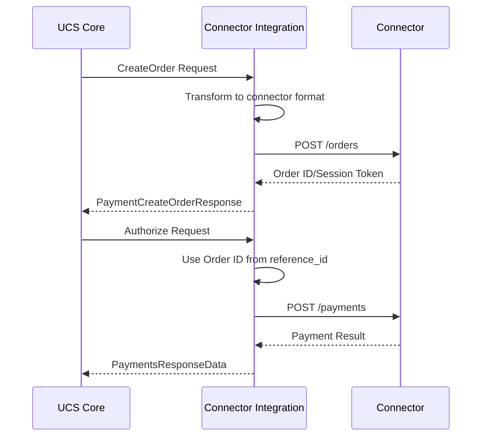

# CreateOrder Flow Pattern

## Table of Contents

1. [Overview](#overview)
2. [When to Use CreateOrder](#when-to-use-createorder)
3. [Architecture](#architecture)
4. [Implementation Patterns](#implementation-patterns)
   - [Enable CreateOrder Flow](#enable-createorder-flow)
   - [Two-Step Flow](#two-step-flow)
   - [Request/Response Types](#requestresponse-types)
5. [Common Patterns](#common-patterns)
   - [Amount Conversion](#amount-conversion)
   - [Reference ID Handling](#reference-id-handling)
   - [Status Mapping](#status-mapping)
6. [Connector Examples](#connector-examples)
   - [Cashfree](#cashfree)
   - [Airwallex](#airwallex)
   - [Razorpay](#razorpay)
   - [PayMe](#payme)
7. [Integration Guide](#integration-guide)
8. [Troubleshooting](#troubleshooting)

## Overview

CreateOrder is a pre-authorization flow pattern where the connector requires a separate order creation step before payment authorization. This two-step approach is common in modern payment processors that decouple order management from payment processing.


## When to Use CreateOrder

### Indicators for CreateOrder Flow

1. **Connector API Structure**: The connector has separate endpoints for order creation and payment processing
2. **Session Management**: The connector returns a session token or order ID to be used in subsequent authorization
3. **Pre-payment Validation**: The connector validates order details before accepting payment
4. **Multi-step Workflows**: The payment flow requires order reservation before charging

### ValidationTrait Implementation

```rust
impl<T: PaymentMethodDataTypes> connector_types::ValidationTrait for ConnectorName<T> {
    fn should_do_order_create(&self) -> bool {
        true // Enable CreateOrder → Authorize flow
    }
}
```

**Note**: Return `false` if the connector uses a single-step payment flow (e.g., Paytm, Revolut).

## Architecture

### Data Flow



### Type Definitions

```rust
// Router Data Types
use domain_types::connector_flow::CreateOrder;
use domain_types::connector_types::{
    PaymentCreateOrderData,
    PaymentCreateOrderResponse,
    PaymentFlowData,
};
use domain_types::router_data_v2::RouterDataV2;

// CreateOrder Router Data
type CreateOrderRouterData = RouterDataV2<
    CreateOrder,
    PaymentFlowData,
    PaymentCreateOrderData,
    PaymentCreateOrderResponse,
>;
```

## Implementation Patterns

### Enable CreateOrder Flow

```rust
// In connector.rs
impl<T: PaymentMethodDataTypes> connector_types::ValidationTrait for ConnectorName<T> {
    fn should_do_order_create(&self) -> bool {
        true // Enable two-step flow
    }
}

// Implement PaymentOrderCreate trait
impl<T: PaymentMethodDataTypes> connector_types::PaymentOrderCreate for ConnectorName<T> {}
```

### Two-Step Flow

CreateOrder flow always works in conjunction with Authorize flow. The CreateOrder response stores the order identifier in `reference_id`, which is then used by the Authorize flow.

```rust
// CreateOrder Response: Store order identifier
impl TryFrom<ResponseRouterData<ConnectorOrderResponse, Self>> for CreateOrderRouterData {
    type Error = error_stack::Report<ConnectorError>;

    fn try_from(item: ResponseRouterData<ConnectorOrderResponse, Self>) -> Result<Self, Self::Error> {
        let mut router_data = item.router_data;

        router_data.response = Ok(PaymentCreateOrderResponse {
            order_id: item.response.order_id.clone(),
        });

        // KEY: Store order ID for Authorize flow
        router_data.resource_common_data = PaymentFlowData {
            status: AttemptStatus::Pending,
            reference_id: Some(item.response.order_id), // Used by Authorize
            ..router_data.resource_common_data
        };

        Ok(router_data)
    }
}

// Authorize Request: Use reference_id from CreateOrder
impl<T: PaymentMethodDataTypes> TryFrom<&RouterDataV2<Authorize, PaymentFlowData, PaymentsAuthorizeData<T>, PaymentsResponseData>>
    for ConnectorPaymentRequest
{
    type Error = error_stack::Report<ConnectorError>;

    fn try_from(item: &RouterDataV2<Authorize, PaymentFlowData, PaymentsAuthorizeData<T>, PaymentsResponseData>) -> Result<Self, Self::Error> {
        // Extract order_id from CreateOrder response
        let order_id = item.resource_common_data.reference_id.clone()
            .ok_or(ConnectorError::MissingRequiredField {
                field_name: "reference_id (order_id from CreateOrder)",
            })?;

        Ok(Self {
            order_id,
            // ... other fields
        })
    }
}
```

### Request/Response Types

#### Standard CreateOrder Request Structure

```rust
#[derive(Debug, Serialize)]
pub struct ConnectorOrderRequest {
    pub order_id: String,              // Unique order identifier
    pub amount: f64,                   // Amount in major/minor units
    pub currency: String,              // ISO currency code
    pub customer_details: CustomerDetails,
    pub return_url: String,            // Redirect URL after payment
    pub notify_url: Option<String>,    // Webhook URL
}

#[derive(Debug, Serialize)]
pub struct CustomerDetails {
    pub customer_id: String,
    pub email: Option<String>,
    pub phone: Option<String>,
    pub name: Option<String>,
}
```

#### Standard CreateOrder Response Structure

```rust
#[derive(Debug, Deserialize)]
pub struct ConnectorOrderResponse {
    pub order_id: String,              // Connector's order identifier
    pub status: String,                // Order status
    pub amount: f64,
    pub currency: String,
    pub session_token: Option<String>, // For frontend SDK
}
```

#### Request Transformation (TryFrom)

```rust
// Method 1: Using macro-generated RouterData wrapper
impl<T: PaymentMethodDataTypes> TryFrom<
    ConnectorRouterData<
        RouterDataV2<CreateOrder, PaymentFlowData, PaymentCreateOrderData, PaymentCreateOrderResponse>,
        T,
    >
> for ConnectorOrderRequest
{
    type Error = error_stack::Report<ConnectorError>;

    fn try_from(
        item: ConnectorRouterData<
            RouterDataV2<CreateOrder, PaymentFlowData, PaymentCreateOrderData, PaymentCreateOrderResponse>,
            T,
        >
    ) -> Result<Self, Self::Error> {
        let router_data = &item.router_data;

        // Access converter from wrapper
        let amount = item.connector.amount_converter
            .convert(router_data.request.amount, router_data.request.currency)?;

        Ok(Self {
            order_id: router_data.resource_common_data.connector_request_reference_id.clone(),
            amount,
            currency: router_data.request.currency.to_string(),
            // ... customer details, URLs
        })
    }
}

// Method 2: Direct TryFrom (simpler connectors)
impl TryFrom<&RouterDataV2<CreateOrder, PaymentFlowData, PaymentCreateOrderData, PaymentCreateOrderResponse>>
    for ConnectorOrderRequest
{
    type Error = error_stack::Report<ConnectorError>;

    fn try_from(item: &RouterDataV2<CreateOrder, PaymentFlowData, PaymentCreateOrderData, PaymentCreateOrderResponse>) -> Result<Self, Self::Error> {
        // Transform without converter access
        Ok(Self {
            order_id: item.resource_common_data.connector_request_reference_id.clone(),
            amount: item.request.amount.get_amount_as_i64() as f64 / 100.0,
            currency: item.request.currency.to_string(),
            // ...
        })
    }
}
```

## Common Patterns

### Amount Conversion

CreateOrder typically uses the same amount conversion pattern as other payment flows:

```rust
// Using connector's amount converter
let amount = item.connector.amount_converter
    .convert(
        item.router_data.request.amount,  // MinorUnit
        item.router_data.request.currency,
    )
    .map_err(|e| ConnectorError::RequestEncodingFailedWithReason(format!("Amount conversion failed: {e}")))?;

// Or manual conversion
let amount_i64 = item.request.amount.get_amount_as_i64();
let converted_amount = FloatMajorUnit(amount_i64 as f64 / 100.0);
```

### Reference ID Handling

The `reference_id` field in `PaymentFlowData` is the key communication mechanism between CreateOrder and Authorize flows:

| Flow | Action | Field |
|------|--------|-------|
| CreateOrder | Store | `resource_common_data.reference_id = Some(order_id)` |
| Authorize | Read | `resource_common_data.reference_id.ok_or(...)?` |

### Status Mapping

Common status mappings from connector-specific to `AttemptStatus`:

```rust
match connector_status {
    "created" | "pending" => AttemptStatus::Pending,
    "requires_payment_method" => AttemptStatus::PaymentMethodAwaited,
    "requires_action" => AttemptStatus::AuthenticationPending,
    "authorized" => AttemptStatus::Authorized,
    "captured" | "paid" => AttemptStatus::Charged,
    "failed" => AttemptStatus::Failure,
    _ => AttemptStatus::Pending,
}
```

## Connector Examples

### Cashfree

Cashfree V3 uses a two-step flow: CreateOrder creates a session, Authorize uses the session.

```rust
// CreateOrder Request
#[derive(Debug, Serialize)]
pub struct CashfreeOrderCreateRequest {
    pub order_id: String,
    pub order_amount: f64,
    pub order_currency: String,
    pub customer_details: CashfreeCustomerDetails,
    pub order_meta: CashfreeOrderMeta,
}

// CreateOrder Response
#[derive(Debug, Deserialize)]
pub struct CashfreeOrderCreateResponse {
    pub payment_session_id: String,  // KEY: Used in Authorize
    pub cf_order_id: i64,
    pub order_id: String,
    pub order_status: String,
}

// Response Transformation
impl TryFrom<ResponseRouterData<CashfreeOrderCreateResponse, Self>> for CreateOrderRouterData {
    type Error = error_stack::Report<ConnectorError>;

    fn try_from(item: ResponseRouterData<CashfreeOrderCreateResponse, Self>) -> Result<Self, Self::Error> {
        let response = item.response;

        Ok(Self {
            response: Ok(PaymentCreateOrderResponse {
                order_id: response.payment_session_id.clone(),
            }),
            resource_common_data: PaymentFlowData {
                status: common_enums::AttemptStatus::Pending,
                reference_id: Some(response.payment_session_id), // Used by Authorize
                ..item.router_data.resource_common_data
            },
            ..item.router_data
        })
    }
}

// Authorize uses payment_session_id
impl<T: PaymentMethodDataTypes> TryFrom<&RouterDataV2<Authorize, PaymentFlowData, PaymentsAuthorizeData<T>, PaymentsResponseData>>
    for CashfreePaymentRequest
{
    type Error = error_stack::Report<ConnectorError>;

    fn try_from(item: &RouterDataV2<Authorize, PaymentFlowData, PaymentsAuthorizeData<T>, PaymentsResponseData>) -> Result<Self, Self::Error> {
        let payment_session_id = item.resource_common_data.reference_id.clone()
            .ok_or(ConnectorError::MissingRequiredField {
                field_name: "payment_session_id",
            })?;

        Ok(Self {
            payment_session_id,
            payment_method: get_cashfree_payment_method_data(&item.request.payment_method_data)?,
            payment_surcharge: None,
        })
    }
}
```

### Airwallex

Airwallex uses CreateOrder to create a Payment Intent, then Authorize confirms it.

```rust
// CreateOrder Request (Intent Creation)
#[derive(Debug, Serialize)]
pub struct AirwallexIntentRequest {
    pub request_id: String,
    pub amount: StringMajorUnit,
    pub currency: Currency,
    pub merchant_order_id: String,
    pub referrer_data: AirwallexReferrerData,  // UCS identification
}

// CreateOrder Response
#[derive(Debug, Deserialize)]
pub struct AirwallexIntentResponse {
    pub id: String,                    // Payment intent ID
    pub status: AirwallexPaymentStatus,
    pub client_secret: Option<String>, // For frontend SDK
}

// Response Transformation
impl TryFrom<ResponseRouterData<AirwallexIntentResponse, Self>> for CreateOrderRouterData {
    type Error = error_stack::Report<ConnectorError>;

    fn try_from(item: ResponseRouterData<AirwallexIntentResponse, Self>) -> Result<Self, Self::Error> {
        let mut router_data = item.router_data;

        let status = match item.response.status {
            AirwallexPaymentStatus::RequiresPaymentMethod => AttemptStatus::PaymentMethodAwaited,
            AirwallexPaymentStatus::Processing => AttemptStatus::Pending,
            _ => AttemptStatus::Pending,
        };

        router_data.response = Ok(PaymentCreateOrderResponse {
            order_id: item.response.id.clone(),
        });

        router_data.resource_common_data = PaymentFlowData {
            status,
            reference_id: Some(item.response.id), // Payment intent ID for Authorize
            ..router_data.resource_common_data
        };

        Ok(router_data)
    }
}
```

### Razorpay

Razorpay creates an order that is then used for payment authorization.

```rust
// CreateOrder Request
#[derive(Debug, Serialize)]
pub struct RazorpayOrderRequest {
    pub amount: i64,           // Amount in minor units
    pub currency: String,
    pub receipt: String,       // Internal reference
}

// CreateOrder Response
#[derive(Debug, Deserialize)]
pub struct RazorpayOrderResponse {
    pub id: String,            // order_id (e.g., "order_123")
    pub amount: i64,
    pub currency: String,
    pub status: String,
}
```

### PayMe

PayMe uses CreateOrder (Generate Sale) to create a sale record, then Authorize adds payment details.

```rust
// CreateOrder = Generate Sale
#[derive(Debug, Serialize)]
pub struct PaymeGenerateSaleRequest {
    pub seller_payme_id: Secret<String>,
    pub sale_price: MinorUnit,
    pub currency: Currency,
    pub product_name: String,
}

// CreateOrder Response
#[derive(Debug, Deserialize)]
pub struct PaymeGenerateSaleResponse {
    pub payme_sale_id: String,      // KEY: Used in Authorize
    pub sale_status: SaleStatus,
    pub sale_price: MinorUnit,
}

// Authorize Request uses payme_sale_id
#[derive(Debug, Serialize)]
pub struct PaymePaymentRequest<T: PaymentMethodDataTypes> {
    pub buyer_name: Secret<String>,
    pub buyer_email: Email,
    pub payme_sale_id: String,      // From CreateOrder reference_id
    pub card: PaymeCardDetails<T>,
}
```

## Integration Guide

### Step 1: Add CreateOrder Flow to Macro

```rust
macros::create_all_prerequisites!(
    connector_name: ConnectorName,
    generic_type: T,
    api: [
        (
            flow: CreateOrder,
            request_body: ConnectorOrderRequest,
            response_body: ConnectorOrderResponse,
            router_data: RouterDataV2<CreateOrder, PaymentFlowData, PaymentCreateOrderData, PaymentCreateOrderResponse>,
        ),
        // ... other flows
    ],
    // ...
);
```

### Step 2: Implement ValidationTrait

```rust
impl<T: PaymentMethodDataTypes> connector_types::ValidationTrait for ConnectorName<T> {
    fn should_do_order_create(&self) -> bool {
        true // Enable CreateOrder flow
    }
}
```

### Step 3: Implement PaymentOrderCreate Trait

```rust
impl<T: PaymentMethodDataTypes> connector_types::PaymentOrderCreate for ConnectorName<T> {}
```

### Step 4: Define Request/Response Types

In `transformers.rs`:
1. Define request structure for order creation
2. Define response structure
3. Implement `TryFrom` for request transformation
4. Implement `TryFrom` for response transformation
5. Store order identifier in `reference_id`

### Step 5: Update Authorize Flow

Modify the Authorize request to use `reference_id` from CreateOrder:

```rust
let order_id = item.resource_common_data.reference_id
    .clone()
    .ok_or(ConnectorError::MissingRequiredField {
        field_name: "reference_id (order_id from CreateOrder)",
    })?;
```

## Troubleshooting

### Common Issues

#### Issue: Missing reference_id in Authorize

**Error**: `MissingRequiredField { field_name: "reference_id" }`

**Cause**: CreateOrder response didn't store the order ID in `reference_id`

**Solution**: Ensure CreateOrder response transformation sets `reference_id`:

```rust
router_data.resource_common_data = PaymentFlowData {
    reference_id: Some(response.order_id), // MUST be set
    ..router_data.resource_common_data
};
```

#### Issue: Amount Conversion Errors

**Error**: `RequestEncodingFailedWithReason("Amount conversion failed")`

**Cause**: Amount converter not properly configured or amount format mismatch

**Solution**: Verify amount converter setup in macro and use correct types:

```rust
let amount = item.connector.amount_converter
    .convert(item.router_data.request.amount, item.router_data.request.currency)?;
```

#### Issue: Wrong Flow Execution

**Problem**: CreateOrder not being called before Authorize

**Cause**: `should_do_order_create()` returns `false`

**Solution**: Return `true` from `ValidationTrait::should_do_order_create()`

#### Issue: Connector API Errors

**Error**: Order creation fails with 4xx/5xx errors

**Common Causes**:
- Missing required fields (customer details, URLs)
- Invalid amount/currency format
- Duplicate order IDs

**Solution**: Review connector API documentation for required fields and formats

### Testing CreateOrder Flow

```rust
// Test that CreateOrder returns order_id and sets reference_id
#[test]
fn test_create_order_response() {
    let response = CashfreeOrderCreateResponse {
        payment_session_id: "session_123".to_string(),
        // ...
    };

    let router_data = create_order_router_data(response);

    assert!(router_data.resource_common_data.reference_id.is_some());
    assert_eq!(
        router_data.resource_common_data.reference_id,
        Some("session_123".to_string())
    );
}

// Test that Authorize uses reference_id
#[test]
fn test_authorize_uses_order_id() {
    let authorize_data = RouterDataV2 {
        resource_common_data: PaymentFlowData {
            reference_id: Some("session_123".to_string()),
            // ...
        },
        // ...
    };

    let request = CashfreePaymentRequest::try_from(&authorize_data).unwrap();
    assert_eq!(request.payment_session_id, "session_123");
}
```

## Summary

CreateOrder flow requires:

1. **Enable the flow**: Return `true` from `should_do_order_create()`
2. **Create request/response types**: Define connector-specific structures
3. **Implement transformations**: `TryFrom` for request and response
4. **Store reference**: Save order ID in `reference_id` for Authorize
5. **Use in Authorize**: Read `reference_id` in Authorize request transformation

The key architectural principle is that `reference_id` in `PaymentFlowData` serves as the bridge between CreateOrder and Authorize flows, carrying the connector's order identifier from the first step to the second.
