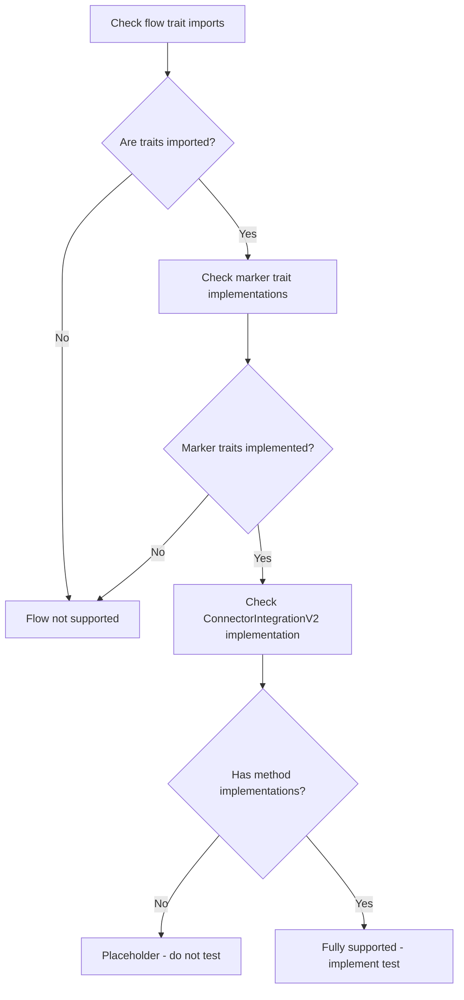

# Connector Test Implementation Guide

This guide provides a comprehensive approach to implementing and testing connector integrations for the payment service. It covers analysis, implementation, testing, debugging, and documentation.

## Implementation Checklist

1. **Analysis**
   - [ ] Analyze connector source code to identify supported flows
   - [ ] **CRITICAL**: Distinguish between implemented and placeholder flows
       - Empty implementations like `impl ConnectorIntegrationV2<PSync, ...> for Checkout {}` are placeholders and should NOT be tested
       - Only flows with actual method implementations like `fn get_headers()`, `fn get_url()` etc. should be tested
   - [ ] Verify which flows have complete implementations with methods
   - [ ] Determine the authentication type required
   - [ ] Identify connector-specific requirements or test data

2. **Implementation**
   - [ ] Create test file with proper structure
   - [ ] Implement helper functions (timestamp, auth, request creators)
   - [ ] Implement test functions for supported flows only
   - [ ] Set up authentication with proper keys

3. **Configuration**
   - [ ] Verify connector is added to config/development.toml
   - [ ] Add missing connector entries if needed
   - [ ] Ensure API keys are valid and accessible

4. **Testing**
   - [ ] Run health check test
   - [ ] Run payment authorization test
   - [ ] Run other flow tests as applicable
   - [ ] Analyze and debug any failures

5. **Debugging**
   - [ ] Check error messages in detail
   - [ ] Differentiate between code issues and API limitations
   - [ ] Apply fixes as needed
   - [ ] Document expected failures and their reasons

6. **Documentation**
   - [ ] Document which flows were tested
   - [ ] Document test results (success/failure)
   - [ ] Document any special requirements or limitations
   - [ ] Update configuration guide if needed

## Table of Contents

1. [Understanding Connector Tests](#understanding-connector-tests)
2. [Analyzing Connector Implementation](#analyzing-connector-implementation)
3. [Determining Supported Flows](#determining-supported-flows)
4. [Test File Structure](#test-file-structure)
5. [Authentication Types](#authentication-types)
6. [Helper Functions](#helper-functions)
7. [Test Implementation](#test-implementation)
8. [Running and Debugging Tests](#running-and-debugging-tests)
9. [Common Errors and Troubleshooting](#common-errors-and-troubleshooting)
10. [Advanced Debugging Techniques](#advanced-debugging-techniques)
11. [Complete Test File Template](#complete-test-file-template)
12. [Step-by-Step Implementation Guide](#step-by-step-implementation-guide)
13. [Request Struct Reference](#request-struct-reference)
14. [Test Documentation Template](#test-documentation-template)

## Understanding Connector Tests

Connector tests verify that all implemented payment flows work correctly for a specific connector. Each test file tests all supported flows for a given connector:

- Payment Authorization (both manual and automatic capture)
- Payment Sync
- Payment Capture
- Refund
- Refund Sync
- Void (payment cancellation)
- Order Creation (if supported)

These tests are implemented as integration tests that interact with the gRPC server.

## Analyzing Connector Implementation

Before creating a test file, analyze the connector's implementation to determine:

1. **Supported Flows**: Check which flow types are imported and used in the connector's main file:
   - Look for import statement: `use domain_types::connector_flow::{Authorize, Capture, PSync, RSync, Refund, Void, CreateOrder};`
   - Check which ones are used in trait implementations:
     - `Authorize` → Authorization flow
     - `Capture` → Capture flow
     - `PSync` → Payment Sync flow
     - `RSync` → Refund Sync flow
     - `Refund` → Refund flow
     - `Void` → Void (cancellation) flow
     - `CreateOrder` → Order Creation flow
   - **CRITICAL REQUIREMENT**: Verify that each flow has a COMPLETE implementation of the ConnectorIntegrationV2 trait with defined methods:
     ```rust
     // DO NOT TEST THIS - Empty implementation (placeholder only)
     impl ConnectorIntegrationV2<PSync, PaymentFlowData, PaymentsSyncData, PaymentsResponseData> for Checkout {}
     
     // TEST THIS - Has actual methods implemented
     impl ConnectorIntegrationV2<Authorize, PaymentFlowData, PaymentsAuthorizeData, PaymentsResponseData>
         for Checkout
     {
         fn get_headers(
             &self,
             _req: &RouterDataV2<Authorize, PaymentFlowData, PaymentsAuthorizeData, PaymentsResponseData>,
         ) -> CustomResult<Vec<(String, hyperswitch_masking::Maskable<String>)>, errors::ConnectorError> {
             Ok(vec![]) // Has actual implementation
         }
         // Other implemented methods...
     }
     ```
     - Empty implementations like `impl ConnectorIntegrationV2<PSync, ...> for Connector {}` are placeholders and should NOT be tested
     - Only test flows that have implemented methods like `get_headers`, `get_url`, `get_request_body`, etc.

2. **Authentication Method**: Determine which authentication type the connector uses:
   - HeaderKey (api_key only)
   - BodyKey (api_key, key1)
   - SignatureKey (api_key, key1, api_secret)
   - MultiAuthKey (api_key, key1, api_secret, key2)

3. **Connector-Specific Requirements**:
   - Special metadata fields
   - Required headers
   - Test card numbers or other test data

## Determining Supported Flows

The first and most critical step is to determine which flows actually have complete implementations versus placeholder/empty implementations.

Use this flowchart to determine which flows should be tested:



### Examples of What to Test vs. Not Test

**DO NOT TEST (Empty Implementation):**
```rust
// This is just a placeholder with no actual implementation
impl ConnectorIntegrationV2<PSync, PaymentFlowData, PaymentsSyncData, PaymentsResponseData> 
    for Checkout {}
```

**TEST THIS (Has Actual Method Implementations):**
```rust
// This has actual implemented methods
impl ConnectorIntegrationV2<Authorize, PaymentFlowData, PaymentsAuthorizeData, PaymentsResponseData>
    for Checkout
{
    fn get_headers(
        &self,
        _req: &RouterDataV2<Authorize, PaymentFlowData, PaymentsAuthorizeData, PaymentsResponseData>,
    ) -> CustomResult<Vec<(String, hyperswitch_masking::Maskable<String>)>, errors::ConnectorError> {
        Ok(vec![]) // Has actual implementation
    }
    
    // Other methods...
}
```

For example, to determine if the Refund flow is fully implemented:
1. Check if `Refund` is imported from `domain_types::connector_flow`
2. Check if the connector implements `RefundV2` marker trait
3. Check if the connector has a non-empty implementation of `ConnectorIntegrationV2<Refund, ...>`
4. Verify that this implementation includes methods like `get_headers`, `get_url`, etc.
5. Only if all these conditions are met should you implement tests for the Refund flow

## Test File Structure

Each connector test file follows this structure:

```rust
#![allow(clippy::expect_used)]
#![allow(clippy::unwrap_used)]
#![allow(clippy::panic)]

use grpc_server::{app, configs};
mod common;

// Import necessary crates and types
use base64::{engine::general_purpose, Engine};
use grpc_api_types::{
    health_check::{health_client::HealthClient, HealthCheckRequest},
    payments::{
        payment_service_client::PaymentServiceClient, AttemptStatus, AuthenticationType,
        CaptureMethod, Currency, PaymentMethod, PaymentMethodType, PaymentsAuthorizeRequest,
        PaymentsAuthorizeResponse, PaymentsCaptureRequest, PaymentsSyncRequest, RefundStatus,
        RefundsRequest, RefundsSyncRequest, PaymentVoidRequest,
    },
};
use std::env;
use std::time::{SystemTime, UNIX_EPOCH};
use tonic::{transport::Channel, Request};

// Constants specific to the connector
const CONNECTOR_NAME: &str = "[connector_name]";

// Authentication related constants
// ... (authentication details)

// Test data constants
// ... (test data)

// Helper functions
// ... (helper functions)

// Test implementations
// ... (test functions)
```

## Authentication Types

Connectors support four authentication types, each requiring different keys:

| Auth Type     | Required Keys                        |
|---------------|-------------------------------------|
| HeaderKey     | api_key                             |
| BodyKey       | api_key, key1                       |
| SignatureKey  | api_key, key1, api_secret           |
| MultiAuthKey  | api_key, key1, api_secret, key2     |

### Example Authentication Implementation

```rust
// Constants for authentication type
const AUTH_TYPE: &str = "signature-key"; // Can be "header-key", "body-key", "signature-key", or "multi-auth-key"

// Environment variable names for API credentials
const CONNECTOR_API_KEY_ENV: &str = "TEST_CONNECTOR_API_KEY";
const CONNECTOR_KEY1_ENV: &str = "TEST_CONNECTOR_KEY1";
const CONNECTOR_API_SECRET_ENV: &str = "TEST_CONNECTOR_API_SECRET";
// Add more if needed for multi-auth

// Helper function to add connector metadata headers to a request
fn add_connector_metadata<T>(request: &mut Request<T>) {
    // Add connector header
    // Add auth type header
    // Add authentication headers based on auth type
    // Add any connector-specific metadata
}
```

## Helper Functions

Common helper functions needed for all connector tests:

### 1. Timestamp Generator

```rust
// Helper function to get current timestamp
fn get_timestamp() -> u64 {
    SystemTime::now()
        .duration_since(UNIX_EPOCH)
        .unwrap()
        .as_secs()
}
```

### 2. Transaction ID Extractor

```rust
// Helper function to extract connector transaction ID from response
fn extract_transaction_id(response: &PaymentsAuthorizeResponse) -> String {
    match &response.resource_id {
        Some(id) => match id.id.as_ref().unwrap() {
            grpc_api_types::payments::response_id::Id::ConnectorTransactionId(id) => id.clone(),
            _ => panic!("Expected connector transaction ID"),
        },
        None => panic!("Resource ID is None"),
    }
}
```

### 3. Request Creation Functions

```rust
// Helper function to create a payment authorization request
fn create_payment_authorize_request(capture_method: CaptureMethod) -> PaymentsAuthorizeRequest {
    // Initialize with all required fields
    //example below.
    PaymentsAuthorizeRequest {
        amount: TEST_AMOUNT,
        minor_amount: TEST_AMOUNT,
        currency: i32::from(Currency::Usd),
        payment_method: i32::from(PaymentMethod::Card),
        payment_method_data: Some(grpc_api_types::payments::PaymentMethodData {
            data: Some(grpc_api_types::payments::payment_method_data::Data::Card(
                grpc_api_types::payments::Card {
                    card_number: TEST_CARD_NUMBER.to_string(),
                    card_exp_month: TEST_CARD_EXP_MONTH.to_string(),
                    card_exp_year: TEST_CARD_EXP_YEAR.to_string(),
                    card_cvc: TEST_CARD_CVC.to_string(),
                    card_holder_name: Some(TEST_CARD_HOLDER.to_string()),
                    card_issuer: None,
                    card_network: None,
                    card_type: None,
                    card_issuing_country: None,
                    bank_code: None,
                    nick_name: None,
                },
            )),
        }),
        email: Some(TEST_EMAIL.to_string()),
        address: Some(grpc_api_types::payments::PaymentAddress::default()),
        auth_type: i32::from(AuthenticationType::NoThreeDs),
        connector_request_reference_id: format!("fiserv_test_{}", get_timestamp()),
        enrolled_for_3ds: false,
        request_incremental_authorization: false,
        capture_method: Some(i32::from(capture_method)),
        payment_method_type: Some(i32::from(PaymentMethodType::Credit)),
        connector_meta_data: Some(metadata_json.as_bytes().to_vec()),
        ..Default::default()
    }
}

// Helper function to create a payment sync request
fn create_payment_sync_request(transaction_id: &str) -> PaymentsSyncRequest {
    PaymentsSyncRequest {
        resource_id: transaction_id.to_string(),
        connector_request_reference_id: Some(format!("fiserv_sync_{}", get_timestamp())),
        all_keys_required: None,
    }
}

// Helper function to create a payment capture request
fn create_payment_capture_request(transaction_id: &str) -> PaymentsCaptureRequest {
    PaymentsCaptureRequest {
        connector_transaction_id: transaction_id.to_string(),
        amount_to_capture: TEST_AMOUNT,
        currency: i32::from(Currency::Usd),
        multiple_capture_data: None,
        connector_meta_data: Some(metadata_json.as_bytes().to_vec()),
        all_keys_required: None,
    }
}

// Helper function to create a refund request
fn create_refund_request(transaction_id: &str) -> RefundsRequest {
    RefundsRequest {
        refund_id: format!("refund_{}", get_timestamp()),
        connector_transaction_id: transaction_id.to_string(),
        currency: i32::from(Currency::Usd),
        payment_amount: TEST_AMOUNT,
        refund_amount: TEST_AMOUNT,
        minor_payment_amount: TEST_AMOUNT,
        minor_refund_amount: TEST_AMOUNT,
        connector_refund_id: None,
        reason: None,
        webhook_url: None,
        connector_metadata: Some(metadata_json.as_bytes().to_vec()), // Add terminal_id for the main connector_metadata field
        refund_connector_metadata: Some(metadata_json.as_bytes().to_vec()), // Add terminal_id for refund
        browser_info: None,
        merchant_account_id: None,
        capture_method: None,
        all_keys_required: None,
    }
}

// Helper function to create a refund sync request
fn create_refund_sync_request(transaction_id: &str, refund_id: &str) -> RefundsSyncRequest {
    RefundsSyncRequest {
        connector_transaction_id: transaction_id.to_string(),
        connector_refund_id: refund_id.to_string(),
        refund_reason: None,
        all_keys_required: None,
    }
}

// Helper function to create a payment void request
fn create_payment_void_request(transaction_id: &str) -> PaymentVoidRequest {
    PaymentVoidRequest {
        // Set necessary fields for void request
    }
}
```

## Test Implementation

Implement tests for each supported flow. Here are the core test function skeletons:

### 1. Health Check Test

```rust
#[tokio::test]
async fn test_health() {
    grpc_test!(client, HealthClient<Channel>, {
        // Send health check request
        // Verify response
    });
}
```

### 2. Payment Authorization Tests

```rust
#[tokio::test]
async fn test_payment_authorization_auto_capture() {
    grpc_test!(client, PaymentServiceClient<Channel>, {
        // Create the payment authorization request with automatic capture
        // Add metadata headers
        // Send the request
        // Verify the response
        // Extract the transaction ID
        // Verify payment status
    });
}

#[tokio::test]
async fn test_payment_authorization_manual_capture() {
    grpc_test!(client, PaymentServiceClient<Channel>, {
        // Create the payment authorization request with manual capture
        // Add metadata headers
        // Send the request
        // Verify the response and extract transaction ID
        // Verify payment is in authorized state
        
        // Create capture request
        // Add metadata headers
        // Send the capture request
        // Verify payment is now in charged state
    });
}
```

### 3. Payment Sync Test

```rust
#[tokio::test]
async fn test_payment_sync() {
    grpc_test!(client, PaymentServiceClient<Channel>, {
        // First create a payment to sync
        // Extract the transaction ID
        
        // Create sync request
        // Add metadata headers
        // Send the sync request
        // Verify the sync response
    });
}
```

### 4. Refund Test

```rust
#[tokio::test]
async fn test_refund() {
    grpc_test!(client, PaymentServiceClient<Channel>, {
        // First create a payment
        // Extract the transaction ID
        // Verify payment status
        
        // Create refund request
        // Add metadata headers
        // Send the refund request
        
        // Handle both success and error cases
        // Verify refund status or expected error
    });
}
```

### 5. Refund Sync Test

```rust
#[tokio::test]
async fn test_refund_sync() {
    grpc_test!(client, PaymentServiceClient<Channel>, {
        // First create a payment
        // Extract the transaction ID
        
        // Create a refund to get a valid refund ID
        // Extract refund ID or use a mock ID
        
        // Create refund sync request
        // Add metadata headers
        // Send the refund sync request
        
        // Handle both success and error cases
        // Verify refund sync status or expected error
    });
}
```

### 6. Void Test

```rust
#[tokio::test]
async fn test_payment_void() {
    grpc_test!(client, PaymentServiceClient<Channel>, {
        // First create a payment with manual capture
        // Extract the transaction ID
        // Verify payment is in authorized state
        
        // Create void request
        // Add metadata headers
        // Send the void request
        
        // Handle both success and error cases
        // Verify void status or expected error
    });
}
```

## Running and Debugging Tests

### 1. Configuration Setup

Before running tests, ensure your configuration file is properly set up:

1. Check the `config/development.toml` file and ensure it has entries for all connectors used in your tests:
   ```toml
   [connectors]
   adyen.base_url = "https://checkout-test.adyen.com/"
   razorpay.base_url = "https://api.razorpay.com/"
   checkout.base_url = "https://api.checkout.com/"
   paypal.base_url = "https://api-m.sandbox.paypal.com/"
   authorizedotnet.base_url = "https://apitest.authorize.net/"
   fiserv.base_url = "https://cert.api.firstdata.com/"
   elavon.base_url = "https://api.sandbox.elavonpaymentgateway.com/"
   # Add any other connectors your system uses
   ```

2. If you're adding a new connector, make sure to add its base URL to this configuration.

### 2. Server Management

For local testing:

1. Check if server is running:
   ```bash
   ps aux | grep cargo
   ```

2. If running, terminate:
   ```bash
   kill -9 [pid]
   ```

3. Start server (if you want to run tests against a live server):
   ```bash
   cargo run
   ```

### 3. Test Execution

Run tests from the project root or backend directory:

```bash
# Run all tests for a specific connector
cd backend && cargo test --test [connector_name]_payment_flows_test

# Run a specific test
cd backend && cargo test --test [connector_name]_payment_flows_test [test_function_name]

# Run with verbose output to see detailed logs
cd backend && cargo test --test [connector_name]_payment_flows_test -- --nocapture
```

### 4. Understanding Test Results

When running tests, you may encounter different outcomes:

1. **All tests pass**: Great! Your connector implementation works as expected.

2. **Health check passes, but payment tests fail**: This is common and could be due to:
   - API keys might not be valid or might have insufficient permissions
   - The connector might require additional configuration
   - Network issues or rate limiting from the payment processor

3. **All tests fail with configuration errors**: Check your `config/development.toml` file and ensure it includes all required connectors.

4. **Specific error patterns**:
   - "Connector processing error": Usually related to the connector's API rejecting the request
   - "Failed to execute a processing step": Check connector implementation for possible issues
   - "Unable to deserialize application configuration": Configuration file issues

### 5. gRPC Curl Commands for Manual Testing

For debugging, create gRPC curl commands for each operation:

```bash
# For payment authorization
grpcurl -v -plaintext \
  -H "x-connector: [connector_name]" \
  -H "x-auth: [auth_type]" \
  -H "x-api-key: [api_key]" \
  -H "x-key1: [key1]" \
  -H "x-api-secret: [api_secret]" \
  -d '{
    "amount": 1000,
    "minor_amount": 1000,
    "currency": 145,
    "payment_method": 0,
    "payment_method_data": {
      "card": {
        "card_number": "[test_card_number]",
        "card_exp_month": "12",
        "card_exp_year": "2025",
        "card_cvc": "123",
        "card_holder_name": "Test User",
        "card_network": 0
      }
    },
    "email": "customer@example.com",
    "address": {},
    "auth_type": 1,
    "connector_request_reference_id": "[connector]_test_debug",
    "enrolled_for_3ds": false,
    "request_incremental_authorization": false,
    "capture_method": 0,
    "payment_method_type": 1
  }' \
  localhost:8000 ucs.payments.PaymentService/PaymentAuthorize
```

## Common Errors and Troubleshooting

### 1. Testing Unimplemented Flows

**Problem**: If you see errors like "no such field" in the test file, it might indicate you're trying to test a flow that isn't fully implemented.

**Solution**: 
- **CRITICAL FIRST STEP**: Before writing any tests, examine the connector implementation to check which flows have actual implementations vs. placeholder implementations
- Use pattern recognition to identify implementations:
  ```rust
  // THIS IS A PLACEHOLDER - DO NOT TEST
  impl ConnectorIntegrationV2<PSync, PaymentFlowData, PaymentsSyncData, PaymentsResponseData> for Checkout {}
  
  // THIS HAS ACTUAL IMPLEMENTATION - TEST THIS
  impl ConnectorIntegrationV2<Authorize, PaymentFlowData, PaymentsAuthorizeData, PaymentsResponseData>
      for Checkout
  {
      fn get_headers(...) {...}
      fn get_url(...) {...}
      // Other methods...
  }
  ```
- Empty implementations like `impl ConnectorIntegrationV2<PSync, ...> for Connector {}` are placeholders and should NOT be tested
- Only test flows that have implemented methods like `get_headers`, `get_url`, `get_request_body`, etc.
- The error is classified as "Internal" (server-side issue)
- There's no detailed source information, which is common with third-party APIs

To debug further:

1. **Enable detailed logging**:
   - Modify the log level in `config/development.toml` to "TRACE"
   ```toml
   [log.console]
   enabled = true
   level = "TRACE"
   log_format = "default"
   ```

2. **Examine connector implementation**:
   - Check the connector's error handling code
   - Look for known error patterns or response codes

3. **Add debug instrumentation**:
   - Modify your test to print request details before sending
   - Use `dbg!()` macro to print values at key points

### 2. Manual API Testing

For direct testing of connector APIs:

1. **Use Postman or similar tools** to make direct API calls to the connector
2. **Check the connector's documentation** for test card numbers and scenarios
3. **Try different parameters** to isolate what might be causing failures

### 3. Diagnosing Common Error Patterns

Based on the error message pattern, you can often determine the nature of the issue:

| Error Pattern | Likely Cause | Solution |
|---------------|--------------|----------|
| "Invalid authentication" | Auth keys are wrong | Check API keys and auth type |
| "Invalid card" | Test card number issue | Try different test cards |
| "Resource not found" | Invalid transaction ID | Check ID formats and syntax |
| "Insufficient funds" | Card limitation | Use a different test card |
| "Processing error" | Sandbox environment issue | Check connector status, try later |

### 4. Expected Failures

Some failures are expected and should be documented rather than fixed:

- **API Limitations**: Some connectors have limitations in their sandbox/test environments
- **Rate Limiting**: Some connectors limit the number of requests you can make
- **Test Card Restrictions**: Some connectors only allow specific operations with specific test cards

## Complete Test File Template

Here's a complete template skeleton for a connector test file:

```rust
#![allow(clippy::expect_used)]
#![allow(clippy::unwrap_used)]
#![allow(clippy::panic)]

use grpc_server::{app, configs};
mod common;

// Imports
use base64::{engine::general_purpose, Engine};
use grpc_api_types::{/* ... */};
use std::env;
use std::time::{SystemTime, UNIX_EPOCH};
use tonic::{transport::Channel, Request};

// Constants specific to the connector
const CONNECTOR_NAME: &str = "[connector_name]";
const AUTH_TYPE: &str = "[auth_type]";

// Environment variable names for API credentials
const CONNECTOR_API_KEY_ENV: &str = "TEST_[CONNECTOR_NAME]_API_KEY";
// Add other credential env vars as needed

// Test data constants
const TEST_AMOUNT: i64 = 1000;
const TEST_CARD_NUMBER: &str = "[appropriate test card for connector]";
// Add other test data constants

// Helper function to get current timestamp
fn get_timestamp() -> u64 {
    // Implementation
}

// Helper function to add connector metadata headers to a request
fn add_connector_metadata<T>(request: &mut Request<T>) {
    // Implementation based on auth type
}

// Helper function to extract connector transaction ID from response
fn extract_transaction_id(response: &PaymentsAuthorizeResponse) -> String {
    // Implementation
}

// Request creation helper functions
fn create_payment_authorize_request(capture_method: CaptureMethod) -> PaymentsAuthorizeRequest {
    // Implementation
}

fn create_payment_sync_request(transaction_id: &str) -> PaymentsSyncRequest {
    // Implementation
}

fn create_payment_capture_request(transaction_id: &str) -> PaymentsCaptureRequest {
    // Implementation
}

fn create_refund_request(transaction_id: &str) -> RefundsRequest {
    // Implementation
}

fn create_refund_sync_request(transaction_id: &str, refund_id: &str) -> RefundsSyncRequest {
    // Implementation
}

fn create_payment_void_request(transaction_id: &str) -> PaymentVoidRequest {
    // Implementation
}

// Test implementations
#[tokio::test]
async fn test_health() {
    // Implementation
}

#[tokio::test]
async fn test_payment_authorization_auto_capture() {
    // Implementation
}

#[tokio::test]
async fn test_payment_authorization_manual_capture() {
    // Implementation
}

#[tokio::test]
async fn test_payment_sync() {
    // Implementation
}

#[tokio::test]
async fn test_refund() {
    // Implementation
}

#[tokio::test]
async fn test_refund_sync() {
    // Implementation
}

#[tokio::test]
async fn test_payment_void() {
    // Implementation
}
```

## Step-by-Step Implementation Guide

1. **Analyze Connector**:
   - Check which flows are supported in the connector implementation
   - **IMPORTANT**: Verify that each flow has actual method implementations, not just empty trait declarations
   - Only implement tests for flows with complete implementations
   - Determine authentication type used
   - Identify any connector-specific requirements

2. **Create Test File**:
   - Create a new file in `backend/grpc-server/tests/[connector_name]_payment_flows_test.rs`
   - Set up the basic structure with imports and constants

3. **Implement Helper Functions**:
   - Add timestamp generator
   - Add connector metadata function with appropriate auth handling
   - Add transaction ID extractor
   - Add request creation functions for each supported flow

4. **Implement Test Functions**:
   - Add a health check test
   - Add tests ONLY for the fully implemented flows:
     - Payment Authorization (auto capture) - if supported
     - Payment Authorization (manual capture) + Capture - if supported
     - Payment Sync - if supported
     - Refund - if supported
     - Refund Sync - if supported
     - Void - if supported

5. **Handle API Keys**:
   - Set up environment variables for required API credentials
   - If keys are not available, request them from the user or hardcode test values

6. **Update Configuration**:
   - Check that `config/development.toml` includes the connector's base URL
   - If not present, add the connector configuration

7. **Run Tests**:
   - Execute: `cd backend && cargo test --test [connector_name]_payment_flows_test`
   - Check if the health test passes (verifies server configuration)
   - Check individual payment flow tests

8. **Debug Test Failures**:
   - For each failing test, examine the error message in detail
   - Determine if the failure is due to:
     - Code implementation issues (fix the code)
     - API limitations (document as expected failure)
     - Configuration issues (fix the config)
   - Try modifying test parameters if needed

9. **Document Results**:
   - Document which tests pass and which fail
   - For failing tests, document the reason (API limitation, etc.)
   - Document any special requirements for the connector
   - Use the [Test Documentation Template](#test-documentation-template)


